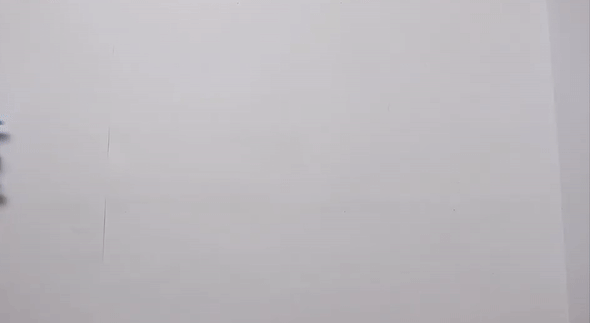
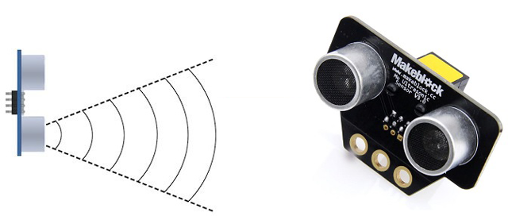
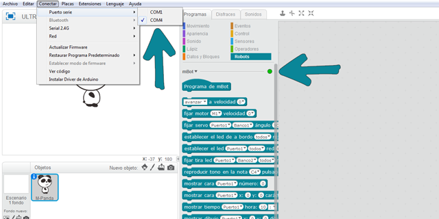
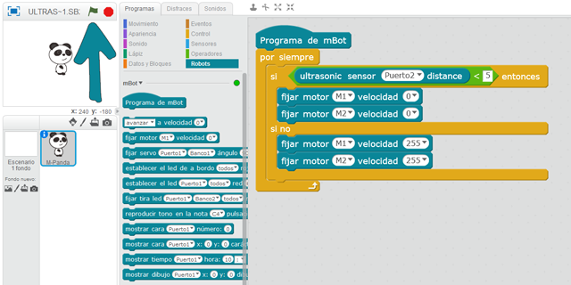
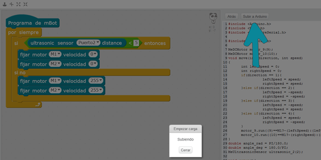
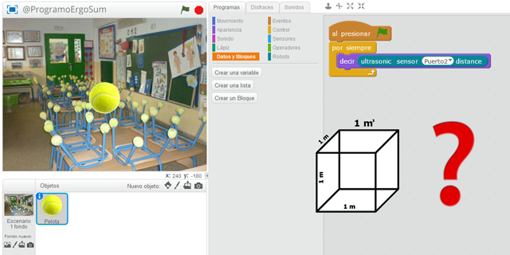
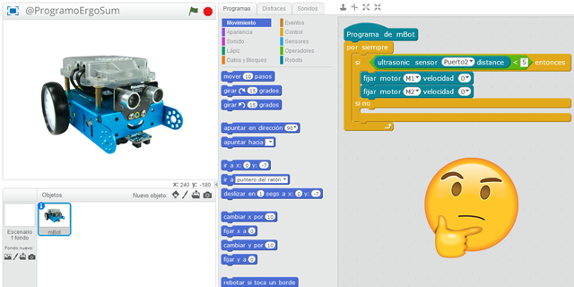

# Sensor ultrasonidos del robot mBot con mBlock

En este curso aprenderás a programar el robot mBot de MakeBlock y utilizar el sensor de ultrasonidos o distancia. Para ello se programará sobre el lenguaje de programación por bloques de mBlock el código que se le pasará al robot mBot.

### ¿Qué es un sensor de ultrasonidos o de distancia?

El sensor de ultrasonidos o distancia son detectores de proximidad que detectan objetos a distancias que van desde pocos centímetros hasta varios metros. El sensor emite un sonido y mide el tiempo que la señal tarda en regresar. Estos reflejan en un objeto, el sensor recibe el eco producido y lo convierte en señales eléctricas, las cuales son elaboradas en el aparato de valoración.

El funcionamiento del sensor es muy sencillo; se utiliza un emisor para emitir una onda de sonido de alta frecuencia (ultrasonido) y un receptor para escuchar la onda reflejada. En mBlock solamente tenemos que utilizar el bloque que nos devuelve la longitud a la cual se encuentra de un obstáculo. A partir de esa distancia podemos actuar según nuestro objetivo.

 

## Ultrasonidos del robot mBot

En esta lección se va a programar el sensor de ultrasonidos utilizando el lenguaje de programación por bloques de mBlock. Para ello lo primero que deberemos hacer será conectar nuestro robot mBot a Scratch y conectar el puerto serie al que estemos conectado. Además, si queremos ejecutar el programa sin desconectarlo de mBlock, deberemos cargar el firmware en el menú Conectar > Actualizar Firmware.

El siguiente paso será añadir el programa encargado de detectar un obstáculo y detenerse ante él. Para ello, utilizaremos una condición encargada de comparar el valor obtenido del sensor de ultrasonidos, y en caso de ser mayor que 5 centímetros, parará los motores (izquierdo - M1 y derecho - M2). En caso contrario, los motores funcionarán al máximo permitod en mBlock, que es el valor de 255.

Por último, para probar nuestro robot desconectado del cable USB y utilizando baterías, deberemos cargar el código del programa en el mCore del robot. Para ello deberemos acceder al editor de arduino haciendo clic en Editar > Modo Arduino y veremos una pantalla similar a la siguiente. Por último, subiremos el código a Arduino y ya podremos probar nuestro robot mBot en un circuito real.

 

## Retos propuestos

Si ya has completado todas las lecciones del tutorial te proponemos resolver los siguientes retos.

### Reto 1: Pelotas de tenis

En este reto de programación con mBot deberás calcular el número de pelotas de tenis que caben en tu habitación utilizando el sensor de ultrasonidos de mBot. Para ello deberás realizar operaciones matemáticas sobre el papel.

### Reto 2: Disminuyendo la velocidad

En este reto de programación con mBot deberás programar el código que haga que el robot mBot se vaya deteniendo a medida que se va acercando a un obstáculo.

