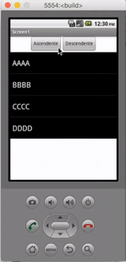

## Introducción

En este curso de programación de dispositivos móviles con AppInventor aprenderás a ordenar una lista de forma ascendente y descendente creando tu propia función y sobrescribiendo otras funciones existentes. Para ello utilizaremos algoritmos avanzados estudiados en ingenierías de informática.

 

## Diseño de la aplicación

En este video te enseñamos el diseño de la aplicación antes de la programación.

  <iframe src="//www.youtube.com/embed/jH3Xx7s4rW0" allowfullscreen></iframe>

 

## Programación principal

En este video programamos los eventos al presionar los diferentes botones.

  <iframe src="//www.youtube.com/embed/IKiraBlZwjM" allowfullscreen></iframe>

 

## Optimización de la programación

En este video creamos la función de ordenación pasándole un parámetro a la misma.

  <iframe src="//www.youtube.com/embed/wlOiFrnWWoQ" allowfullscreen></iframe>

 

## Mejoras de la programación

Por último, sobreescribimos la función para comparar textos.

  <iframe src="//www.youtube.com/embed/WFVIx8bvois" allowfullscreen></iframe>

