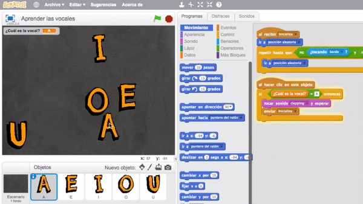
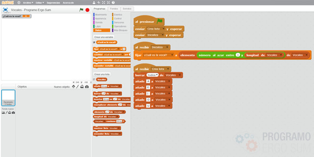
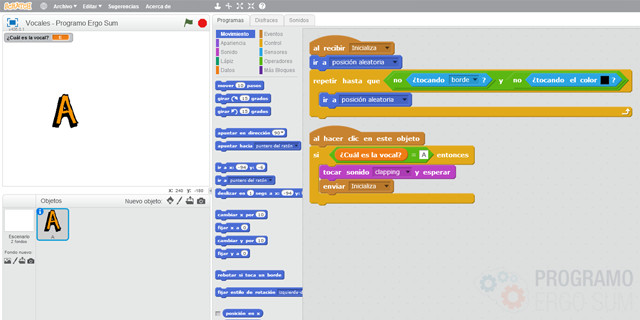
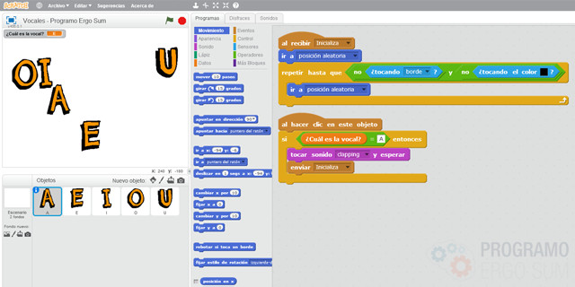

## Introducción

En este tutorial con Scratch 2.0 te explicamos cómo programar un sencillo videojuego educativo. En el videojuego aparecerán diferentes objetos en posiciones aleatorias y tendremos que atraparlos. Modificando los objetos podemos crear una infinidad de videojuegos educativos.

### Reinventa, programa y comparte

Antes de continuar con las lecciones de este curso de programación con Scratch te recomendamos seguir los siguientes pasos para reinventar y obtener todas las imágenes utilizadas en el videojuego gratis.

- Reinventa el proyecto [Vocales (base)](https://scratch.mit.edu/projects/120297048/editor) para obtener todas las imágenes.
- Programa el videojuego siguiendo los videotutoriales de las siguientes lecciones.
- Comparte el proyecto y si está entre los mejores aparecerá en la sección Mejores proyectos.

 

## Escenario

  <iframe src="//www.youtube.com/embed/WXUuqY-2yY4" allowfullscreen></iframe>

### Crear una lista con vocales

Con esta aplicación queremos que nuestros alumnos aprendan a distinguir las vocales, con lo cual, el primer paso que tenemos que hacer es guardar las vocales en una lista. Una lista es una colección de elementos y en este caso contendrá las vocales.

Siempre que pulsemos la bandera verde se genera una lista con las vocales y se selecciones aleatoriamente una de las vocales, así tu alumno cada vez tendrá que adivinarlas en distinto orden.

Recuerda que si modificas el juego para que tus alumnos aprendan otro tipo de conceptos, como consonantes, colores, etc. deberás primero añadir estos alementos a la lista y borrar los existentes.

 

## Vocales

  <iframe src="//www.youtube.com/embed/PgrZqwEnPNA" allowfullscreen></iframe>

### Programación de la vocal

En esta lección te enseñamos la programación de la vocal, es decir, deberá aparecer en una posición aleatoria de la pantalla. Para ello se implementa la funcionalidad en el evento de "Inicializar".

Al ser posiciones aleatorias, se puede dar el caso que aparezcan vocales sobre otras. En este caso, para solucionar este posible problema, en nuestro algoritmo añadimos la opción de volver a cambiar de posición mientras no esté tocando una vocal, como te explicamos en el video.

 

## Objetos

  <iframe src="//www.youtube.com/embed/-I3CAcOF1s0" allowfullscreen></iframe>

### Duplicar vocales

En esta lección te enseñamos un método rápido para duplicar objetos a partir de uno ya programado perfectamente, pero recuerda que es conveniente haber terminado de programar correctamente la vocal para poder duplicarla sin arrastrar errores.

Una vez duplicado todos los objetos recuerda que hay que cambiar la condición al pulsar el objeto.

 

## Retos propuestos

Si ya has completado todas las lecciones del tutorial te proponemos resolver los siguientes retos de programación con Scratch.

### Reto 1: Utiliza tu propia voz

En este reto te proponemos que cambies el sonido que aparece cuando se acierta la vocal, por tu propia voz, indicándole así al alumno que ha acertado. ¿Qué tendrías que modificar para realizar esta mejora?

 

## Mejores proyectos

<!--

-->

 

## Materiales

- Aprende las vocales `Vocales.sb2`
- Reto 1: Utiliza tu propia voz `Reto-1.sb2`
