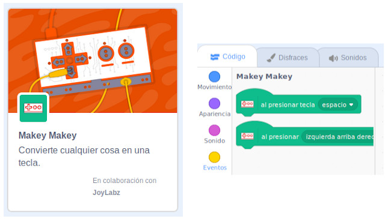
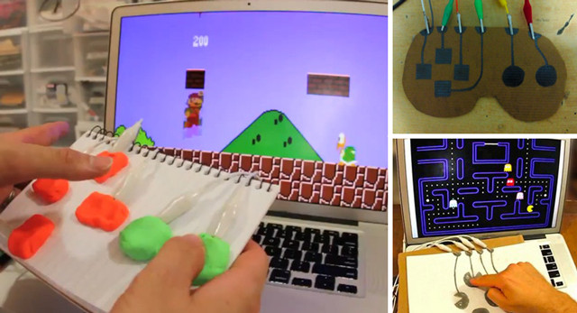
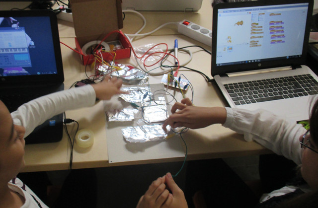
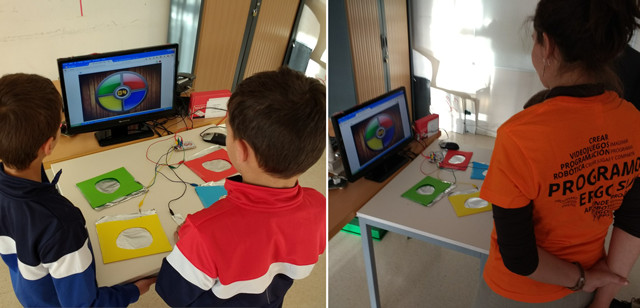

## Introducción

En este tutorial aprenderás a conectar una placa Makey-Makey con Scratch en su versión 3.0 para realizar cualquier tipo de videojuego y conectar el mundo digital con el mundo físico.

 

## Conectar con Scratch 3.0

Si estás utilizando la versión de Scratch 3.0 podrás comprobar que trae una extensión que permite crear códigos y controles para tus aplicaciones y videojuegos con Scratch e implementarlos con Makey Makey.

En las anteriores versiones de Scratch se podía conseguir el mismo resultado pero con esta nueva extensión utilizamos menos bloques de programación.

 

## Mando de videojuego

Otra de las opciones para utilizar la placa de Makey-Makey, es mediante la construcción de un mando para jugar a diferentes videojuegos ya que utilizaremos las flechas del teclado y otros botones más que pueden ser personalizados en algunos de los videojuegos online.

También está la opción de que los alumnos programen sus propios videojuegos utilizando el lenguaje de programación por bloques de Scratch y se conviertan en creadores y programadores.

Otras elaboraciones más sofisticadas consisten en utilizar plastilina conductora, lápiz de grafito u otras herramientas y utensilios conductores que encontremos en casa o en el aula, para poder jugar a videojuegos online o programados por nosotros mismos en Scratch u otros lenguajes de programación.

 

## Juego de Simón

El juego de simón consiste en reproducir una secuencia de colores en el mismo orden que se generan. De esta forma, utilizando junto a la placa Makey-Makey, nuestros alumnos pueden ver el juego más divertido.

Puedes acceder al proyecto en la web de [scratch.mit.edu](https://scratch.mit.edu/projects/20016532/fullscreen), conectar tu placa Makey-Makey y jugar a este juego con tus amigos.

 

## Otros proyectos

Para realizar este videojuego de descifrar códigos secretos, se ha incluido un elemento de resolución de rompecabezas físico que necesitas para descubrir el código secreto. El objetivo del videojuego consiste en descifrar el código, alimentar al oso y luego crear tu propio videojuego con Scratch

  <iframe src="//www.youtube.com/embed/NvzFx_2Duw4" allowfullscreen></iframe>

