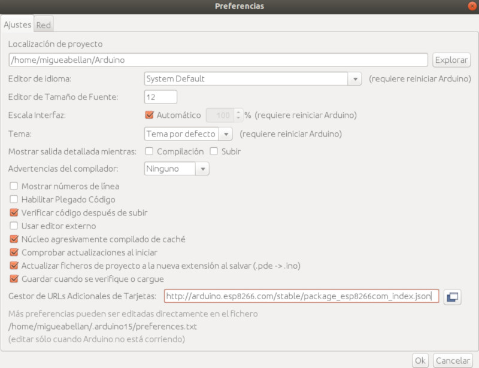
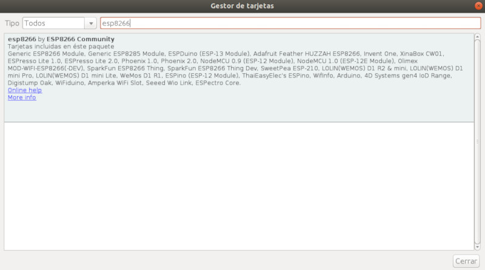
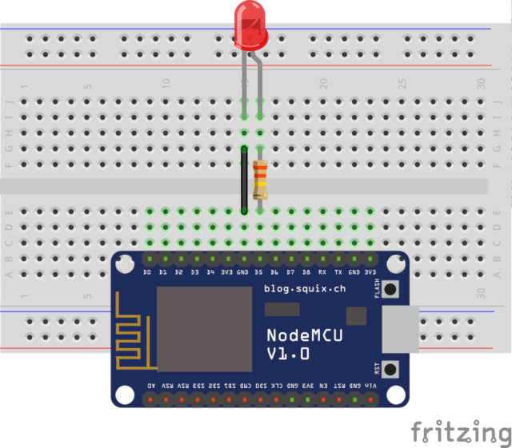
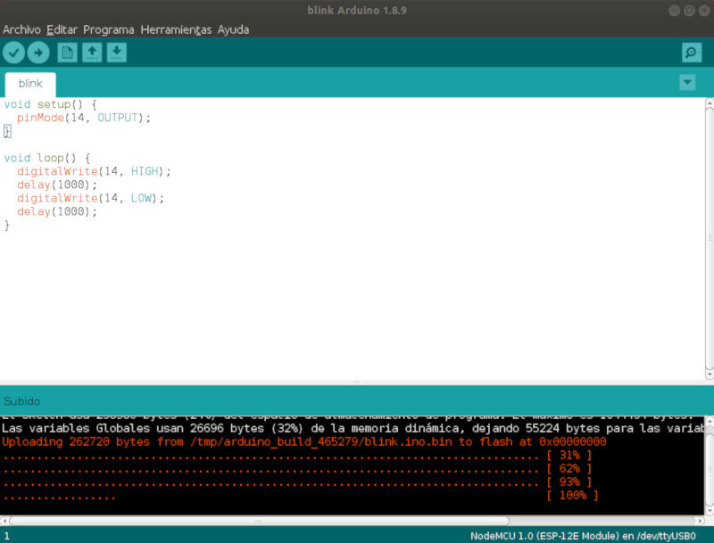

## Introducción

En este tutorial vamos a explicar cómo configurar el IDE de Arduino para programar con módulos NodeMCU como ESP8266.

### Antes de empezar

Vas a necesitar los siguientes componentes:

- NodeMCU ESP8266


<br />


## Arduino IDE

Lo primero que tenemos que hacer es descargar el *IDE de Arduino* desde la web oficial.

```
URL: https://www.arduino.cc/en/Main/Software
```


<br />


## Drivers de la ESP8266

Para sistemas operativos Linux o MAC la placa es reconocida sin problemas. Sin embargo, para Windows 7 o inferior nos pedirá instalar los drivers buscando de forma automática en `Search for updated driver software`.

### Agregar tarjeta ESP8266 en el IDE de Arduino

Agregar la ESP8266 sobre el IDE de Arduino es muy sencillo gracias al soporte de la comunidad que hace que esté disponible como paquete. Con lo cual lo que tenemos que hacer es importar dicho paquete sobre el IDE de Arduino accediendo a `Archivo > Preferencias` y añadimos la ruta en `Gestor de URLs Adicionales de Tarjetas` donde se cuentra el paque del ESP8266.

```
URL: http://arduino.esp8266.com/stable/package_esp8266com_index.json
```



Una vez añadido el paquete, instalamos la placa accediendo al menú `Herramientas > Placas > Gestor de placas`. A continuación buscamos la placa `esp8266` y la instalamos. Este proceso tardará unos minutos.



Al finalizar el proceso de instalación ya podemos seleccionar la placa `NodeMCU 1.0 (ESP 12E Module)` y el puerto al cual tengamos conectada nuestra ESP.

Para probar que funciona, añadimos el siguiente código encargado de encender un LED situado en el pin digital 5 de nuestra ESP8266 (conectado internamente al pin GPIO14).



```arduino
void setup() {
  pinMode(14, OUTPUT);
}

void loop() {
  digitalWrite(14, HIGH);
  delay(1000);
  digitalWrite(14, LOW);
  delay(1000);
}
```




<br />


## Ejercicios propuestos

1.- Instala Arduino IDE con la configuración para programar placas NodeMCU.

2.- Carga el programa Blink y realiza la configuración necesaria para hacerlo funcionar.
