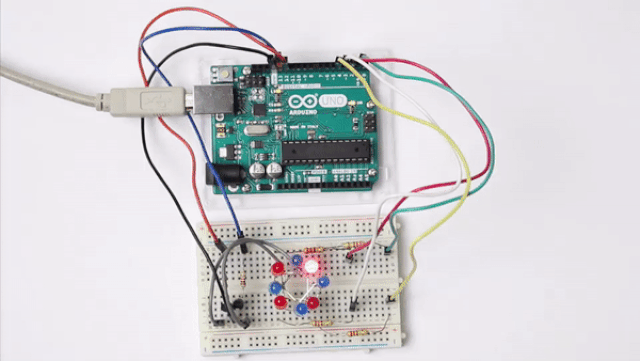
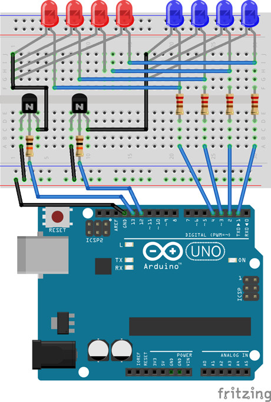
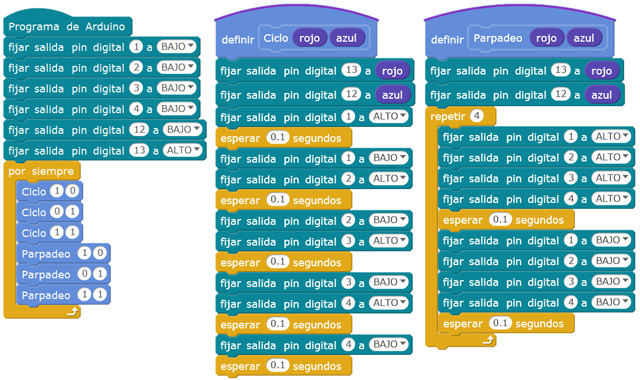

## Introducción

En este curso aprenderás a construir un cubo de 8 LEDs (2 x 2 x 2) con forma de ruleta para programar con mBlock y Arduino IDE diferentes efectos de colores. En siguientes prácticas se crearán cubos de LEDs con más niveles.



### Materiales

Antes de continuar con las lecciones del curso asegúrate que dispones de todos los componentes que se van a necesitar. Los componentes utilizados en este tutorial son:

- Arduino UNO
- Protoboard
- Latiguillos
- LEDs
- Resistencias
- Transistores




<br />


## Programación en mBlock

Para programar los efectos de ciclo y parpadeo con mBlock vamos a necesitar crear 2 funciones a las cuales se le pasa por parámetro las diferentes opciones de activación de los niveles del cubo de LEDs.

En la función ciclo se establece en primer lugar el nivel del cubo y a continuación se encienden y apagan los diferentes LEDs de dichos niveles.

Por otro lado, en la función parpadeo se encienden y apagan todos los LEDs del nivel activado.




<br />


## Programación en Arduino IDE

Para programar el cubo de LEDs en Arduino IDE vamos a proceder a explicar por separado las distintas funciones a programar.

**Función setup()**

El primer paso será inicializar los pines a utilizar en nuestra placa de Arduino. En nuestro caso utilizamos los pines digitales 13 y 12 para activar o desactivar los niveles del cubo de LEDs; el 13 será utilizado para el primer nivel de color rojo y el 12 para el segundo nivel de color azul. Por otro lado, los pines 1, 2, 3 y 4 se utilizarán para los LEDs en sentido de las agujas del reloj.

```arduino
void setup() {
	pinMode(1, OUTPUT);
	pinMode(2, OUTPUT);
	pinMode(3, OUTPUT);
	pinMode(4, OUTPUT);
	pinMode(12, OUTPUT);
	pinMode(13, OUTPUT);
}
```

**Función loop()**

A continuación programaremos el bucle principal de la programación encargado de establecer los valores las funciones que veremos a continuación, para realizar diferentes formas o figuras. En este caso se han creado las funciones ciclo() y parpadeo(). Observa como se le pasa por parámetro 2 valores, correspondientes al nivel del cubo de LEDs, es decir, la primera llamada a la función ciclo(1, 0), indica que solamente encenderá los LEDs de la posición activada con el valor lógico 1, los LEDs rojos en este caso.

```arduino
void loop() {
	ciclo(1, 0);
	ciclo(0, 1);
	ciclo(1, 1);
	parpadeo(1, 0);
	parpadeo(0, 1);
	parpadeo(1, 1);
}
```

**Función ciclo(rojo, azul)**

Esta función se encarga de encender en forma de ciclo los LEDs activados en la llamada.

```arduino
void ciclo(int rojo, int azul){
	digitalWrite(13, rojo);
	digitalWrite(12, azul);

	for(int i=1; i<=4; i++){
		digitalWrite(i, HIGH);
		delay(50);
		digitalWrite(i, LOW);
		delay(50);
	}
}
```

**Función parpadeo(rojo, azul)**

De forma similar a la función anterior, en esta función se realiza un parpadeo de los LEDs según los LEDs activados en la llamada a la función.

```arduino
void parpadeo(int rojo, int azul){
	digitalWrite(13, rojo);
	digitalWrite(12, azul);

	for(int j=0; j<=4; j++){
		for(int i=1; i<=4; i++){
			digitalWrite(i, HIGH);
		}
		delay(50);
		for(int i=1; i<=4; i++){
			digitalWrite(i, LOW);
		}
		delay(50);
	}
}
```
