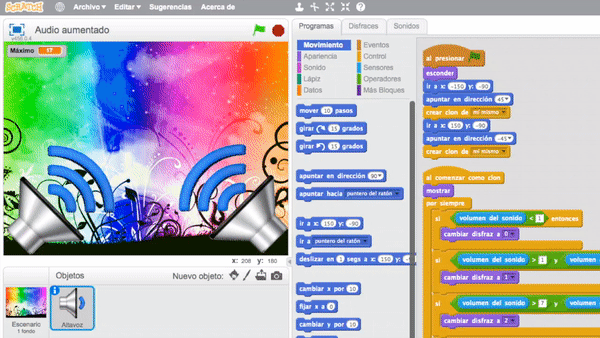
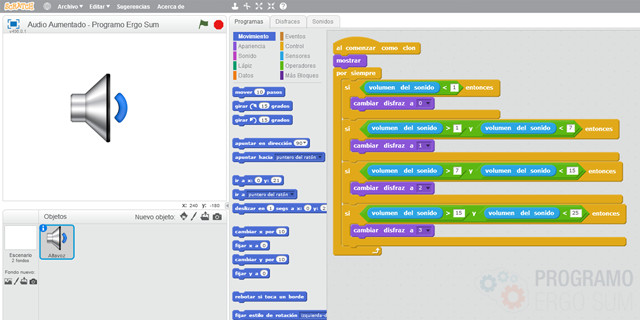
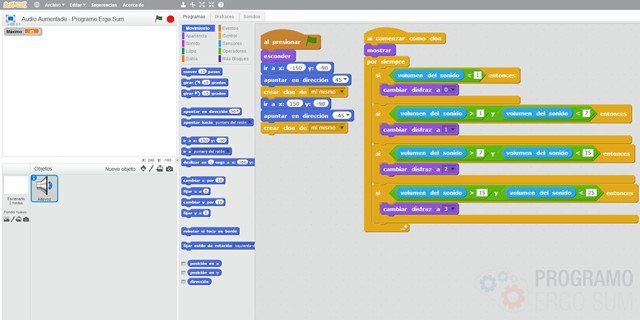
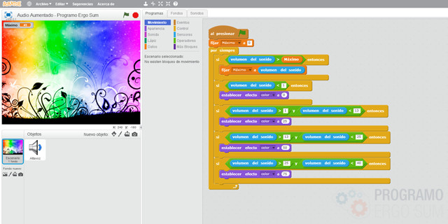

## Introducción

En este tutorial de realidad aumentada con Scratch 2.0 aprenderás a programar una sencilla aplicación. Para ello vamos a utilizar el micrófono para detectar el volúmen y cambiar de imagen representando las ondas de un altavoz. También se modificará el fondo añadiéndole un efecto de colores.

### Reinventa, programa y comparte

Antes de continuar con las lecciones de este curso de programación con Scratch te recomendamos seguir los siguientes pasos para reinventar y obtener todas las imágenes utilizadas en el videojuego gratis.

- Reinventa el proyecto [Efecto altavoz (base)](https://scratch.mit.edu/projects/147155203/editor) para obtener todas las imágenes.
- Programa el videojuego siguiendo los videotutoriales de las siguientes lecciones.
- Comparte el proyecto y si está entre los mejores aparecerá en la sección Mejores proyectos.

 

## Audio aumentado

  <iframe src="//www.youtube.com/embed/mPJpZwvC6co" allowfullscreen></iframe>

### Detectar el audio con Scratch

En este video te enseñamos cómo detectar el audio con Scratch. Para ello creamos un objeto con diferentes disfraces simulando las ondas de un altavoz. Recuerda que los disfraces deberán estar centrados en el centro del editor de dibujo para no crear efectos incorrectos.

En cuanto a la programación de la aplicación establecemos unos límites para cambiar de disfraz según el volumen de nuestro micrófono. Recuerda que deberás medir el volumen mínimo y máximo para establecer los puntos de corte deseados.

 

## Clones con scratch

  <iframe src="//www.youtube.com/embed/AdVlyWYgPvU" allowfullscreen></iframe>

### Clones con Scratch

Queremos situar dos altavoces en los extremos de la pantalla y podríamos pensar en duplicar el altavoz cambiándole las coordenadas. Sin embargo, en este vídeo explicamos cómo duplicarlo utilizando clones.

Utilizando clones con Scratch evitamos duplicar código siendo la programación más eficiente.

 

## Escenario

  <iframe src="//www.youtube.com/embed/jGjDf2mgzZs" allowfullscreen></iframe>

### Escenario al son de la voz

Un efecto que programamos en el video es el efecto de cambiar colores a través de la gama de colores que trae por defecto Scratch, pero también podéis utilizar otros efectos que le darán un efecto diferente como por ejemplo el ojo de pez, etc.

 

## Mejores proyectos

<!--

-->

 

## Materiales

- Efecto altavoz `Altavoz.sb2`
