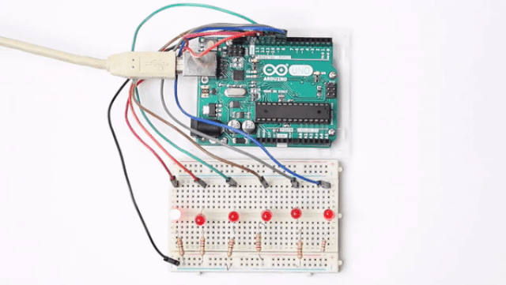
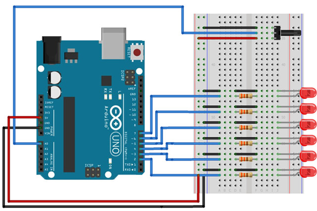
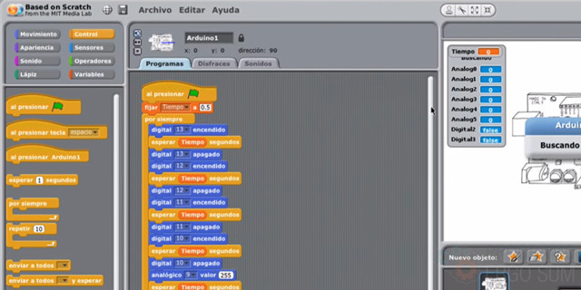
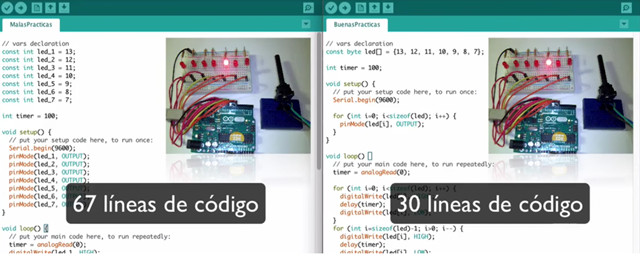

## Introducción

En este curso aprenderás a construir y programar el efecto de las luces del coche fantástico en Arduino. En las siguientes lecciones te explicamos paso a paso conceptos básicos de electrónica y programación que deberás conocer para construir la práctica.

### Materiales

Antes de continuar con las lecciones del curso asegúrate que dispones de todos los componentes que se van a necesitar. Los componentes utilizados en este tutorial son:

- Arduino UNO
- Protoboard
- Latiguillos
- Potenciómetro
- LEDs
- Resistencias

 

## Programación en S4A

  <iframe src="//www.youtube.com/embed/0WANe6ktTEc" allowfullscreen></iframe>

En esta lección te enseñamos la programación de las luces del coche fantástico programado en Scratch 4 Arduino (S4A) y en las siguientes lecciones explicaremos como construir sobre la placa de prototipado los diferentes leds y resistencias.

Lo primero que hay que hacer es crear un objeto de tipo Arduino que será donde se programarán todas las instrucciones que se comunican con la placa de Arduino.

En cuanto a la programación, utilizaremos un bucle que se repetirá siempre y dentro del bucle añadiremos las instrucciones de apagar y encender el led correspondiente durante una determinada cantidad de tiempo. Para reutilizar código se ha creado una variable que se inicializa al principio del bucle y que contiene el tiempo de espera entre encendido y apagado de cada led.

### Construcción del semáforo

  <iframe src="//www.youtube.com/embed/QnphMqVGE8A" allowfullscreen></iframe>

Siguiendo el esquema eléctrico y explicaciones proporcionadas en la lección anterior, conectamos los led y resistencias sobre la placa de prototipado y Arduino.

Siguiendo el esquema eléctrico de la lección anterior, conectamos los led y resistencias sobre la placa de prototipado y Arduino. Para reutilizar cables, conectamos todas las resistencias a la guía serigrafiada con el polo negativo de nuestra placa de prototipado. A continuación, conectamos los led a la resistencia. Para esta conexión se ha conectado la patilla más corta del led (cátodo o negativo) a la resistencia, y la patilla más larga (ánodo o positivo) al pin digital programado en nuestro programa S4A.

Por último, se conecta el cable de USB al equipo y pulsamos la bandera verde para ver el resultado de nuestro cruce de semáforos.

### Regular la velocidad con un potenciómetro

  <iframe src="//www.youtube.com/embed/C9UnmhfXAe4" allowfullscreen></iframe>

En esta lección te enseñamos como modificar la velocidad de los leds con ayuda de un potenciómetro. Para ello tenemos que modificar la programación para obtener el valor, y por otro lado añadir el componente sobre la placa de prototipado.

En cuanto a la programación es suficiente con añadir a la variable el valor que nos da el sensor conectado al pin analógico 0.

Por otro lado, el potenciómetro deberá estar conectado al sensor analógico 0 en su patilla central, y las otras se conectarán al 5V y GND respectivamente.

 

## Programación en Arduino IDE

En esta lección te vamos a enseñar una forma de programar este código, pero como podrás observar viendo el título, existe una forma mejor o más eficiente, que podrás ver en las siguientes lecciones.

El motivo de este video es para que observes que un programa se puede programar de muchas formas, pero siempre tenemos que intentar buscar la manera que nuestro código pueda ser reutilizable, escalable y mantenible.

### Malas prácticas

  <iframe src="//www.youtube.com/embed/7CoMjsU0aI4" allowfullscreen></iframe>

### Buenas prácticas

  <iframe src="//www.youtube.com/embed/7VJ_nCiII6w" allowfullscreen></iframe>

En este caso observa la reducción a la mitad del código fuente. Además de quedar más limpio y ordenado. Todo esto es lo que se persigue con el aprendizaje de la programación. Puedes ver todos los beneficios que conlleva la reutilización del código como comentamos en el video.

### Construcción del semáforo

  <iframe src="//www.youtube.com/embed/HFzhEpXn6yA" allowfullscreen></iframe>

Siguiendo el esquema eléctrico de la lección anterior, conectamos los led y resistencias sobre la placa de prototipado y Arduino. Para reutilizar cables, conectamos todas las resistencias a la guía serigrafiada con el polo negativo de nuestra placa de prototipado. A continuación, conectamos los led a la resistencia. Para esta conexión se ha conectado la patilla más corta del led (cátodo o negativo) a la resistencia, y la patilla más larga (ánodo o positivo) al pin digital programado en nuestro programa S4A.
