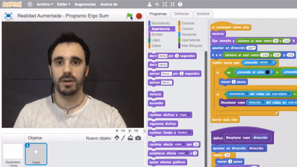
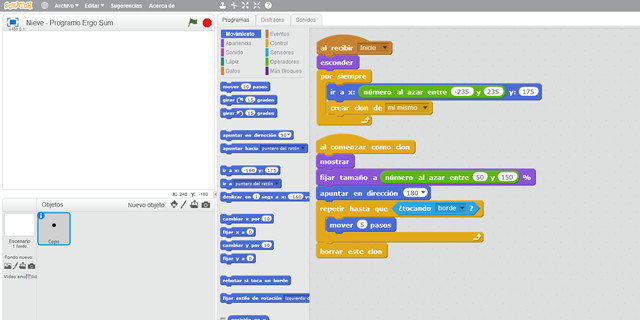
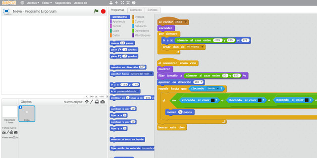
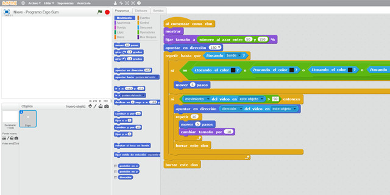

## Introducción

En este tutorial de realidad aumentada con Scratch 2.0 aprenderás a programar una sencilla aplicación. La aplicación que se va a programar consiste en el efecto de nieve. Para ello se creará un copo de nieve y con ayuda de los clones de Scratch parecerá que está nevando en nuestra habitación. Además, se podrá interactuar con los copos de nieve para que desaparezcan una vez los toquemos.

### Reinventa, programa y comparte

Antes de continuar con las lecciones de este curso de programación con Scratch te recomendamos seguir los siguientes pasos para reinventar y obtener todas las imágenes utilizadas en el videojuego gratis.

- Reinventa el proyecto [Efecto nieve (base)](https://scratch.mit.edu/projects/147157528/editor) para obtener todas las imágenes.
- Programa el videojuego siguiendo los videotutoriales de las siguientes lecciones.
- Comparte el proyecto y si está entre los mejores aparecerá en la sección Mejores proyectos.

 

## Clones con scratch

  <iframe src="//www.youtube.com/embed/oGvV2ThljMI" allowfullscreen></iframe>

### Copos de nieve

Lo primero que tenemos que hacer es importar o dibujar un copo de nieve con el editor de dibujo de Scratch. Utilizaremos solamente un copo de nieve ya que dicho copo tendrá que clonarse una y otra vez. Si todavía no sabes cómo programar clones con Scratch, puedes acceder al videojuego de pájaros programado con Scratch, de esta misma plataforma, donde se explica el concepto de los clones en la programación.

Una vez creado el objeto lo situaremos en el borde superior y de forma aleatoria sobre el eje horizontal. Utilizando un bucle se clonará y se desplazará hasta el borde inferior. En caso de tocar el fondo inferior deberá borrarse para que puedan seguir saliendo clones.

> En Scratch solamente podemos crear 120 clones, o lo que es lo mismo, 120 copos de nieve.

 

## Detectar zonas

  <iframe src="//www.youtube.com/embed/GBJ5qCCxPao" allowfullscreen></iframe>

### Detección de zonas

Como comentamos en el video, Scratch está desarrollado para iniciarse en la programación y no es un programa para programar realidad aumentada. Por este motivo la detección de colores no está tan desarrollada como en otros programas.

Para detectar colores utilizaremos una condición y el sensor correspondiente. La única diferencia es que ante una gama de colores deberemos utilizar varios sensores junto con el operador lógico como se explica en el vídeo.

 

## Movimientos aleatorios

  <iframe src="//www.youtube.com/embed/4OaPj4ObhSE" allowfullscreen></iframe>

### Movimientos aleatorios

Hasta ahora se ha programado el copo de nieve para que aparezca en el borde superior de la pantalla y se desplace hasta el fondo inferior, y una vez ahí se borre para que puedan seguir apareciendo nuevos copos de nieve. También se ha programado la detección de zonas para que el copo de nieve se pare según el color deseado.

En esta lección se va a programar el efecto que ocurre cuando nos movemos. Es decir, el copo de nieve que está parado en nuestro pelo se desplazará hacia una dirección aleatoria haciendo el efecto de que desaparece. Para programarlo utilizamos el sensor de Scratch que nos indica si se ha realizado un movimiento en el objeto clonado.

 

## Refactorización

  <iframe src="//www.youtube.com/embed/RcnhSCPqJXE" allowfullscreen></iframe>

### ¿Qué es la refactorización?

En ingeniería del software, el término refactorización se usa a menudo para describir la modificación del código fuente sin cambiar su comportamiento, lo que se conoce informalmente por limpiar el código. La refactorización se realiza a menudo como parte del proceso de desarrollo del software.

> La refactorización es la parte del mantenimiento del código que no arregla errores ni añade funcionalidad, símplemente limpia el código dejándolo más ordenado.

Probablemente hayas visto códigos de programación con Scratch que ocupan muchísimos bloques y has intentado modificar algo y lo has visto casi imposible. Sin embargo, si tenemos el código mejor programado utilizando buenas prácticas de programación, los cambios o mejoras futuras son más fáciles de programar. Por eso, en todos nuestros tutoriales de programación con Scratch y otros lenguajes de programación explicamos siempre estas buenas prácticas.

 

## Mejores proyectos

<!--

-->

 

## Materiales

- Efecto nieve `Nieve.sb2`
