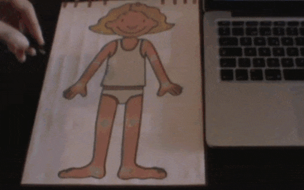
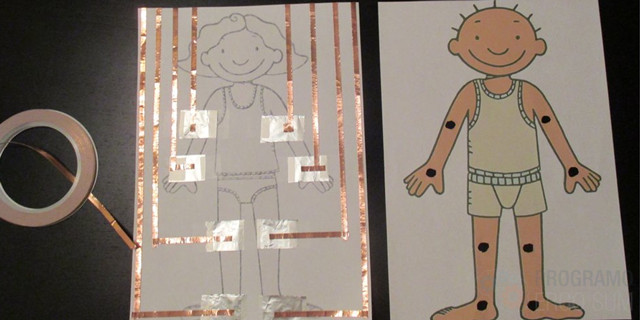
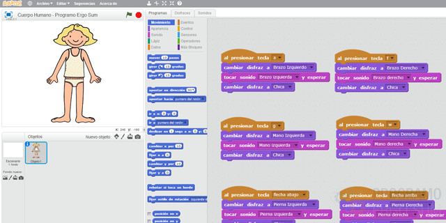

## Introducción

En este tutorial aprenderás a utilizar la placa de electrónica Makey-Makey junto al lenguaje de programación por bloques de Scratch para crear una aplicación educativa encargada de detectar las diferentes partes del cuerpo humano al mismo tiempo que se muestra un mensaje por la pantalla del ordenador.

> Con esta sencilla aplicación estaremos conectando el mundo físico con el mundo digital.

 

## Construcción de la plantilla

En en siguiente vídeo se muestra cómo crear una plantilla de ejemplo para llevarla al aula o crearla con tus alumnos en el aula. Para ello hemos utilizado una cartulina donde hemos impreso el dibujo de un niño.

Sobre la plantilla se han realizado unos pequeños orificios en las partes que queremos detectar (extremidades) y le hemos añadido los contactos de aluminio en la parte posterior. Se ha utilizado cinta conductora aunque otra opción podría haber sido mediante tiras finas de papel de aluminio.

  <iframe src="//www.youtube.com/embed/MD-aHaoXMow" allowfullscreen></iframe>

Como queremos que la plantilla sea duradera, hemos optado por plastificarla teniendo especial cuidado en los orificios de la parte delantera del dibujo para que todos los contactos queden visibles y puedan conectarse a las pinzas de cocodrilo.

 

## Programación con Scratch

En el siguiente vídeo se muestra la programación de la aplicación utilizando el lenguaje de programación por bloques de Scratch, y como puedes observar, es muy sencilla.

Lo único que tenemos que hacer es conectar cada conexión de nuestra placa de Makey-Makey y recordar a qué parte del cuerpo humano se corresponde, para que en Scratch solamente tengamos que activar el disfraz y sonido.

  <iframe src="//www.youtube.com/embed/m791U-d_qYk" allowfullscreen></iframe>

Recuerda que si conectamos el contacto de la flecha arriba en el brazo derecho, en la programación con Scratch habrá que indicarle que al presionar dicha tecla cambie el color de la extremidad y muestre el audio grabado.

 

## Consejos

En este proyecto estamos utilizando una placa Makey-Makey como la que se observa en la siguiente imagen, ya que vamos a necesitar 8 conexiones para conectar las extremidades superiores e inferiores. Las conexiones utilizadas en la placa son:

- Parte delantera: Flechas arriba, derecha, abajo e izquierda. Conectada mediante cocodrilos.
- Parte trasera: Letras f, a, g y w. Conectada mediante pines.

 

## Otros proyectos

En el blog [La Meva Escola](https://lamevaescola.com/el-cuerpo-humano-con-makey-makey-y-scratch/) han puesto en práctica una aplicación similar siguiendo este tutorial para interactuar entre la realidad y el mundo digital para los más peques del cole, niños y niñas de infantil de 3 años.

  <iframe src="//www.youtube.com/embed/epeL4rxz68A" allowfullscreen></iframe>

