## Introducción

En este curso aprenderás a programar diferentes prácticas utilizando las entradas analógicas de la placa de arduino. Para cada una se explica la parte de electrónica que deberás conocer antes de programarlas. Observarás además que puedes programarlas utilizando los lenguajes de programación por bloques o textual de Arduino.

- Práctica 1: Encendido nocturno
- Práctica 2: RGB crepuscular
- Práctica 3: Regulador de luz
- Práctica 4: Servomotor manual

### ¿Qué materiales voy a necesitar?

Antes de continuar con las lecciones del curso asegúrate que dispones de todos los componentes que se van a necesitar. Los componentes utilizados en este tutorial son:

- Arduino UNO
- Protoboard
- Latiguillos
- LEDs
- LED RGB
- Resistencias
- Sensor LDR
- Potenciómetro


<br />


## Entradas analógicas

Una señal analógica es aquella que puede tomar diferentes valores. Su forma característica es conocida como señal de onda senoidal y las representaciones se realizan en el dominio del tiempo. La función principal de las salidas analógicas es entregar una señal de control que le dará funcionalidad a un circuito electrónico que será el encargado de cumplir con las funciones que el usuario requiera.

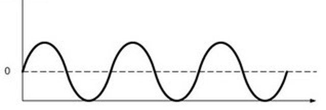

### Entradas analógicas en Arduino

En arduino disponemos de 6 pines para entradas analógicas serigrafiados con los números del A0 al A5. Estos pines son utilizados únicamente como entradas analógicas.

> La entrada analógica toma los valores comprendidos entre 0 y 1023.

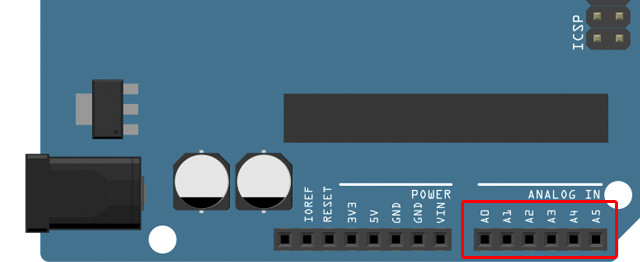

Es importante recordar que no podemos sobrepasar los límites de voltaje permitidos, es decir, si se aplica un voltaje mayor a 5 voltios en una entrada digital, la placa de arduino se quemará. Lo mismo aplica para voltajes negativos, por lo que debemos asegurar que el voltaje aplicado a una entrada digital se encuentre entre 0 y 5 voltios.

### Bloques de programación

Para programar las siguientes prácticas utilizando el lenguaje de programación por bloques de mBlock, deberás conocer los siguientes bloques de programación, encargados de recibir el valor en los pines analógicos de la placa de arduino.

El bloque lee la cantidad que recibe del sensor conectado, un valor comprendido entre 0 y 1023.

> Los pines para las entradas analógicas corresponden a los pines del A0 al A5 y pueden tomar valores comprendidos entre 0 y 1023.

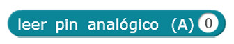

### Instrucciones de programación

Para programar las siguientes prácticas utilizando el lenguaje de programación textual de Arduino IDE, deberás conocer las siguientes instrucciones de programación.

**Función analogRead()**

La función analogRead(), utilizada normalmente en la función loop(), sirve para leer un valor un pin de entrada analógico. Los valores están comprendidos entre 0 y 1023. El valor leído puede ser almacenado en una variable o comprobarse dinámicamente en una condición.

```arduino
// Lee en "pin"
analogRead(pin);

// Ejemplo: Leer el pin analógico 0
analogRead(0);
```
 
**Función map()**

La función map() sirve para mapear de forma sencilla convirtiendo un rango de valores en otro rango.

```arduino
// Estrapolar un rango de valores en otro
map(valor, rango_final(inicio, fin), rango_inicial(inicio, fin));

// Ejemplo: Estrapolar la salida de un servo tomando el dato de la entrada analógica
map(valor, 0, 1023, 0, 255);
```

### Estructura de un programa en Arduino IDE

Todo programa para Arduino consta de 2 funciones; la función setup() y la función loop(). La función setup() es la primera función que se ejecuta en nuestro programa, ejecutándose sólo una vez, y se utiliza para configurar la comunicación con nuestro equipo, inicializar los pines de nuestra tarjeta de Arduino e inicialización de las variables.

```arduino
// La función setup() es la primera función en ejecutarse, una sola vez
void setup(){
  Instrucción 1
  Instrucción 2
  ...
  Instrucción N
}
```

La función loop() se ejecuta repetidamente después de la función setup(). Dentro de la misma vamos a introducir el programa que queremos ejecutar dentro de la placa de Arduino.

```arduino
// La función loop() se ejecuta repetidamente en modo bucle infinito
void loop(){
  Instrucción 1
  Instrucción 2
  ...
  Instrucción N
}
```

### Sintaxis de programación en Arduino IDE

Es importante tener claras las siguientes reglas del lenguaje de programación:

- Toda línea termina en punto y coma ";" excepto las estructuras de control que se acompañan con llaves "{}".
- Las instrucciones y variables son sensibles a mayúsculas y minúsculas, es decir, debemos respetar el nombre exacto.
- Las instrucciones que comienzan por el símbolo de doble barra "//" se tomará como comentario para el programa. También se dispone de comentarios de múltiples líneas /* */.


<br />


## Práctica 1: Encendido nocturno

El objetivo de esta práctica es encender un LED utilizando un sensor de luz LDR, es decir, queremos que se encienda el LED cuando cae la noche y oscurece. En caso contrario el LED permanecerá apagado. Para ello utilizaremos un sensor LDR.

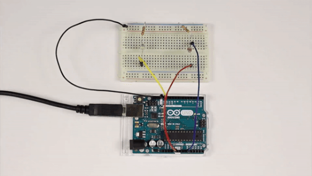

### Materiales

- 1 Arduino UNO
- 1 Protoboard
- 4 Latiguillos
- 1 LED
- 1 Sensor LDR
- 1 Resistencia de 220Ω (rojo-rojo-marrón)
- 1 Resistencia de 10KΩ (marrón-negro-naranja)

### Esquema eléctrico

Por un lado se conecta el LED al pin digital 13 de la placa de arduino (utilizando su debida resistencia). Por otro lado, se conecta el sensor LDR al pin analógico 0 de la placa de arduino (utilizando la resistencia en modo Pull-Down).

```
V = 5V - 2.1V = 2.9V
I = 20mA

V = I x R ; R = V / I

R = 2.9V / 0.02A = 145Ω -> 220Ω (por aproximación)
```

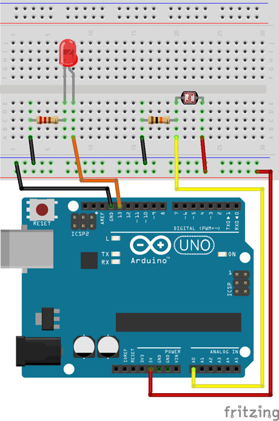

### Programación en mBlock

Al ejecutar el código se calcula el valor del sensor analógico conectado al pin 0 de la placa de arduino, y en caso de ser superior al valor 150 se activará la salida digital 13 encendiendo el LED. En caso contrario el LED permanecerá apagado.

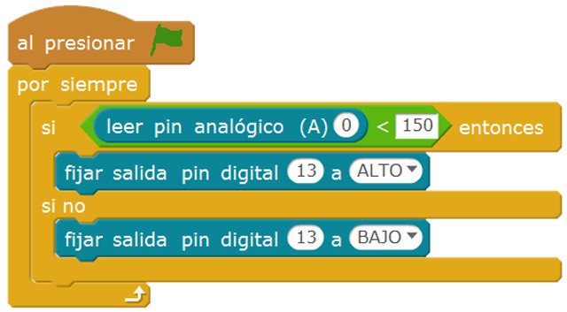

### Programación en Arduino IDE

n primer lugar, se configura el pin digital 13 en modo salida (OUTPUT). Esta configuración se establece en la función setup(), ya que solamente se ejecuta una vez.

Por otro lado, en la función loop() se calcula el valor del sensor analógico conectado al pin de entrada analógica 0 de la placa de arduino, y en caso de ser superior al valor 150 se activará la salida digital 13 encendiendo el LED. En caso contrario el LED permanecerá apagado.

```arduino
void setup() {
  pinMode(13, OUTPUT);
}

void loop() {
  if (analogRead(0) > 150) {
    digitalWrite(13, HIGH);
  }
  else {
    digitalWrite(13, LOW);
  }
}
```


<br />


## Práctica 2: LED RGB crepuscular

El objetivo de esta práctica es cambiar los colores de un LED RGB utilizando un sensor de luz LDR, es decir, queremos que se encienda en diferentes colores a medida que oscurece pasando por una gama de colores. Para ello utilizaremos un sensor LDR y un LED RGB de ánodo común.

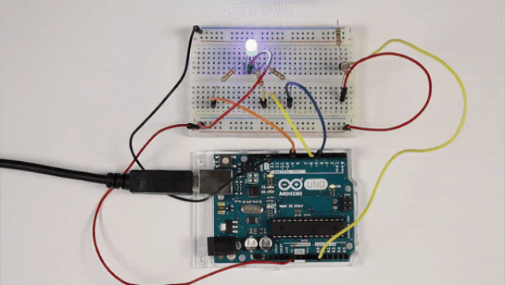

### Materiales

- 1 Arduino UNO
- 1 Protoboard
- 7 Latiguillos
- 1 LED RGB de ánodo común
- 1 Sensor LDR
- 1 Resistencia de 100Ω (marrón-negro-marrón)
- 2 Resistencia de 220Ω (rojo-rojo-marrón)
- 1 Resistencia de 10KΩ (marrón-negro-naranja)

### Esquema eléctrico

Por un lado se conecta el LED RGB de ánodo común a los pines 9, 6 y 5 (RGB) de la placa de arduino (utilizando su debida resistencia). Por otro lado, se conecta el sensor LDR al pin de entrada analógica 0 de la placa de arduino (utilizando la resistencia en modo Pull-Down).

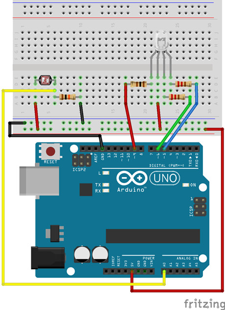

### Programación en mBlock

Al ejecutar el código se calcula el valor analógico del sensor LDR y mediante condiciones creamos los diferentes casos; si es mayor que 600 se enciende el color rojo (mediante una llamada por eventos), si el valor está entre 300 y 600 se encenderá el color verde, y si es menor que 300 se encenderá el color azul.

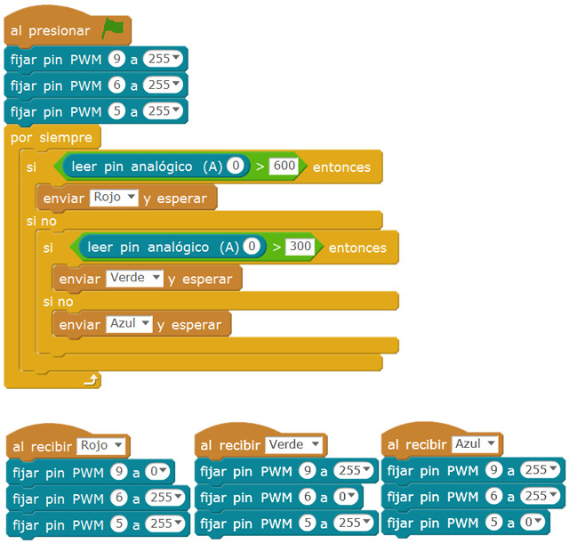

### Programación en Arduino IDE

En primer lugar, se configuran los pines analógicos 9, 6 y 5 en modo salida (OUTPUT). Esta configuración se establece en la función setup(), ya que solamente se ejecuta una vez.

Por otro lado, al ejecutar el código se calcula el valor analógico del sensor LDR y mediante condiciones creamos los diferentes casos; si es mayor que 600 se enciende el color rojo, si el valor está entre 300 y 600 se encenderá el color verde, y si es menor que 300 se encenderá el color azul.

```arduino
void setup() {
  pinMode(9, OUTPUT);
  pinMode(6, OUTPUT);
  pinMode(5, OUTPUT);

  analogWrite(9, 0);
  analogWrite(6, 0);
  analogWrite(5, 0);
}

void loop() {
  if (analogRead(0) < 300) {
    analogWrite(9, 0);
    analogWrite(6, 255);
    analogWrite(5, 255);
  } else if (analogRead(0) < 600) {
    analogWrite(9, 255);
    analogWrite(6, 0);
    analogWrite(5, 255);
  } else {
    analogWrite(9, 255);
    analogWrite(6, 255);
    analogWrite(5, 0);
  }
}
```


<br />


## Práctica 3: Regulador de luz

El objetivo de esta práctica es regular la intensidad de 3 LEDs utilizando un potenciómetro, es decir, podemos variar la cantidad de luz que emiten los LEDs girando el potenciómetro desde su posición de resistencia mínima a resistencia máxima.


### Materiales

- 1 Arduino UNO
- 1 Protoboard
- 7 Latiguillos
- 3 LEDs
- 3 Resistencia de 100Ω (marrón-negro-marrón)
- 1 Potenciómetro

### Esquema eléctrico

Por un lado se conectan los LEDs a los pines 9, 6 y 5 de la placa de arduino (utilizando su debida resistencia). Por otro lado, se conecta el potenciómetro al pin analógico 0 de la placa de arduino.

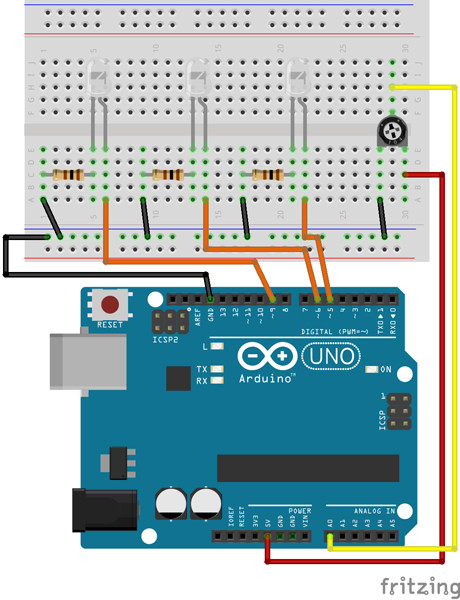

### Programación en mBlock

Al ejecutar el código se calcula el valor analógico del potenciómetro y se almacena en una variable. A continuación se interpola el valor obtenido en la entrada analógica a través del potenciómetro (o-1023) con el valor de salida analógica (0-255). Todos los LEDs se encenderán con la misma intensidad fijada en la variable.

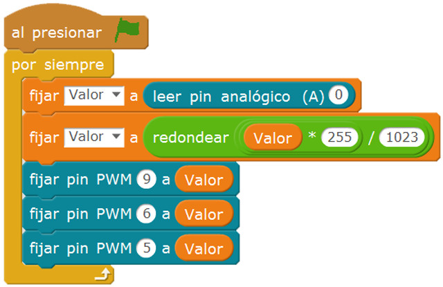

### Programación en Arduino IDE

En primer lugar, se configuran los pines analógicos 9, 6 y 5 en modo salida (OUTPUT). Esta configuración se establece en la función setup(), ya que solamente se ejecuta una vez.

Al ejecutar el código se calcula el valor analógico del potenciómetro y se almacena en una variable. A continuación se interpola utilizando la función map() el valor obtenido en la entrada analógica a través del potenciómetro (o-1023) con el valor de salida analógica (0-255). Todos los LEDs se encenderán con la misma intensidad fijada en la variable.

```arduino
void setup() {
  pinMode(9, OUTPUT);
  pinMode(6, OUTPUT);
  pinMode(5, OUTPUT);
}

void loop() {
  int valor = analogRead(0);
  valor = map(valor, 0, 1023, 0, 255);

  analogWrite(9, valor);
  analogWrite(6, valor);
  analogWrite(5, valor);
  delay(15);
}
```


<br />


## Práctica 4: Servomotor con potenciómetro

El objetivo de esta práctica es regular el ángulo de un servomotor con ayuda de un potenciómetro, es decir, según se gira el potenciómetro desde su posición de resistencia mínima a resistencia máxima, el servomotor girará entre sus valores de 0º y 180º.

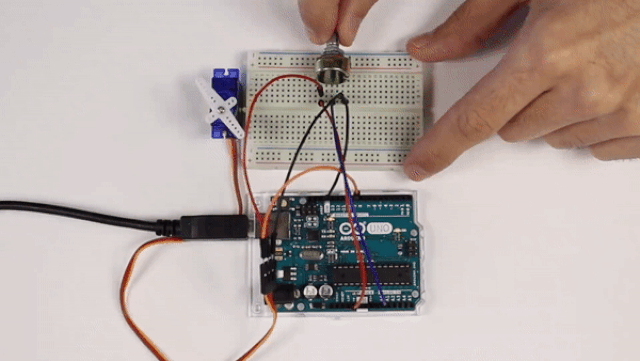

### Materiales

- 1 Arduino UNO
- 1 Protoboard
- 6 Latiguillos
- 1 Servomotor
- 1 Potenciómetro

### Esquema eléctrico

Conectamos el cable rojo (positivo del servomotor) al pin 5V de la placa de arduino, el cable negro (negativo del servomotor) al pin GND de la placa de arduino y el color amarillo al pin analógico PWM 9 de la placa de arduino. Por otro lado, se conecta el potenciómetro al pin 0 de la entrada analógica de arduino.

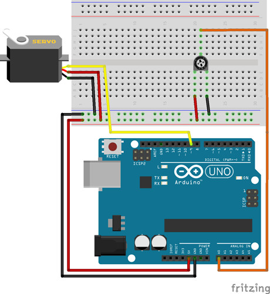

### Programación en mBlock

Al ejecutar el código se calcula el valor analógico del potenciómetro y se almacena en una variable. A continuación se interpola el valor obtenido en la entrada analógica a través del potenciómetro (o-1023) con el valor de salida analógica (0-180) correspondiente a los valores admitidos por el servomotor.

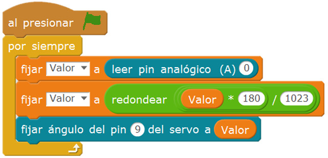

### Programación en Arduino IDE

En primer lugar, se importa la librería a utilizar <Servo.h> y se inicializa el objeto llamado servomotor. Además se configura el pin analógico PWM 9 a utilizar por el servomotor. Esta configuración se establece en la función setup(), ya que solamente se ejecuta una vez.

Por otro lado, al ejecutar el código se calcula el valor analógico del potenciómetro y se almacena en una variable. A continuación se interpola el valor obtenido en la entrada analógica a través del potenciómetro (o-1023) con el valor de salida analógica (0-180) correspondiente a los valores admitidos por el servomotor.

```arduino
#include <Servo.h> 

Servo servomotor;

void setup() {
  servomotor.attach(9);
}

void loop() {
  int angulo = analogRead(0);
  angulo = map(angulo, 0, 1023, 0, 180);

  servomotor.write(angulo);
  delay(15);
}
```


<br />


## Materiales 

- Encendido nocturno - Esquema eléctrico `fritzing.fzz`
- Encendido nocturno en mBlock `mblock.sb2`
- Encendido nocturno en Arduino IDE `arduino.ino`
- RGB crepuscular - Esquema eléctrico `fritzing.fzz`
- RGB crepuscular en mBlock `mblock.sb2`
- RGB crepuscular en Arduino IDE `arduino.ino`
- Regulador de luz - Esquema eléctrico `fritzing.fzz`
- Regulador de luz en mBlock `mblock.sb2`
- Regulador de luz en Arduino IDE `arduino.ino`
- Servomotor manual - Esquema eléctrico `fritzing.fzz`
- Servomotor manual en mBlock `mblock.sb2`
- Servomotor manual en Arduino IDE `arduino.ino`
- Sensor de temperatura - Esquema eléctrico `fritzing.fzz`
- Sensor de temperatura en mBlock `mblock.sb2`
- Sensor de temperatura en Arduino IDE `arduino.ino`
