## Introducción

En este curso aprenderás a programar diferentes prácticas utilizando las entradas digitales de la placa de arduino. Para cada una se explica la parte de electrónica que deberás conocer antes de programarlas. Observarás además que puedes programarlas utilizando los lenguajes de programación por bloques o textual de Arduino.

- Práctica 1: Pulsador simple
- Práctica 2: Medidor de distancias
- Práctica 3: Detector de aparcamiento

### ¿Qué materiales voy a necesitar?

Antes de continuar con las lecciones del curso asegúrate que dispones de todos los componentes que se van a necesitar. Los componentes utilizados en este tutorial son:

- Arduino UNO
- Protoboard
- Latiguillos
- LEDs
- Resistencias
- Pulsadores
- Ultrasonidos
- Zumbador


<br />


## Entradas digitales

Una señal digital es aquella que sólo puede tomar ciertos valores (alto o bajo). Su forma característica es conocida como señal de onda cuadrada y las representaciones se realizan en el dominio del tiempo. La función principal de las salidas digitales es entregar una señal de control que le dará funcionalidad a un circuito electrónico que será el encargado de cumplir con las funciones que el usuario requiera.

> Los sistemas electrónicos manejan este tipo de señales binarias..

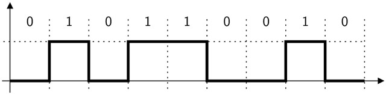

### Entradas digitales en Arduino

Las entradas digitales permiten recibir señales de voltaje. En arduino disponemos de 14 pines digitales serigrafiados con los números del 0 al 13, utilizados para entradas y salidas digitales.

> La entrada digital toma los valores 0V (bajo) ó 5V (alto).

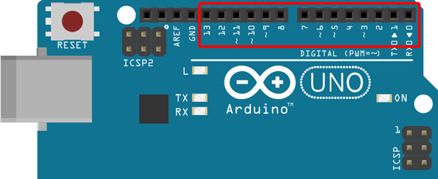

Es importante recordar que no podemos sobrepasar los límites de voltaje permitidos, es decir, si se aplica un voltaje mayor a 5 voltios en una entrada digital, la placa de arduino se quemará. Lo mismo aplica para voltajes negativos, por lo que debemos asegurar que el voltaje aplicado a una entrada digital se encuentre entre 0 y 5 voltios.

### Bloques de programación

Para programar las siguientes prácticas utilizando el lenguaje de programación por bloques de mBlock, deberás conocer los siguientes bloques de programación, encargados de recibir el voltaje en los pines digitales de la placa de arduino.

El primer bloque recibe el valor del pin digital 9 de la placa de arduino. Por otro lado, el segundo bloque es utilizado en los sensores de ultrasonidos, y devuelve la distancia en centímetros del objeto más cercano al sensor (como se explica en la siguiente lección).

> Los pines para las entradas digitales corresponden a los pines desde el 0 hasta el 13 y toman los valores ALTO o BAJO.

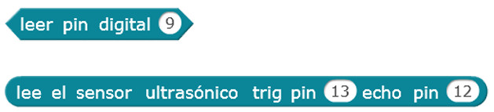

### Instrucciones de programación

Para programar las siguientes prácticas utilizando el lenguaje de programación textual de Arduino IDE, deberás conocer las siguientes instrucciones de programación.

**Función pinMode()**

La función pinMode(), utilizada en la función setup(), sirve para configurar el modo de trabajo de un pin pudiendo ser INPUT (entrada) u OUTPUT (salida).

```arduino
// Configura "pin" como salida
pinMode(pin, OUTPUT);

// Ejemplo: Activar el pin digital 13 como salida
pinMode(13, OUTPUT);
```
 
**Función digitalRead()**

La función digitalRead(), utilizada normalmente en la función loop(), sirve para leer un valor (o poner en un estado) un pin digital. Los valores o estados posibles son HIGH (alto) o LOW (bajo). El valor leído puede ser almacenado en una variable o comprobarse dinamicamente en una condición.

```arduino
// Lee en "pin"
digitalRead(pin);

// Ejemplo: Leer el pin digital 2
digitalRead(2);
```

**Función pulseIn()**

La función delay() sirve para detener el flujo del programa durante una cantidad de tiempo. Dicha cantidad de tiempo está representada en milisegundos.

```arduino
// Obtener el tiempo transcurrido hasta el valor alto
digitalWrite(trigger, LOW);
pulseIn(echo, HIGH);

// Ejemplo: Tiempo transcurrido entre el cambio de estados
digitalWrite(13, LOW);
pulseIn(12, HIGH);
```

**Función delayMicroseconds()**

La función delayMicroseconds() sirve para detener el flujo del programa durante una cantidad de tiempo. Dicha cantidad de tiempo está representada en milisegundos.

```arduino
// Espera una determinada cantidad de microsegundos
delayMicroseconds(microsegundos);

// Ejemplo: Esperar 10 microsegundos
delayMicroseconds(10);
```

### Estructura de un programa en Arduino IDE

Todo programa para Arduino consta de 2 funciones; la función setup() y la función loop(). La función setup() es la primera función que se ejecuta en nuestro programa, ejecutándose sólo una vez, y se utiliza para configurar la comunicación con nuestro equipo, inicializar los pines de nuestra tarjeta de Arduino e inicialización de las variables.

```arduino
// La función setup() es la primera función en ejecutarse, una sola vez
void setup(){
  Instrucción 1
  Instrucción 2
  ...
  Instrucción N
}
```

La función loop() se ejecuta repetidamente después de la función setup(). Dentro de la misma vamos a introducir el programa que queremos ejecutar dentro de la placa de Arduino.

```arduino
// La función loop() se ejecuta repetidamente en modo bucle infinito
void loop(){
  Instrucción 1
  Instrucción 2
  ...
  Instrucción N
}
```

### Sintaxis de programación en Arduino IDE

Es importante tener claras las siguientes reglas del lenguaje de programación:

- Toda línea termina en punto y coma ";" excepto las estructuras de control que se acompañan con llaves "{}".
- Las instrucciones y variables son sensibles a mayúsculas y minúsculas, es decir, debemos respetar el nombre exacto.
- Las instrucciones que comienzan por el símbolo de doble barra "//" se tomará como comentario para el programa. También se dispone de comentarios de múltiples líneas /* */.


<br />


## Práctica 1: Encender un LED mediante pulsador

El objetivo de esta práctica es encender un LED utilizando un simple pulsador, es decir, se va a programar un código encargado de detectar si se pulsa el pulsador (haciendo uso de la entrada digital), en cuyo caso se encenderá el LED (haciendo uso de la salida digital). Para ello se va a construir un circuito utilizando un LED y un pulsador.

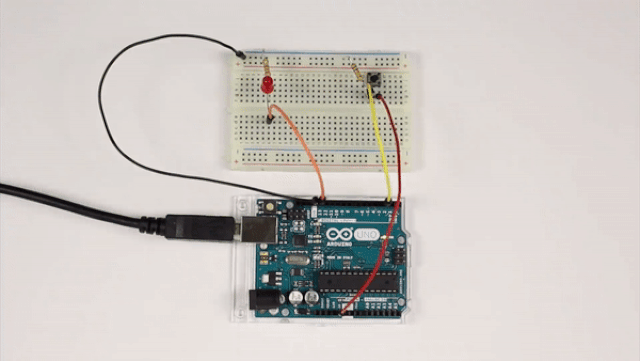

### Materiales

- 1 Arduino UNO
- 1 Protoboard
- 4 Latiguillos
- 1 LED
- 1 Pulsador
- 1 Resistencia de 220Ω (rojo-rojo-marrón)
- 1 Resistencia de 10KΩ (marrón-negro-naranja)

### Esquema eléctrico

Por un lado se conecta el LED al pin digital 13 de la placa de arduino (utilizando su debida resistencia). Por otro lado, se conecta el pulsador al pin digital 2 de la placa de arduino (utilizando la resistencia en modo Pull-Down).

```
V = 5V - 2.1V = 2.9V
I = 20mA

V = I x R ; R = V / I

R = 2.9V / 0.02A = 145Ω -> 220Ω (por aproximación)
```

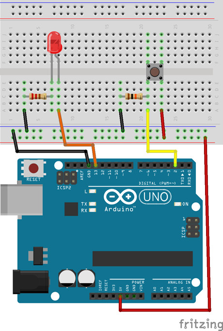

### Programación en mBlock

Al ejecutar el código se deberá detectar en todo momento si se ha pulsado el pulsador conectado al pin digital 2, en cuyo caso se establecerá el valor alto al pin digital 13, el cual está conectado al LED.

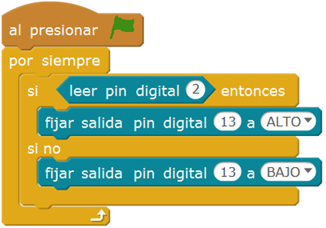

### Programación en Arduino IDE

En primer lugar, se configura el pin digitales 13 en modo salida (OUTPUT) y el pin digital 2 en modo entrada (INPUT). Esta configuración se establece en la función setup(), ya que solamente se ejecuta una vez.

Al ejecutar el código se deberá detectar en todo momento si se ha pulsado el pulsador conectado al pin digital 2, en cuyo caso se establecerá el valor alto al pin digital 13, el cual está conectado al LED.

```arduino
void setup() {
  pinMode(13, OUTPUT);
  pinMode(2, INPUT);
}

void loop() {
  if (digitalRead(2) == HIGH) {
    digitalWrite(13, HIGH);
  }
  else {
    digitalWrite(13, LOW);
  }
}
```


<br />


## Práctica 2: Medidor de distancia con ultrasonidos

El objetivo de esta práctica es medir la distancia entre objetos próximos comprendidos entre unos cuantos centímetros. Para ello se va a utilizar un sensor de ultrasonidos.

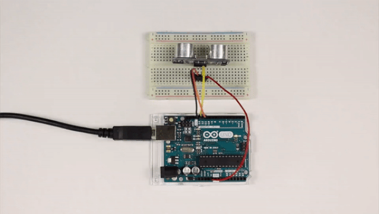

### Materiales

- 1 Arduino UNO
- 1 Protoboard
- 4 Latiguillos
- 1 Ultrasonidos

### Esquema eléctrico

Fijándonos en los pines del sensor de ultrasonidos, se conecta el pin Vcc al pin 5V de la placa de arduino, el GND al GND de la placa de arduino, y los pines triger y echo a los pines 13 y 12 respectivamente.

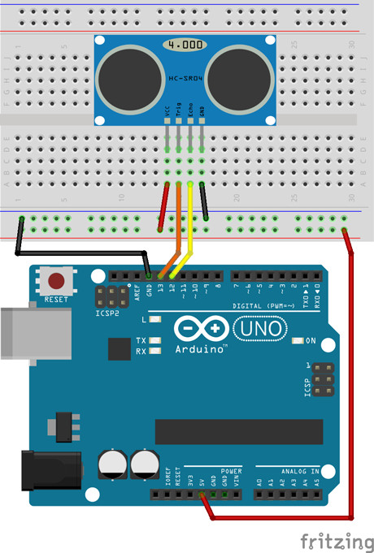

### Programación en mBlock

Al ejecutar el código se deberá detectar la distancia mediante el bloque que devuelve la distancia en centímetros. Además el valor se guardará en una variable para mostrarla por la pantalla.

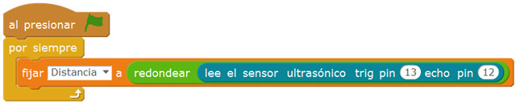

### Programación en Arduino IDE

En primer lugar, se configura el pin digitales 13 en modo salida (OUTPUT) y el pin digital 12 en modo entrada (INPUT). Esta configuración se establece en la función setup(), ya que solamente se ejecuta una vez. Además se establece el pin digital 13 a un valor bajo (LOW).

Al ejecutar el código se establece el pin digital 13 a un valor alto (HIGH) y bajo (LOW) rápidamente durante 10 microsegundos. Este es el estado que cambia y deberá detectar el pin digital 12, el cual almacena en una variable el tiempo transcurrido. Solamente quedará calcular la distancia conociendo la velocidad del sonido y dividiendo el resultado entre 2 ya que se trata de ida y vuelta.

> Para ver los valores de distancias deberás abrir el monitor serial.

```arduino
void setup() {
  Serial.begin(9600);
  pinMode(13, OUTPUT);
  pinMode(12, INPUT);

  digitalWrite(13, LOW);
}

void loop() {
  digitalWrite(13, HIGH);
  delayMicroseconds(10);
  digitalWrite(13, LOW);

  long tiempo;
  tiempo = pulseIn(12, HIGH);

  // Velocidad Sonido = 343 m/s
  float distancia = 34300*tiempo*0.000001;
  distancia = distancia / 2;

  Serial.print("Distancia: ");
  Serial.println(distancia);
}
```


<br />


## Práctica 3: Detector de aparcamiento con ultrasonidos

El objetivo de esta práctica es medir la distancia entre objetos simulando el detector de aparcamiento con zumbador existente en algunos vehículos. Para ello se va a utilizar un sensor de ultrasonidos.

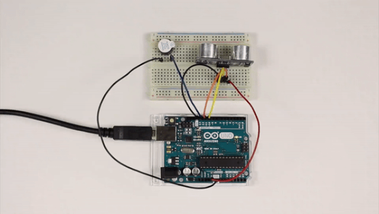

### Materiales

- 1 Arduino UNO
- 1 Protoboard
- 6 Latiguillos
- 1 Ultrasonidos
- 1 Zumbador

### Esquema eléctrico

Fijándonos en los pines del sensor de ultrasonidos, se conecta el pin Vcc al pin 5V de la placa de arduino, el GND al GND de la placa de arduino, y los pines triger y echo a los pines 12 y 11 respectivamente. Por otro lado se conecta el zumbador al pin digital 13 de la placa de arduino.

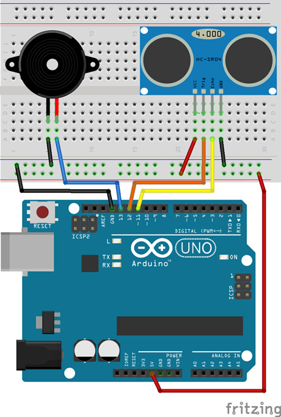

### Programación en mBlock

Al ejecutar el código se deberá detectar la distancia mediante el bloque que devuelve la distancia en centímetros y almacenarla en una variable. De esta forma en caso de estar a más de 30 centímetros el zumbador permanecerá desactivado. En caso de estar a menos 10 centímetros se activará de forma fija, y si se encuentra entre 10 y 30 centímetros irá aumentando la velocidad del zumbador en base a una constante de 5 milisegundos.

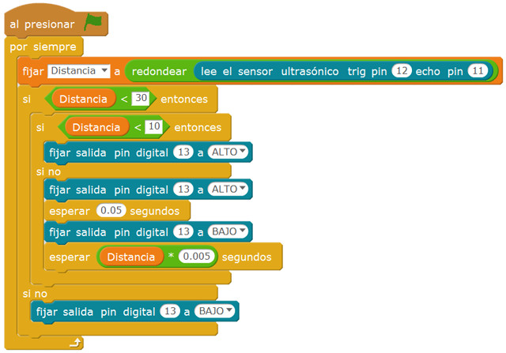

### Programación en Arduino IDE

En primer lugar, se configura el pin digitales 13 y 12 en modo salida (OUTPUT) y el pin digital 11 en modo entrada (INPUT). Esta configuración se establece en la función setup(), ya que solamente se ejecuta una vez. Además se establece el pin digital 12 a un valor bajo (LOW).

Al ejecutar el código se deberá detectar la distancia mediante el bloque que devuelve la distancia en centímetros y almacenarla en una variable. De esta forma en caso de estar a más de 30 centímetros el zumbador permanecerá desactivado. En caso de estar a menos 10 centímetros se activará de forma fija, y si se encuentra entre 10 y 30 centímetros irá aumentando la velocidad del zumbador en base a una constante de 5 milisegundos.

```arduino
void setup() {
  pinMode(13, OUTPUT);
  pinMode(12, OUTPUT);
  pinMode(11, INPUT);

  //Inicialización  de los pines
  digitalWrite(13, LOW);
  digitalWrite(12, LOW);
}

//Este código se ejecuta en bucle repetidamente
void loop() {
  digitalWrite(12, HIGH);
  delayMicroseconds(10);
  digitalWrite(12, LOW);

  long tiempo;
  tiempo = pulseIn(11, HIGH);

  // Velocidad Sonido = 343 m/s
  float distancia = 34300*tiempo*0.000001;
  distancia = distancia / 2;
  
  if(int(distancia)<30){
    if(int(distancia)<10){
      digitalWrite(13, HIGH);
    }else{
      digitalWrite(13, HIGH);
      delay(50);
      digitalWrite(13, LOW);
      delay(distancia*5);
    }
  }else{
    digitalWrite(13, LOW);
  }
}
```
