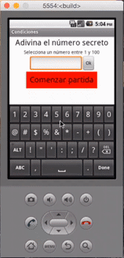
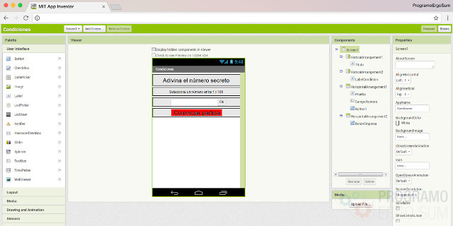
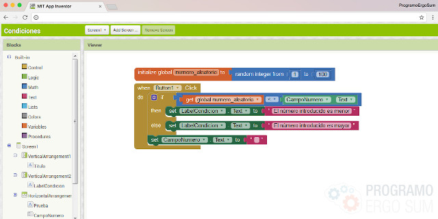
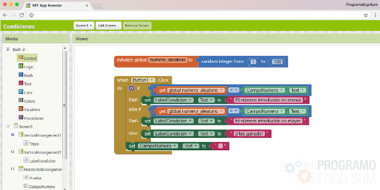
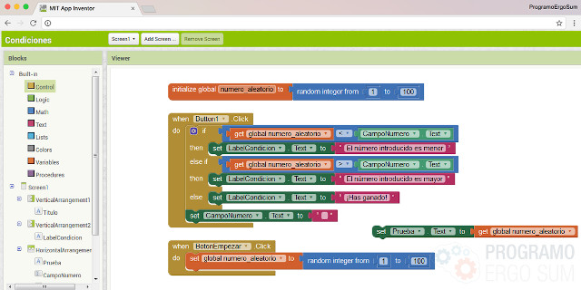

## Introducción

En este curso online de programación de aplicaciones AppInventor aprenderás a utilizar los campos de texto y condiciones para programar un sencillo juego que consiste en adivinar un número aleatorio entre un valor mínimo y máximo.

 

## Diseño de la aplicación

  <iframe src="//www.youtube.com/embed/JGX8VeKZDP0" allowfullscreen></iframe>

Para realizar la aplicación de adivinar un número con AppInventor en primer lugar diseñaremos la aplicación y a continuación programaremos la funcionalidad mediante el lenguaje de bloques.

En este video aprenderás las técnicas básicas de configuración inicial y cuadrícula de la aplicación. Para ello se inicializan las propiedades de la pantalla y dentro de la misma añadimos los diferentes componentes a utilizar, en este caso nos referimos a las etiquetas, campo de texto y botón.

En la siguiente imagen se puede observar la jerarquía que se ha seguido para representar sobre la cuadrícula los diferentes componentes.

 

## Programación principal

  <iframe src="//www.youtube.com/embed/usvG0JDD_Y0" allowfullscreen></iframe>

En este video programamos mediante bloques las condiciones necesarias para saber cuándo un número es mayor que otro utilizando los bloques matemáticos y lógicos. Para ello debemos acceder al partado de bloques para programar la lógica.

La programación es sencilla y consiste en añadir un evento al botón que calcula si el número introducido en el campo de texto es mayor o menor que el número a adivinar. Lógicamente, el número adivinar deberá almacenarse en una variable que se inicializará al comenzar la aplicación.

 

## Propuesta condiciones

  <iframe src="//www.youtube.com/embed/EuY9rcZ7JA8" allowfullscreen></iframe>

Para resolver la propuesta que se proponía en el video anterior consiste en añadir una condición anidada en el bucle. De esta forma estamos comprobando los 3 casos, es decir, cuando el número es maoyr, es menor o por el contrario es igual que el número que tenemos que adivinar.

 

## Mejoras de la app

  <iframe src="//www.youtube.com/embed/kraO5okHPZE" allowfullscreen></iframe>

En el vídeo anterior se propone añadir un botón a la aplicación para que se pueda iniciar la partida siempre que queramos. Para ello debemos añadir en primer lugar el nuevo botón en la sección de diseño de la aplicación, y a continuación añadir la programación que se encargará de inicializar los datos a sus valores iniciales.

