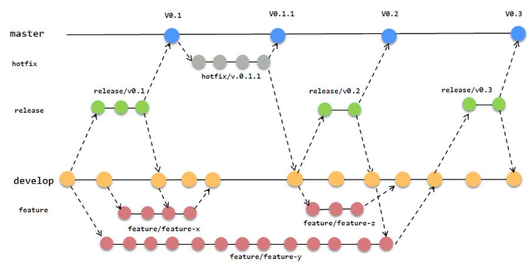

## Introducción

En este tutorial vamos a explicar cómo trabajar con ramas en Git de una forma muy sencilla, gracias a la herramienta [Git-Flow](https://github.com/nvie/gitflow) de Vincent Driessen.


<br />


## ¿Qué es Git-Flow?

Git-Flow es una herramienta diseñada para el control de versiones en Git que define un modelo de ramificación robusto para gestionar proyectos de desarrollo de software.



El modelo de GitFlow cuenta con dos ramas principales, **master** y **develop**, y varias de soporte para estas que podrán ser ramas de **feature**, **release** y **hotfix**.

- La rama **master** es la que contiene la última versión de nuestro proyecto y usaremos para desplegar en producción.
- La rama **develop** es la que contiene el último estado del desarrollo del mismo, es decir, hasta el último commit que hayamos hecho.
- Las ramas de **feature** se usarán para desarrollar nuevas funcionalidades, se crearán a partir de la rama develop y al terminar se fusiona con develop.
- Las ramas **release** se usarán para lanzar una nueva versión de nuestro proyecto y se fusionaran tanto con master como con develop.
- Las ramas **hotfix** se usarán para cambios rápidos sobre la rama master y se fusionan con master y develop.


<br />


## Instalar GitFlow

Para instalarlo sobre nuestro PC en Linux basta con lanzar la siguiente instrucción sobre la terminal:

```sh
migueabellan@Ubuntu:~ $ sudo apt install git-flow
```

Una vez instalado y desde el directorio raiz de nuestro proyecto, tenemos que inicializarlo de forma similar a como hacemos con Git. Esto nos hará una serie de preguntas sobre como queremos nombrar a las diferentes ramas, el prefijo de nuestras versiones, etc. 

```sh
migueabellan@Ubuntu:~ $ git flow init
```

Tras la inicialización observaremos que nos encontramos sobre la rama develop de nuestro repositorio. Algo similar a lo siguiente:

```sh
migueabellan@Ubuntu:~/miproyecto (develop) $ |
```

## Ramas Features

Para empezar a desarrollar una nueva funcionalidad tenemos que crearla mediante el comando `git flow feature start [nombre]`, por ejemplo:

```sh
migueabellan@Ubuntu:~ $ git flow feature start nueva_feature
```

Observaremos que de forma automática se ha creado la rama `nueva_feature` y estamos trabajando sobre dicha rama:

```sh
migueabellan@Ubuntu:~/miproyecto (develop/nueva_feature) $ |
```

Una vez consideres que has terminado la funcionalidad y tras comitear los cambios, se finaliza la rama fusionando de forma automática todos los cambios sobre la rama develop. Utilizaremos el siguiente comando:

```sh
migueabellan@Ubuntu:~ $ git flow feature finish nueva_feature
```

## Ramas Releases

Después de haber desarrollado unas cuantas features y haberlas commiteado, queremos liberar una nueva versión de nuestro proyecto y para ello utilizaremos la rama releases de forma similar a la anterior. Es decir, creamos la rama utilizando el comando `git flow release start [nombre_version]` y una vez finalizado los cambios cerramos la rama mediante el comando `git flow release finish [nombre_version]`.

```sh
migueabellan@Ubuntu:~ $ git flow release start version_1
...
...
migueabellan@Ubuntu:~ $ git flow release finish version_1
```

Podemos observar que en este momento se han fusionado correctamente las ramas develop y master.

## Ramas Hotfix

Como podemos imaginar, puede que se de el caso de querer modificar un línea o bug de nuestro código sobre la rama master sin necesidad de lanzar una nueva release. Es en este caso cuando utilizamos las ramas hotfix de forma similar a las anteriores:

```sh
migueabellan@Ubuntu:~ $ git flow hotfix start bug_1
...
...
migueabellan@Ubuntu:~ $ git flow hotfix finish bug_1
```

Una vez solucionado el bug y cerrada la rama de hotfix, observaremos que los cambios se han fusionado sobre las ramas master y develop para que podamos seguir trabajando con normalidad.


<br />

## Conclusiones

Como veis GitFlow automatiza la forma de trabajar con git, aplicando un flujo de trabajo adaptándose perfectamente a la mayoría de los proyectos de desarrollo de software.
