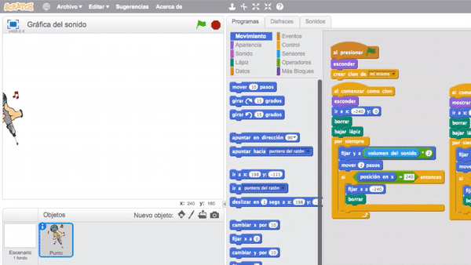
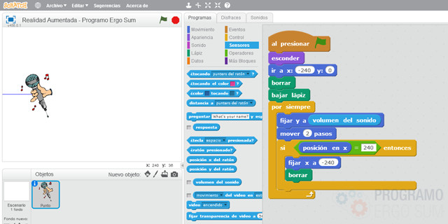
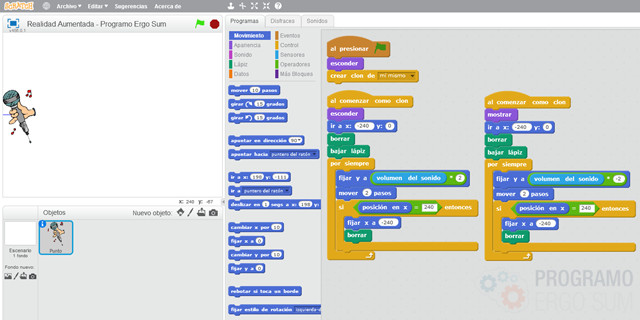
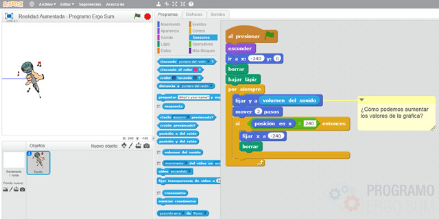

## Introducción

En este tutorial de realidad aumentada con Scratch 2.0 aprenderás a programar aplicaciones y usarlas en el aula con tus alumnos. La aplicación consiste en pogramar con Scratch un detector de audio, con ayuda de un micrófono y mostrar una gráfica en tiempo real.

### Reinventa, programa y comparte

Antes de continuar con las lecciones de este curso de programación con Scratch te recomendamos seguir los siguientes pasos para reinventar y obtener todas las imágenes utilizadas en el videojuego gratis.

- Reinventa el proyecto [Gráficas (base)](https://scratch.mit.edu/projects/159798128/editor) para obtener todas las imágenes.
- Programa el videojuego siguiendo los videotutoriales de las siguientes lecciones.
- Comparte el proyecto y si está entre los mejores aparecerá en la sección Mejores proyectos.

 

## Realidad aumentada

  <iframe src="//www.youtube.com/embed/XolwnwSMFIU" allowfullscreen></iframe>

### Programación de la aplicación

En esta lección se utilizan los bloques de dibujo de Scratch para crear el efecto de gráfica utilizando el micrófono. Para ello se crea un objeto nuevo con un disfraz cualquiera.

Una vez añadido el disfraz, se programa el objeto para que se desplace en movimiento continuo sobre el eje horizontal (de izquierda a derecha) de extremo a extremo de la pantalla. Para ello hacemos uso de los bloques de movimiento y coordenadas para indicarle el comienzo y final del recorrido.

En el siguiente paso se añade el bloque de lápiz para que pinte sobre el escenario la posición del objeto, es decir, el objeto está situado sobre unas coordenadas dentro del escenario, y al desplazarse se pinta el recorrido.

> Recuerda añadir el bloque de "bajar lápiz" para que sitúe el lápiz sobre el escenario y el bloque de "borrar lápiz" para que cuando se inicie la aplicación el escenario esté completamente blanco.

Para finalizar, se crea el efecto de la gráfica del sonido. Para ello se cambia la posición del objeto sobre el eje vertical. La posición vendrá delimitada según el sensor de audio que detecta el micrófono, dentro de los bloques de sonido.

> Recuerda que el valor del sensor de sonido del micrófono oscila entre 0 y 100.

 

## Clones

  <iframe src="//www.youtube.com/embed/sNkiLUljM_I" allowfullscreen></iframe>

### Clones con Scratch

En esta lección se va a utilizar la técnica de clonado de objetos para crear el efecto de la gráfica en formato de espejo. Es decir, hasta ahora tenemos que la gráfica solamente cambia en su componente vertical entre "0 y 100", y queremos que el efecto de gráfica también aparezca en la componente vertical "0 y -100". Para ello vamos a clonar el objeto programando sobre el clon unas coordenadas diferentes, opuestas en este caso.

> En programación, un clon es una copia exacta del objeto en tiempo de ejecución.

Para crear los clones con scratch tenemos que utilizar los bloques de control. En primer lugar se añade el bloqueque crea un clon (de si mismo) y a continuación tantos evento del tipo "al comenzar como clon"  como queramos clonar, 2 en este caso.

 

## Retos propuestos

Si ya has completado todas las lecciones del tutorial te proponemos resolver los siguientes retos de programación con Scratch.

### Reto 1: Aumenta la altura de la gráfica

En este reto te proponemos que modifiques la programación para que aumente la altura de la gráfica sin llegar a tocar los bordes en el peor de los casos (volúmen máximo). Recuerda que las medidas del escenario son de 480px de ancho y 360px de alto. Como pista, puedes ayudarte del concepto matemático de interpolación.

<!--
 

## Mejores proyectos

-->
