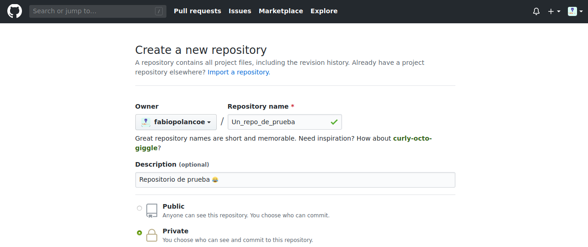
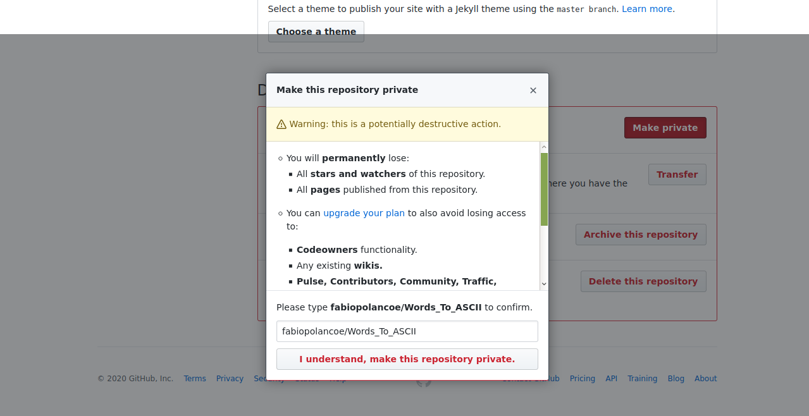

## Introducción

En este tutorial vamos a explicar cómo crear una cuenta y repositorios desde la propia interfaz web de GitHub.

 

## ¿Qué es GitHub?

Antes de explicar qué es GitHub, conviene explicar qué es Git.

> Git es un software de control de versiones diseñado por Linus Torvalds.

Vale, pero... ¿Qué es un control de versiones?

> El control de versiones es un sistema que registra los cambios realizados sobre un documento a lo largo del tiempo, de modo que puedas recuperar versiones específicas de dicho documento.

Entonces, ¿Qué es GitHub?

> GitHub es una plataforma en línea, propiedad de Microsoft para alojar proyectos, notas, software e incluso páginas web accessibles desde toda la Web (Con un dominio tu_pagina.github.io o incluso uno personalizado que tengas) por medio de su servicio gratuito [GitHub Pages](https://pages.github.com). Utilizando el sistema de control de versiones de Git.

**Ejemplo**

Supongamos que estamos escribiendo un carta y a medida que redactamos un párrafo guardamos el documento con el estado actual. Al cabo de 3 párrafos tendremos 3 versiones del documento.

- Versión 1: 1er párrafo
- Versión 2: 1er y 2º párrafo
- Versión 3: 1er, 2º y 3er párrafo

Supongamos que nos arrepentimos del texto redactado en el 2º párrafo y lo borramos. En este caso tendremos 4 versiones.

- Versión 1: 1er párrafo
- Versión 2: 1er y 2º párrafo
- Versión 3: 1er, 2º y 3er párrafo
- versión 4: 1er y 3er párrafo

Viendo esto podemos ver que aunque en la última versión de nuestro documento no aparece el 2º párrafo, realmente lo tenemos guardado en la versión 2 y 3 de nuestro historial, con lo cual en un futuro podríamos acceder a dichas versiones para recuperar el texto del 2º párrafo.

 

## Crear una cuenta

Para crear una cuenta GitHub accedemos a la web [Join GitHub](https://github.com/join) e introducimos los datos solicitados. A continuación nos llegará un correo para confirmar la cuenta.

Una vez registrados podemos editar nuestro perfil para añadir una imagen, descripción, y datos que queramos mostrar de forma pública.

 

## Crear un repositorio

En Git, un repositorio es un espacio utilizado para almacenar algún tipo de información. Por ejemplo, podemos crear un repositorio para guardar la carta que anteriormente mencionábamos. En ese mismo repositorio podemos guardar las imágenes utilizadas en la carta u otros documentos relacionados. Podría decirse que un repositorio es una carpeta donde guardamos uno o más documentos.

Para añadir un repositorio hacemos clic sobre el icono `+` situado en la parte superior derecha de la pantalla y a continuación `New repository`. El siguiente paso será añadir el nombre del repositorio y de forma opcional una breve descripción (Puedes elegir si va a ser privado o público; su licencia, y agregarle un README.md, que es una descripción e información general de tu proyecto; pero éso se tratará después). Por último creamos el repositorio.

Una vez creado el repositorio vamos a crear un documento con el texto `Hola Mundo`. Para crear el documento hacemos clic sobre `create a new file`.

Por último, añadimos el nombre del fichero `hola` y en la descripción `Hola Mundo`. Abajo del todo hacemos clic sobre el botón `Commit new file` para guardar el documento. 

> Si te fijas, puedes observar que puedes añadir un título y descripción a la versión que vas a guardar de ese documento.

Una vez guardado te aparecerá el documento en el repositorio.

 

## Formato Markdown

Markdown es un lenguaje de marcado ligero, primo lejano del HTML (Incluso puedes instertar HTML en Markdown), con extensión `.md`, cuyo objetivo es conseguir la máxima legibilidad y facilidad de publicación usando texto plano (De hecho, éste tutorial fué escrito en Markdown).

En el siguiente [repositorio](https://github.com/adam-p/markdown-here/wiki/Markdown-Cheatsheet) podemos ver un resumen de las etiquetas utilizadas en este formato.

 

## Repositorios privados y públicos

Supongamos que quieres crear un, hmmm... Código para [Arduino](https://www.programoergosum.es/tutoriales/tags/arduino), lo escribes en el IDE y decides publicarlo. Cuando vas a GitHub y cuando creas un repositorio piensas que sería mejor primero trabajar un poco en él sin que nadie pueda interactuar con el repositorio y después hacerlo público.

Ésto es muy válido y tiene una solución: repositorios privados. Puedes configurar un repositorio como privado desde que lo creas:

> También puedes volver privados tus repositorios públicos y viceversa.

### De público a privado

Entra a tu repositorio, haz click en `Settings`, baja hasta el apartaado que dice `Danger zone` y haz click en el botón `Make Private`. Saldrá una ventana que te pedirá que escribas tu nombre de usuario seguido de un diagonal `/` y el nombre de tu repositorio.

### De privado a público

El proceso es el mismo sólo que cambiand el botón de "Make private" a "Make public"

### Licencia

La licencia es un documento que indica cómo las personas pueden usar los archivos de tu proyecto, puedes elegir una aquí:
[Choose a license](https://choosealicense.com/)

### README.md

Un archivo README.md es un archivo Markdown que provee datos, información e instrucciones sobre tu repositorio.

### GitHub Pages

¿Tienes los archivos de una página web que quieras hacer pública? Lo puedes hacer con [GitHub Pages](https://pages.github.com), sólo necesitas crear un repositorio con los archivos. Ve a `Settings`, baja hasta encontrar el apartado GitHub Pages y selecciona `Master Branch`.

Listo, puedes acceder a tu página desde `https://tu_nombre_de_usuario.github.io/tu_repositorio`

### GitHub Gists

Puedes crear [GitHub Gists](https://gists.github.com), que son como repositorios pero con ún sólo archivo, que puede ser una nota, código, instrucciones o lo que quieras. Sólo haz click en el símbolo `+` situado en la parte superior derecha de la pantalla y `New Gist`. 

## Ejercicios propuestos

1.- Entra a tu perfil de GitHub para añadir una foto y una descripción a tu perfil.

2.- Añade un documento desde el escritorio arrastrándolo a la ventana de GitHub. **_Recuerda que todo el contenido compartido es público. No subas datos sensibles_**.

3.- Crea un fichero llamado `prueba.md` e introduce al menos 5 etiquetas diferentes utilizando el formato Markdown.

4.- Crea un archivo README.md

5.- Crea un Gist
