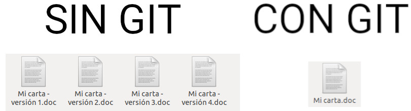
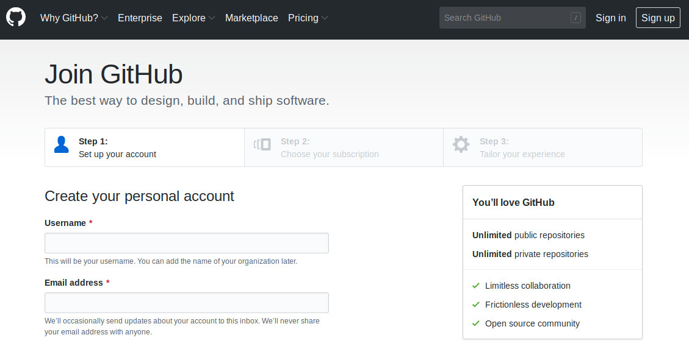
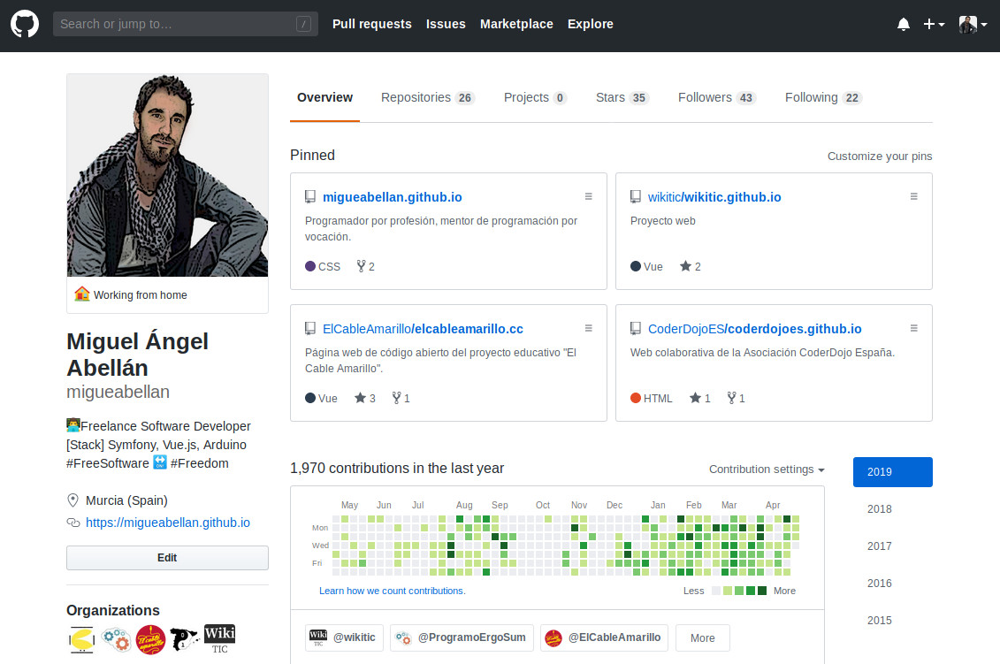
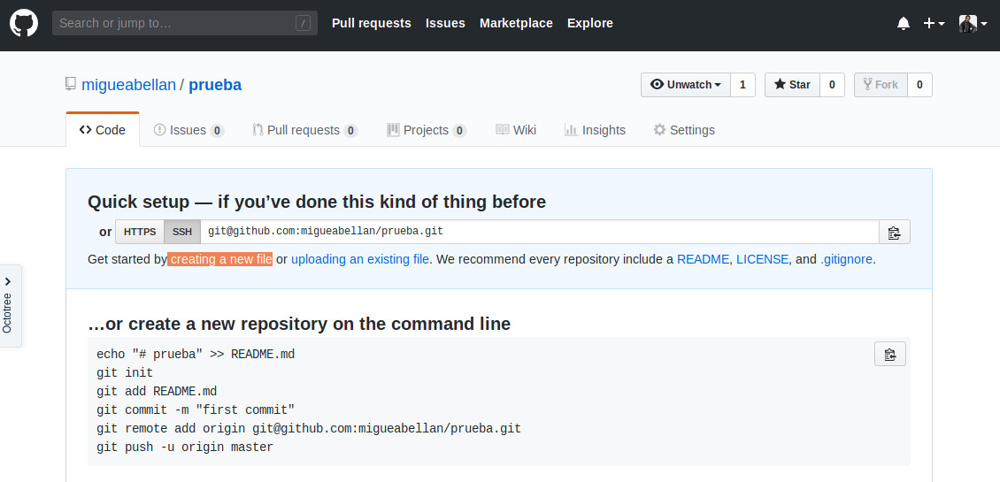
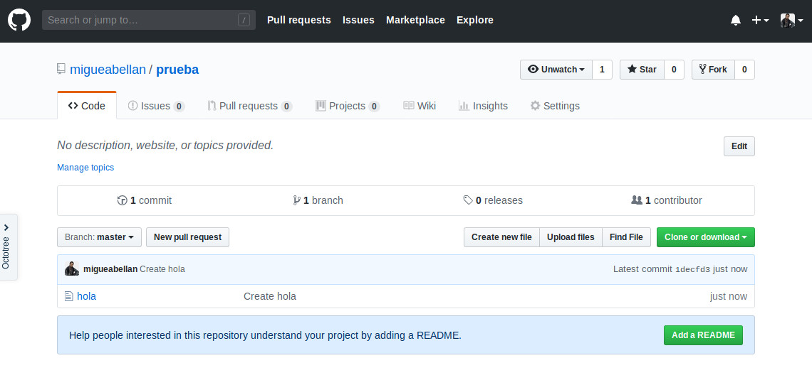

## Introducción

En este tutorial vamos a explicar cómo crear una cuenta y repositorios desde la propia interfaz web de GitHub.

 

## ¿Qué es GitHub?

Antes de explicar qué es GitHub, conviene explicar qué es Git.

> Git es un software de control de versiones diseñado por Linus Torvalds.

Vale, pero... ¿Qué es un control de versiones?

> El control de versiones es un sistema que registra los cambios realizados sobre un documento a lo largo del tiempo, de modo que puedas recuperar versiones específicas de dicho documento.

Entonces, ¿Qué es GitHub?

> GitHub es una plataforma para alojar proyectos utilizando el sistema de control de versiones de Git.

**Ejemplo**

Supongamos que estamos escribiendo un carta y a medida que redactamos un párrafo guardamos el documento con el estado actual. Al cabo de 3 párrafos tendremos 3 versiones del documento.

- Versión 1: 1er párrafo
- Versión 2: 1er y 2º párrafo
- Versión 3: 1er, 2º y 3er párrafo

Supongamos que nos arrepentimos del texto redactado en el 2º párrafo y lo borramos. En este caso tendremos 4 versiones.

- Versión 1: 1er párrafo
- Versión 2: 1er y 2º párrafo
- Versión 3: 1er, 2º y 3er párrafo
- versión 4: 1er y 3er párrafo

Viendo esto podemos ver que aunque en la última versión de nuestro documento no aparece el 2º párrafo, realmente lo tenemos guardado en la versión 2 y 3 de nuestro historial, con lo cual en un futuro podríamos acceder a dichas versiones para recuperar el texto del 2º párrafo.

 

## Crear una cuenta

Para crear una cuenta GitHub accedemos a la [Web](https://github.com/join) e introducimos los datos solicitados. A continuación nos llegará un correo para confirmar la cuenta.

Una vez registrados podemos editar nuestro perfil para añadir una imagen, descripción, y datos que queramos mostrar de forma pública.

 

## Crear un repositorio

Un Git, un repositorio es un espacio utilizado para almacenar algún tipo de información. Por ejemplo, podemos crear un repositorio para guardar la carta que anteriormente mencionábamos. En ese mismo repositorio podemos guardar las imágenes utilizadas en la carta u otros documentos relacionados. Podría decirse que un repositorio es una carpeta donde guardamos uno o más documentos.

Para añadir un repositorio hacemos clic sobre el icono `+` situado en la parte superior derecha de la pantalla y a continuación `New repository`. El siguiente paso será añadir el nombre del repositorio y de forma opcional una breve descripción. Por último creamos el repositorio.

Una vez creado el repositorio vamos a crear un documento con el texto `Hola Mundo`. Para crear el documento hacemos clic sobre `creating a new file`.

Por último, añadimos el nombre del fichero `hola` y en la descripción `Hola Mundo`. Abajo del todo hacemos clic sobre el botón `Commit new file` para guardar el documento. 

> Si te fijas, puedes observar que puedes añadir un título y descripción a la versión que vas a guardar de ese documento.

Una vez guardado te aparecerá el documento en el repositorio.

 

## Formato Markdown

Markdown es un lenguaje de marcado ligero, con extensión `.md`, cuyo objetivo es conseguir la máxima legibilidad y facilidad de publicación usando texto plano.

En el siguiente [repositorio](https://github.com/adam-p/markdown-here/wiki/Markdown-Cheatsheet) podemos ver un resumen de las etiquetas utilizadas en este formato.

 

## Ejercicios propuestos

1.- Entra a tu perfil de GitHub para añadir una foto y una descripción a tu perfil.

2.- Añade un documento desde el escritorio arrastrándolo a la ventana de GitHub. *Recuerda que todo el contenido compartido es público. No subas datos sensibles*.

3.- Crea un fichero llamado `prueba.md` e introduce al menos 5 etiquetas diferentes utilizando el formato Markdown.
