## Introducción

En este curso aprenderás qué son y cómo utilizar los pines GPIO de tu Raspberry Pi para activar entradas y salidas mediante el lenguaje de programación por bloques de Scratch. También aprenderás nociones básicas de electrónica para realizar numerosas prácticas desde nivel iniciación.

En el tutorial no se va a explicar el lenguaje de programación por bloques con Scratch ya que tenemos una categoría de cursos de programación con Scratch en esta misma plataforma.
Pines GPIO con Scratch

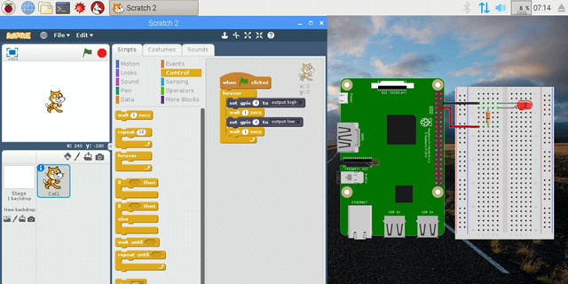


<br />


## ¿Qué es GPIO?

General Purpose Input Output (GPIO) es un sistema de entrada y salida de propósito general, es decir, consta de una serie de pines o conexiones que se pueden usar como entradas o salidas para múltiples usos. Estos pines están incluidos en todos los modelos de Raspberry Pi aunque con diferencias.

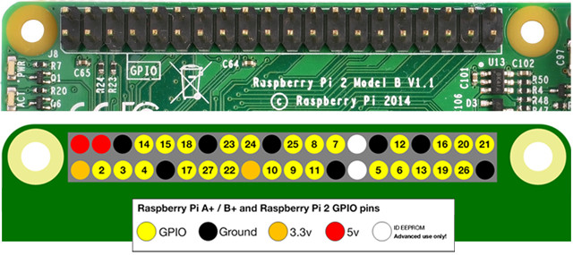

Hay que tener en cuenta que dependiendo del modelo de la Raspberry Pi encontramos una cantidad de pines diferentes, por ejemplo, en la versión 1 de Raspberry Pi se tienen 26 pines GPIO mientras que a partir de la versión 2 de Raspberry Pi el número de pines aumentó a 40. Sin embargo la compatibilidad es total, puesto que los 26 primeros pines mantienen su función original.

> Revisa la ficha técnica de tu Raspberry Pi antes de utilizar los pines GPIO.

Como podéis observar, el número de pines pasó de 26 a 40 para tener más disponibilidad, aunque volvemos a comentar que los 26 primeros pines son comunes para todas las versiones. Los pines GPIO tienen funciones específicas (aunque algunos comparten funciones) y se pueden agrupar de la siguiente manera:

- Amarillo (2): Alimentación a 3.3V.
- Rojo (2): Alimentación a 5V.
- Naranja (26): Entradas / salidas de proposito general. Pueden configurarse como entradas o salidas. Ten presente que el nivel alto es de 3.3V y no son tolerantes a tensiones de 5V.
- Gris (2): Reservados.
- Negro (8): Conexión a GND o masa.
- Azul (2): Comunicación mediante el protocolo I2C para comunicarse con periféricos que siguen este protocolo.
- Verde (2): Destinados a conexión para UART para puerto serie convencional.
- Morado (5): Comunicación mediante el protocolo SPI para comunicarse con periféricos que siguen este protocolo.

> Todos los pines son de tipo "unbuffered", es decir, no disponen de buffers de protección y puedes dañar la placa con un mal uso.

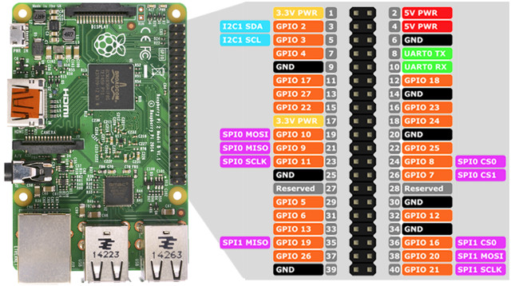

Existen 2 formas de numerar los pines de la Raspberry Pi, en modo GPIO o en modo BCM.

- En el modo GPIO, los pines se numeran de forma física por el lugar que ocupan en la placa (representados por el color gris) viene siendo igual para todas las versiones (comenzamos a contar desde arriba a la izquierda y finalizamos abajo a la derecha).
- En el modo BCM, los pines se numeran por la correspondencia en el chip Broadcom (que es la CPU de la Raspberry Pi).

Por este mismo motivo podéis encontrar 2 nomenclaturas a la hora de realizar las prácticas de electrónica con Raspberry Pi, cuando nos refiramos al modo GPIO o al modo BCM. A continuación mostramos una tabla de equivalencias.

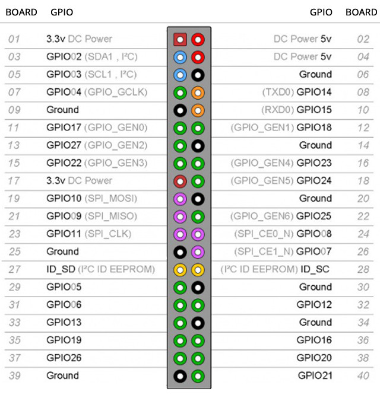

De los pines GPIO disponibles, hay una serie de pines con capacidad de PWM (como volveremos más adelante). Sin ambargo no se dispone de ningún convertidor de analógico a digital. Esto quiere decir que para medir valores de sensores analógicos necesitaremos utilizar un convertidor externo o un Arduino en la mayoría de los casos.

### Advertencias

Cuando se utilizan los pines de GPIO hay que poner mucho cuidado para no dañar la propia Raspberry Pi. Es muy importante comprobar los niveles de tensión y la corriente solicitada. Los pines de GPIO pueden generar y consumir tensiones compatibles con los circuitos de 3.3V, como la nueva electrónica. No conectar nunca componentes de 5V, o podéis quemar el chip y quedaros sin Raspberry Pi.

> Los pines GPIO ofrecen una tensión de 3.3V y no son tolerantes a tensiones de 5V.

Hay que tener presente que la intensidad de corriente que sale de esos pines proviene de la fuente de 3.3V y esta fue diseñada para una carga de unos 3mA por cada pin GPIO, suficiente para encender diodos led, pero poco más.

> Los pines GPIO ofrecen una corriente de 3mA.


<br />


## ¿Qué es Scratch?

Como se explica en los cursos de programación con Scratch de esta misma plataforma, Scratch es un lenguaje de programación por bloques distinado a la enseñanza de la programación desde edades tempranas. La aplicación de los lenguajes de programación por bloques permiten una presentación visual del paradigma y metodología de la programación informática permitiendo centrarse en la lógica de la programación dejando a un lado la sintaxis propia de los lenguajes de programación (puntos y comas, paréntesis, etc)

> Scratch permite crear fácilmente historias interactivas propias, animaciones, juegos, grabar sonidos y realizar creaciones artísticas e incluso conectarse con los pines GPIO en su versión para Raspberry Pi.

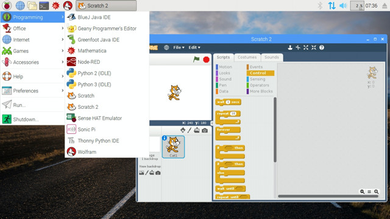

### ¿Cómo conectar Scratch con GPIO en Raspberry Pi?

Si has seguido los pasos de instalación de Raspbian en esta misma plataforma podrás acceder a la versión de Scratch para procesadores ARM como el de tu Raspberry Pi.

Lo primero que tienes que hacer es iniciar Scratch (situado en el menú de lenguajes de programación de Raspbian) y una vez abierta la aplicación deberás acceder al apartado de más bloques de Scratch. A continuación añade una extensión y verás que aparece como extensión predefinida la extensión de Pi GPIO para Raspberry Pi.

> Recuerda que además de esta extensión puedes añadir otro tipo de extensión, como Lego Wedo, etc.

Una vez añadida la extensión ya podrás empezar a programar los pines GPIO de tu Raspberry Pi.


<br />


## Salidas digitales: Led Intermitente

<div class="iframe">
  <iframe src="//www.youtube.com/embed/3qej2Ur2mLk" allowfullscreen></iframe>
</div>

En esta lección se va a programar y construir un led intermitente que parpadea continuamente con una frecuencia de 1 segundo. Para ello abrimos el entorno de programación Scratch de nuestra Raspberry Pi e importamos la extensión para utilizar los pines GPIO, como se explica en la lección anterior.

A continuación, añadimos el bucle con las instrucciones de encender y apagar el pin GPIO deseado. En esta práctica vamos a utilizar el pin GPIO número 4 (situado en la posición número 7 de la placa).

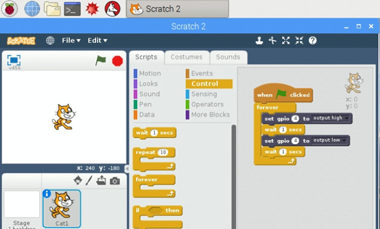

En nuestro caso tenemos un led de color rojo, que según la ficha técnica el fabricante nos asegura que funciona a una tensión o voltaje de 2,1V y admite una corriente máxima de 20mA. También sabemos de la lección anterior que los pines GPIO ofrecen una tensión de 3,3V y una intensidad de entre 3mA (suficiente para encender el led). De estos datos tenemos que:

- El Voltaje o diferencia de potencial en el led será de 3,3V - 2,1V = 1,2V.
- La Intensidad en el led será de 20mA (la misma que en el circuito ya que no varía).
- La Resistencia que hay que aplicarle según la Ley de Ohm será de: R = V / I = 1,2V / 20mA = 60Ω, redondeando a 100Ω.

La Ley de Ohm establece que la caída de voltaje de un elemento del circuito es igual a la intensidad de corriente que circula por él, multiplicado por la resistencia que ejerce cada componente al paso de esta corriente.

### Esquema eléctrico

Por último, fijándonos en la tabla de los pines GPIO de nuestra Raspberry Pi, conectamos al cátodo de nuestro led el pin de masa (GND) y al ánodo del led el pin que hemos activado en la programación con Scratch, el pin GPIO 4 (pin número 7 de nuestra placa).

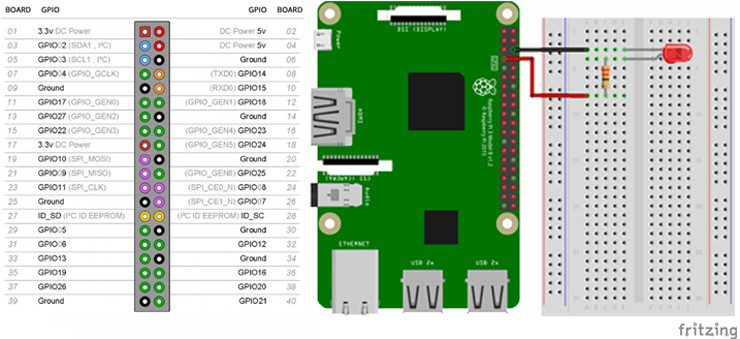

### Advertencias

- Fíjate muy bien donde conectas el cable y mucho cuidado con equivocarte o podrás quemar la Raspberry Pi.
- Vuelve a revisar la conexión antes de conectar los cables a la protoboard.
- No conectes nada a 5V si no estás seguro. La raspberry Pi funciona a 3.3V y pasándole 5V supone quemar la placa.


<br />


## Salidas digitales: Semáforo

<div class="iframe">
  <iframe src="//www.youtube.com/embed/heWrdru_NwE" allowfullscreen></iframe>
</div>

En esta lección se va a programar y construir un semáforo sencillo. Para ello abrimos el entorno de programación Scratch de nuestra Raspberry Pi e importamos la extensión para utilizar los pines GPIO.

En este caso vamos a realizar la programación sencilla del semáforo sin utilizar funciones, es decir, dentro de un mismo bucle que se repite siempre programamos las funciones de los leds. Dichos diodos led estarán conectados a los pines GPIO 17, 27 y 22 correspondientes a las posiciones 11, 13 y 15 de nuestra placa.

Además, para visualizar el estado del semáforo en la pantalla de Scratch vamos a crearle 3 disfraces para cada posición del semáforo.

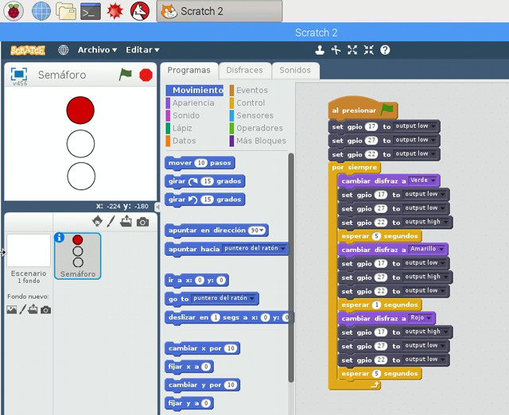

En nuestro caso tenemos un led de color rojo, que según la ficha técnica el fabricante nos asegura que funciona a una tensión o voltaje de 2,1V y admite una corriente máxima de 20mA. También sabemos de la lección anterior que los pines GPIO ofrecen una tensión de 3,3V y una intensidad de entre 3mA (suficiente para encender el led). De estos datos tenemos que:

- El Voltaje o diferencia de potencial en el led será de 3,3V - 2,1V = 1,2V.
- La Intensidad en el led será de 20mA (la misma que en el circuito ya que no varía).
- La Resistencia que hay que aplicarle según la Ley de Ohm será de: R = V / I = 1,2V / 20mA = 60Ω, redondeando a 100Ω.

La Ley de Ohm establece que la caída de voltaje de un elemento del circuito es igual a la intensidad de corriente que circula por él, multiplicado por la resistencia que ejerce cada componente al paso de esta corriente.

### Esquema eléctrico

Por último, procedemos a construir el semáforo sobre la placa de prototipado y los conectamos a los pines GPIO de nuestra Raspberry Pi como los hemos programado.

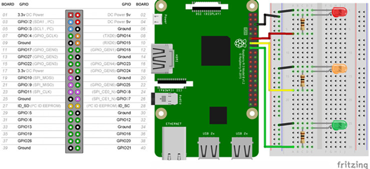

### Advertencias

- Fíjate muy bien donde conectas el cable y mucho cuidado con equivocarte o podrás quemar la Raspberry Pi.
- Vuelve a revisar la conexión antes de conectar los cables a la protoboard.
- No conectes nada a 5V si no estás seguro. La raspberry Pi funciona a 3.3V y pasándole 5V supone quemar la placa.


<br />


## Entradas digitales: Pulsador

<div class="iframe">
  <iframe src="//www.youtube.com/embed/NVxUIeGziS0" allowfullscreen></iframe>
</div>

En esta lección se va a programar y construir un pulsador. Para ello abrimos el entorno de programación Scratch de nuestra Raspberry Pi e importamos la extensión para utilizar los pines GPIO.

En este caso vamos a realizar la programación similar a la primera lección del intermitente añadiéndole el pulsador. El led lo vamos a conectar en el pin GPIO 4 mientras que la entrada del pulsador se conectará al pin GPIO número 2 de nuestra placa de Raspberry Pi.

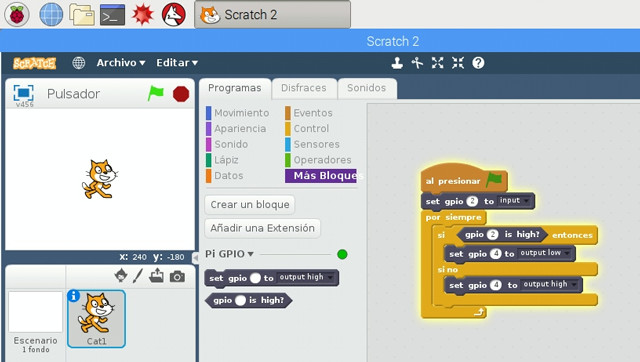

En nuestro caso tenemos un led de color rojo, que según la ficha técnica el fabricante nos asegura que funciona a una tensión o voltaje de 2,1V y admite una corriente máxima de 20mA. También sabemos de la lección anterior que los pines GPIO ofrecen una tensión de 3,3V y una intensidad de entre 3mA (suficiente para encender el led). De estos datos tenemos que:

- El Voltaje o diferencia de potencial en el led será de 3,3V - 2,1V = 1,2V.
- La Intensidad en el led será de 20mA (la misma que en el circuito ya que no varía).
- La Resistencia que hay que aplicarle según la Ley de Ohm será de: R = V / I = 1,2V / 20mA = 60Ω, redondeando a 100Ω.

La Ley de Ohm establece que la caída de voltaje de un elemento del circuito es igual a la intensidad de corriente que circula por él, multiplicado por la resistencia que ejerce cada componente al paso de esta corriente.

### Esquema eléctrico

Por último, procedemos a construir el pulsador sobre la placa de prototipado y los conectamos a los pines GPIO de nuestra Raspberry Pi como los hemos programado. En este caso vamos a utilizar el pin físico número 3 que equivale al GPIO 2.


### Advertencias

- Fíjate muy bien donde conectas el cable y mucho cuidado con equivocarte o podrás quemar la Raspberry Pi.
- Vuelve a revisar la conexión antes de conectar los cables a la protoboard.
- No conectes nada a 5V si no estás seguro. La raspberry Pi funciona a 3.3V y pasándole 5V supone quemar la placa.


<br />


## Salidas PWM

Hasta ahora hemos realizado prácticas con salidas y entradas digitales. Sin embargo, en ocasiones necesitamos señales analógicas. Es decir, en las lecciones anteriores comprobábamos si habíamos pulsado un pulsador (entrada digital) y en ese caso encendíamos un led (salida digital).

En las siguientes prácticas vamos a necesitar utilizar salidas analógicas. Puesto que en Raspberry Pi no disponemos de convertidores digital a analógico nos vemos obligados a utilizar otras técnicas para poder simular las señales analógicas en Raspberry Pi. A esta técnica se le conoce como modulación por ancho de pulsos o PWM.

### ¿Qué es PWM?

La modulación por ancho de pulsos o PWM (pulse-width modulation) de una señal es una técnica en la que se modifica el ciclo de trabajo de una señal periódica para controlar la cantidad de energía que se envía, o dicho de otro modo, modificamos el tiempo de la señal para simular una señal analógica.

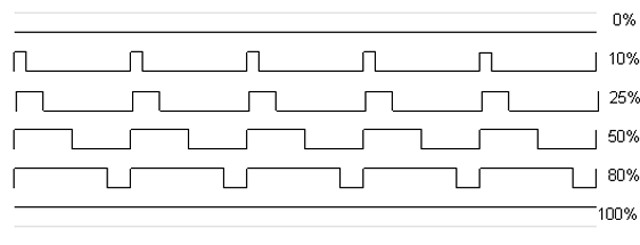

### PWM en Scratch 2 para Raspberry Pi

En la versión "ba2f624-dirty" de Scratch en Raspbian para Raspberry Pi solamente se dispone de 2 bloques básicos para interactuar con los pines GPIO (como puedes ver en la siguiente imagen) y no podemos utilizar señales PWM (hasta el momento de grabar este tutorial). Estos bloques son los que se han utilizado en las lecciones anteriores para activar las salidas y entradas digitales.

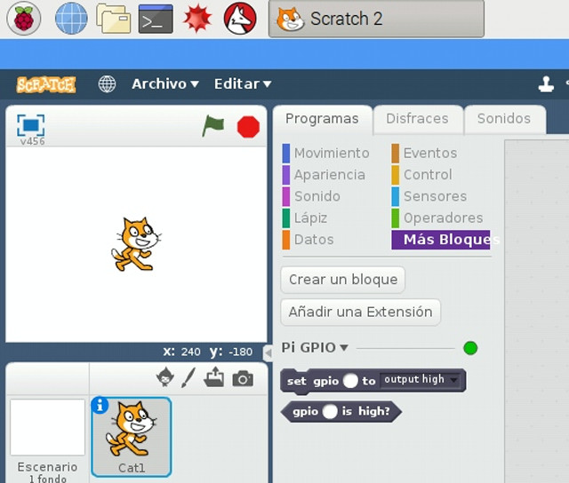

Para utilizar los bloques de señales PWM en Scratch, por ejemplo para utilizar servo motores, vamos a necesitar añadir una nueva extensión creada para Scratch 2.0.

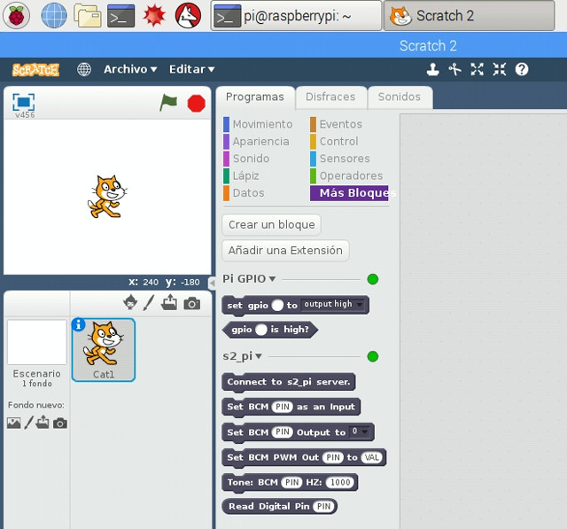

### Extensión S2PI a Scratch 2.0

En esta lección te explicamos cómo añadir una extensión a Scratch, en concreto la <a target="_blank" href="https://github.com/MrYsLab/s2-pi">extensión S2PI</a> para disponer de bloques PWM que utilizaremos para interactuar con los pines GPIO de nuestra Raspberry Pi.

Suponemos que tienes instalado el sistema operativo Raspbian para Raspberry Pi y en la versión de Scratch 2.0 no te aparecen los bloques PWM. En ese caso, lo primero que debemos hacer es instalar la extensión a través del siguiente comando en la terminal.

```sh
pi@raspberrypi: ~ $ sudo pip3 install s2-pi
```

A continuación habilitamos e iniciamos el servidor que escucha los pines GPIO de nuestra Raspberry Pi con los siguientes comandos en la terminal. Por último arrancamos Scratch 2.0 desde la terminal.

```sh
pi@raspberrypi: ~ $ sudo systemctl enable pigpiod
pi@raspberrypi: ~ $ sudo systemctl start pigpiod
pi@raspberrypi: ~ $ s2pi
```

Una vez arrancado Scratch 2.0 tendremos que añadir la extensión situada en la ruta /home/pi/s2_pi.js en modo experimental como puedes ver en la siguiente imagen. Recuerda que para que aparezcan las opciones extendidas de Scratch debes hacer clic al mismo tiempo que pulsas la tecla SHIFT.

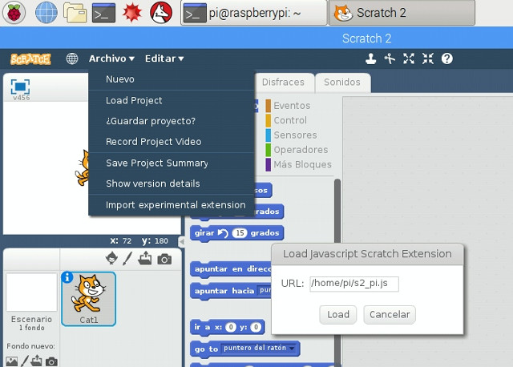

¡Recuerda! Cada vez que necesites utilizar la extensión deberás cargarla realizando los mismos pasos tras la instalación (habilitar e iniciar pigpiod, arrancar s2pi y cargar extensión experimental).
