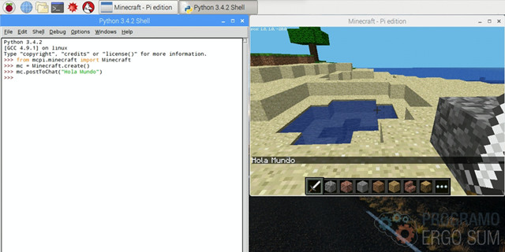
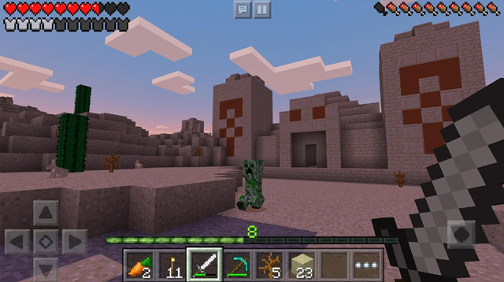
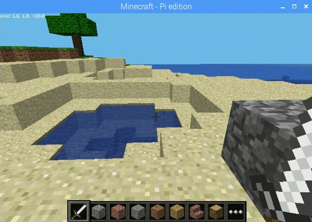
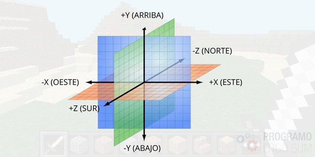
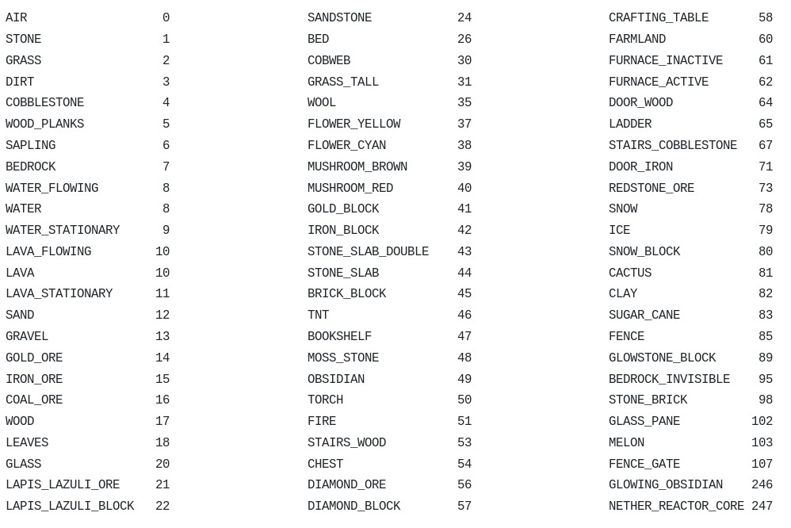
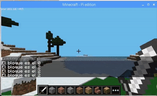
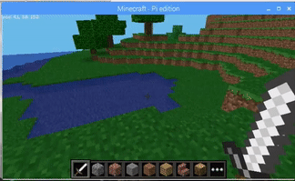

## Introducción

En este curso aprenderás a programar en Python utilizando Minecraft Pi para aprender conceptos de programación informática. Si lo que estás buscando son consejos útiles para construir esctructuras o luchar en combates este no es el curso que buscas.

Aunque Minecraft es multiplataforma y está disponible para Windows, Linux o MAC en su versión extendida, en este curso se va a utilizar Minecraft Pi por ser gratuito y estar instalado por defecto en las versiones de Raspbian para Raspberry Pi.




<br />


## ¿Qué es Minecraft?

Minecraft es un juego indie sandbox, en el que construyes estructuras, recolectas objetos, extraes minerales y peleas con mosntruos para sobrevivir. Se muestra como un mundo virtual en 3D, creado con diferentes tipos de bloques, cada uno de ellos con su propio lugar dentro de la disposición en la parrilla del mundo virtual 3D.

Los juegos indie son "videojuegos independientes", creados por pequeños equipos. Como resultado de su naturaleza independiente suelen ser más innovadores que otros más comerciales.

En un juego sandbox, eres un jugador dentro de un mundo virtual donde tomas tus propias decisiones desde el principio en vez de verte forzado a seguir una ruta creada por los diseñadores del juego, es decir, creas tus propias historias y te mueves a través del mundo 3D libremente aprendiendo nuevas funcionalidades o descubriéndolas por casualidad a través de experimentación.



### ¿Qué es Minecraft Pi?

Minecraft Pi Edition es una versión de Minecraft desarrollado para procesadores de bajo coste como Raspberry Pi. Se basa en la ya existente Pocket Edition, pero está ligeramente modificada, que contiene un conjunto de características revisadas y un soporte para múltiples lenguajes de programación.

Está pensada como una herramienta educativa para los programadores principiantes y está disponible para su descarga de manera gratuita, bajo la licencia GNU, desde la página de descargas de Minecraft Pi.




<br />


## ¡Hola Mundo!

<div class="iframe">
  <iframe src="//www.youtube.com/embed/s7f9oTdf3dI" allowfullscreen></iframe>
</div>

El primer programa que se va a programar en Python consistirá en mostrar el mensaje "Hola Mundo" a través del chat de Minecraft Pi. Para ello, debemos ejecutar Minecraft Pi y tenerlo activo al mismo tiempo que estamos programando.

A continuación iniciaremos el IDLE de Python para escribir las instrucciones del código que vamos a programar. Podemos escribir el código directamente en la Shell o abrir un fichero nuevo donde guardaremos el código escrito en Python.

```python
from mcpi.minecraft import Minecraft
mc = Minecraft.create()
mc.postToChat("Hola Mundo")
```

Una vez ejecutado el código anterior en la consola observarás una imagen similar a la siguiente donde aparece el mensaje introducido en el chat de Minecraft. Recuerda que si escribes el código en el fichero, deberás guardar y ejecutar el código para ver los resultados.


<br />


## ¡Hola Mundo!

<div class="iframe">
  <iframe src="//www.youtube.com/embed/pfUBQU1uyg8" allowfullscreen></iframe>
</div>

En esta lección vamos a programar diferentes movimientos conociendo la posición de nuestro personaje Steve en el mapa, o lo que es lo mismo, en nuestro mundo.

Recuerda que cada bloque de Minecraft representa un cubo, y cada cubo mide 1 unidad. Por lo tanto, si nos desplazamos 3 bloques, nos estamos desplazando 3 unidades. El mundo está construido con bloques vacios que se rellenan con materiales (piedra, madera, lana, aire...). Hay varias excepciones como la lava o las alfombras que ocupan menos espacio y no pueden combinarse con otros bloques.

Dicho todo esto, nuestro personaje se encontrará en todo momento una determinada posición dentro de nuestro mundo y poseerá unas determinadas coordenadas (x, y, z). Una coordenada representa una posición única en 3 dimensiones dentro de nuestro mundo.

> Las coordenadas en Minecraft vienen representadas como si de una brújula se tratase, y se representan del siguiente modo.



Visto lo anterior y sabiendo el funcionamiento de las coordenadas en Minecraft, para mostrar la posición de nuestro personaje Steve ejecutaremos la siguiente instrucción.

```python
print(mc.player.getPos())
```


<br />


## Programando bloques

<div class="iframe">
  <iframe src="//www.youtube.com/embed/_-8kmz22MyY" allowfullscreen></iframe>
</div>

En esta lección vamos a programar diferentes tipos de bloques para que aparezcan en posiciones establecidas conociendo las coordenadas.

En Minecraft, cada bloque está representado por un número (que conocerás si eres jugador habitual de Minecraft), y nos referiremos a dicho bloque por programación.



De momento vamos a empezar escribiendo un programa sencillo encargado de colocar de forma automática un bloque inmediatamente justo delante del jugador. Una vez puedas colocar un bloque en el mundo de Minecraft, podrás construir cualquier cosa que se te ocurra de forma automática. Es decir, dadas unas coordenadas "x, y, z" y sabiendo que el bloque número "1" correspone al bloque de "piedra", escribiremos el siguiente código:

```python
from mcpi.minecraft import Minecraft
from mcpi import block
mc = Minecraft.create()
mc.setBlock(x, y, z, block.STONE.id)
```

Por otro lado, supongamos que queremos obtener el tipo de un bloque situado en una coordenada, es decir, quiero saber si en una posición tengo un bloque de dinamita para no pasar sobre el bloque. En este caso utilizaremos la función que obtiene el tipo de bloque.

```python
mc.getBlock(x, y, z)
```


<br />


## Retos propuestos

Si ya has completado todas las lecciones del tutorial te proponemos resolver los siguientes retos de programación.

### Reto 1: ¿Qué bloque está pisando Steve?

En este reto te proponemos que programes en Python un algoritmo que muestre a través del chat de Minecrat Pi el número de bloque que está pisando el personaje Steve. Para ello deberás utilizar las instrucciones estudiadas en las lecciones anteriores de este curso. Para el correcto funcionamiento deberás importar la libreria correspondiente que pausa los mensajes en el chat durante unos segundos.



### Reto 2: Hazte paso a través de los bloques

En este reto te proponemos que programes en Python un algoritmo encargado de borrar todos los bloques que se encuentra Steve a su paso por el mundo de Minecraft. Solamente deberás borrar los bloques que encuentres delante, detrás y a sus lados derecha e izquierda. Para el correcto funcionamiento deberás borrar los bloques contiguos al personaje conociendo el sistema de corrdenadas.


### Reto 3: El camino del Rey

En este reto te proponemos que programes en Python un algoritmo que añada bloques debajo del personaje Steve, de tal forma que si te situas en lo alto de una colina, parecerá que estás caminando entre las nubes. Para el correcto funcionamiento deberás colocar los bloques contiguos al personaje conociendo el sistema de corrdenadas


