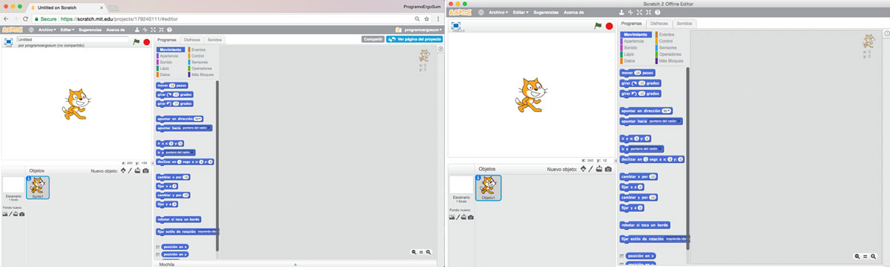
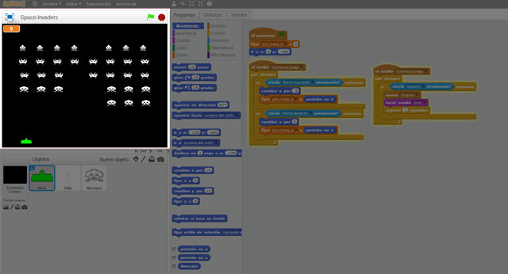
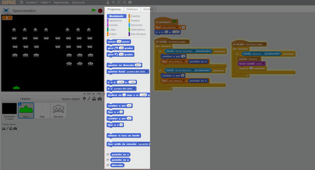
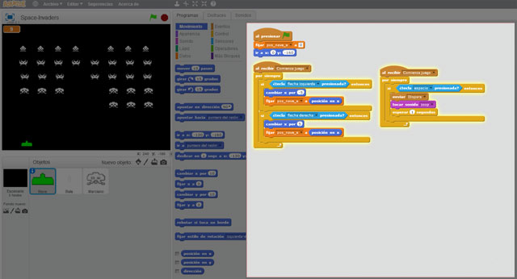

## Introducción

En este tutorial de **iniciación a la programación con Scratch 2.0** aprenderás a utilizar la herramienta de Scratch en su versión 2.0 para programar diferentes tipos de videojuegos y animaciones mediante el lenguaje de programación por bloques.

> ¡IMPORTANTE! En este tutorial se explica la versión de Scratch 2.0.

### ¿Qué es Scratch?

Scratch es un entorno gráfico de programación desarrollado por un grupo de investigadores del Lifelong Kindergarten Group del Laboratorio de Medios del MIT, bajo la dirección del Dr. Mitchel Resnick.

Este entorno gráfico hace que la programación sea más atractiva y accesible para todo aquel que se enfrenta por primera vez a aprender un lenguaje de programación. Según sus creadores, fue diseñado como medio de expresión para ayudar a niños y jóvenes a expresar sus ideas de forma creativa, al tiempo que desarrollan habilidades de pensamiento lógico.

> Scratch permite crear fácilmente historias interactivas propias, animaciones, juegos, grabar sonidos y realizar creaciones artísticas.

La aplicación de los lenguajes de programación por bloques permite una presentación visual del paradigma y metodología de la programación informática permitiendo centrarse en la lógica de la programación dejando a un lado la sintaxis propia de los lenguajes de programación (puntos y comas, paréntesis, etc).

### Beneficios de Scratch

Son varios los estudios que han demostrado que mediante la programar se desarrollan ciertas habilidades cognitivas como:

- Desarrollo del pensamiento lógico
- Fomento de la creatividad
- Mejora en el razonamiento
- Resolución de problemas

> Un estudio realizado a niños de infantil programando con Logo, demostró que obtienen mejores resultados en pruebas de matemáticas, de razonamiento y resolución de problemas.

 

## Acceder a Scratch

En el siguiente vídeo se enseña cómo registrarse en la web de Scratch a través de un navegador cualquiera y la opción de descargar la versión escritorio para programar sin conexión a internet. Además verás lo fácil que es acceder al panel de control para ver los proyectos realizados, estudios, amigos y seguidores, etc.

  <iframe src="//www.youtube.com/embed/BMU-UlPf_0A" allowfullscreen></iframe>

### Scratch online vs. Scratch Desktop

Para empezar a utilizar Scratch tendrás que elegir entre la versión online o la versión de escritorio, ambas idénticas en cuanto a diseño y estructura:

- Versión online. [Accede a Scratch online](https://scratch.mit.edu) a través de un navegador. Es recomendable registrarse para poder guardar los proyectos que crees y tenerlos siempre a tu disposición.
- Versión de escritorio. [Descarga Scratch Desktop](https://scratch.mit.edu/download/) e instala en tu propio equipo para programar sin conexión a internet. En estos momentos solamente está disponible para usuarios de Windows o MAC.

> Desde la web de Scratch informan que Scratch Desktop no es compatible con Linux y están trabajando para que en un futuro pueda funcionar en sistemas operativos de Linux.

 

## Pantalla de Scratch

En el siguiente vídeo se enseña cómo añadir diferentes objetos o sprites al videojuego, así como modificarlos mediante el editor de dibujo en el apartado de disfraces.

  <iframe src="//www.youtube.com/embed/7P8q1ltd44Y" allowfullscreen></iframe>

### Interfaz o pantalla

Sobre la izquierda tenemos el escenario o lugar donde podemos ver el resultado de nuestro programa. En este ejemplo el gato es un objetivo sobre el cual podemos trabajar, se trata en realidad del logo de Scratch que aparece por defecto.

Pero no hay limitaciones en cuanto a objetos a utilizar, la misma aplicación cuenta con una galería donde elegirlos e incluso se pueden crear a partir de fotos, subir o editar (pintar, modificar) en el mismo Scratch. También podemos trabajar con distintos escenarios al mismo tiempo y agregarles fondos personalizados a cada uno de ellos.

### Bloques de programación

En la parte central podemos ver la paleta de bloques que podemos utilizar para nuestro programa, se dividen en diferentes categorías y colores para poder identificarlos mejor. También hay otras dos pestañas con más opciones que permiten trabajar con sonidos y disfraces, estos son los diseños o las distintas formas que un mismo objeto puede tener.

Por ejemplo, el gato es un objeto que por defecto tiene dos disfraces… la diferencia entre ellos es la posición de sus patas que permiten generar un efecto de movimiento si le ordenamos caminar.

### Área de programación

Por último, sobre la derecha veremos el área de trabajo o programación donde los bloques se deben colocar de forma ordenada para crear el programa. Observa la forma anidada de puzle que tiene la programación. Es importante no dejar bloques sueltos ya que llevan a confusión y/o errores.

 

## Primeros pasos

En el siguiente vídeo se explica la categorización de bloques de programación, es decir, cómo están organizados por categorías según funcionalidad y colores. 

  <iframe src="//www.youtube.com/embed/vMVBzr_rh2g" allowfullscreen></iframe>

Los principales bloques del lenguaje de programación por bloques de Scratch, son:

- `Bloque de movimiento`: grupo de instrucciones caracterizadas por el color azul obscuro. Te permitirá mover al objeto en x-y, girar tanto en sentido de reloj como sentido contrario, cambiar la dirección del objeto derecha-izquierda, arriba, abajo. Posicionar al objeto en el lugar deseado. Rebotar al objeto si se toca algún borde, etc.
- `Bloque de apariencia`: grupo de instrucciones caracterizadas por el color morado. Te permitirá cambiar de disfraz al objeto, decir algún comentario, aplicar algún efecto digital a la imagen de disfraz, cambiar tamaño, mostrar, esconder, enviar al frente, enviar hacia atrás n capas.
- `Bloque de sonido`: grupo de instrucciones caracterizadas por el color rosa. Te permitirá tocar algún sonido desde archivo, una nota musical en específico, cambiar el volumen, cambiar el tempo de la nota musical.
- `Bloque de lápiz`: grupo de instrucciones caracterizadas por el color verde. Te permitirá dibujar en el escenario conforme se va moviendo el objeto, se puede cambiar el color, intensidad y tamaño del lápiz, así mismo se puede bajar, subir o sellar el lápiz.
- `Bloque de control`: grupo de instrucciones caracterizadas por el color naranja. Este bloque de instrucciones tiene la opción de detectar eventos o acciones realizados por otros objetos y reaccionar a ellos. También permite detectar el teclado y reaccionar a alguna tecla presionada. Te permitirá crear ciclos iterativos y condicionales, dentro de los cuales se realizarán instrucciones de otros bloques. Ejecutar instrucciones al iniciar un programa o animación, presionando la Bandera Verde y detener el programa o Todo.
- `Bloque de sensores`: grupo de instrucciones caracterizadas por el color azul claro. Te permitirá detectar si el objeto está tocando algún color, puede detectar alguna tecla presionada del teclado, leer las posiciones x-y del ratón, detectar la distancia al apuntador del ratón. En este grupo de instrucciones se obtienen los valores de los dispositivos externos o kits robóticos (acciones para robots). Podrás saber si el volumen esta fuerte. Se puede hacer una pregunta y leer el valor tecleado para almacenarlo en una variable.
- `Bloque de operadores`: grupo de instrucciones caracterizadas por el color verde. Te permitirá realizar operaciones lógicas como matemáticas básicas. Entre las operaciones lógicas encontramos and, or y not. Y operaciones matemáticas como suma, resta, multiplicación, división, raíz cuadrada, operaciones logarítmicas y trigonométricas básicas, mayor, menor e igual.
- `Bloque de variables`: grupo de instrucciones caracterizadas por el color rojo. Podrás crear variables, las cuales solo pueden almacenar un valor y listas que son variables que almacenan un conjunto de variables.

 

## Juego de persigue

En el siguiente vídeo se realiza un ejemplo básico del juego de persigue para que el alumno empiece a entender el concepto de la programación por bloques paso a paso

  <iframe src="//www.youtube.com/embed/XQMv802TZQQ" allowfullscreen></iframe>

Este sencillo videojuego es el primero que recomendamos para entender el funcionamiento del lenguaje de programación por bloques de Scratch. Para ello vamos a utilizar los bloques de movimiento para interactuar con el personaje principal del videojuego. Por otro lado, crearemos un algoritmo para que el segundo personaje se mueva siguiendo a nuestro personaje.

Recuerda que estamos utilizando los bloques de movimiento que permiten mover al objeto en las diferentes direcciones del escenario, girar tanto en sentido de reloj como sentido contrario, cambiar la dirección del objeto derecha, izquierda, arriba y abajo, posicionar al objeto en el lugar deseado, rebotar al objeto si se toca algún borde, etc.

 

## Datos en Scratch

En este último vídeo enseñamos qué son las variables en programación y cómo podemos utilizarlas.

  <iframe src="//www.youtube.com/embed/anzXUgb6rkU" allowfullscreen></iframe>

Las variables son una especie de cajas en las que podemos almacenar cualquier tipo de dato o valor, como pueden ser los puntos de un personaje, el número de vidas, etc. En este videojuego se crea una variable encargada de almacenar la velocidad de uno de nuestros personajes, aunque podríamos crear varios tipos de variables para almacenar otros datos.

 

## Materiales

- VideoJuego de persigue `Persigue.sb2`
