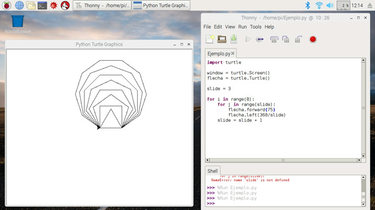
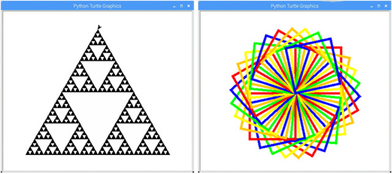
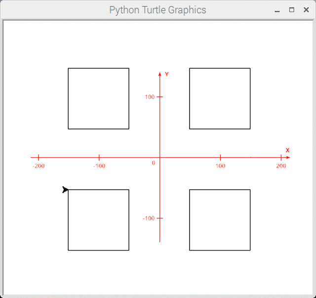
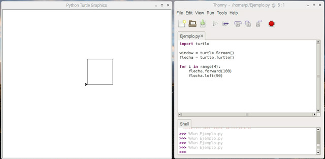
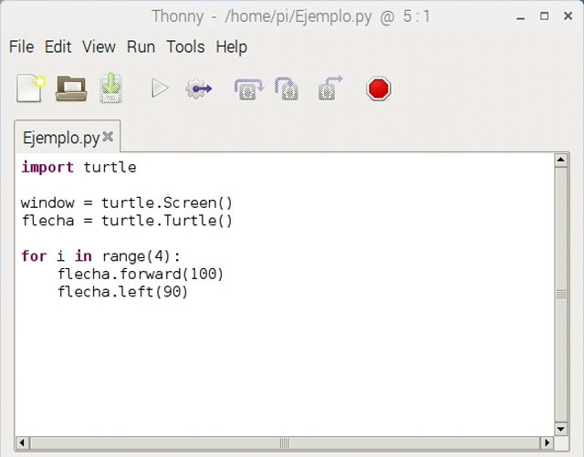
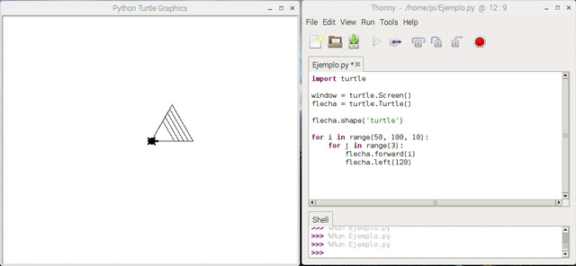
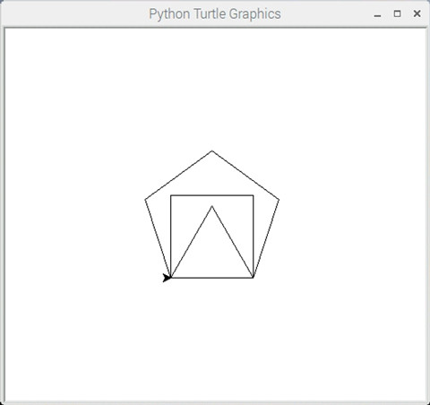

## Introducción

En este curso aprenderás el concepto de Programación Orientada o Objetos en Python a través de Python Turtle Graphics, una librería creada para la enseñanza de la programación en el ámbito educativo similar al antiguo entorno de programación Logo.

Para continuar con las lecciones del tutorial te recomendamos utilizar el sistema de Raspbian para Raspberry Pi. No obstante puedes instalar en tu sistema operativo (Linux, PC o MAC) el entorno de programación Python 3 para seguir las lecciones de este curso.




<br />


## ¿Qué es Python Turtle Graphics?

Python Turtle Graphics es un módulo de programación gráfica para Python utilizado como método para enseñar programación a través de coordenadas relativas. El objeto a programar recibe el nombre de tortuga, elemento clave en el lenguaje de programación Logo, creado por Seymour Papert a finales de la década de los 60.



A la tortuga es un objeto al cual se le puede dar órdenes de movimiento (avance, retroceso, giro, etc). Moviendo adecuadamente la tortuga se puede conseguir dibujar todo tipo de figuras. La tortuga dispone de 3 atributos esenciales:

- Posición: Respecto al centro de coordenadas.
- Orientación: Dirección hacia donde mira la tortuga.
- Pluma: Rastro que puede dejar la tortuga al desplazarse.

### ¿Qué medidas tiene el escenario?

El escenario donde se dibujan las figuras tiene un tamaño dinámico, es decir, se puede variar redimensionando la ventana. Sin embargo es importante recordar que el centro de coordenadas lo tenemos en el centro de la imagen. En este caso puedes ver como aparecen 4 cuadrantes y tendremos que calcular las posiciones de los mismos a la hora de dibujar figuras.



### ¿Qué es la Programación Orientada a Objetos?

Como explicamos en el curso de Introducción a Python de esta misma plataforma, Python es un lenguaje que soporta el paradigma de Programación Orientada a Objetos. Con este paradigma, los objetos son entidades con un determinado estado o comportamiento, y pueden ser manipualdos en tiempo de ejecución invocando a los métodos del objeto.

Dicho de otra forma, supongamos que tenemos una tortuga a la cual le damos diferentes órdenes (avance, retroceso, giro, etc). El objeto sería la tortuga, y los métodos de la tortuga son las órdenes.




<br />


## Mi primera figura

Como se explica en la anterior lección, Python es un lenguaje de programación orientado a objetos y en este caso nuestro objeto va a ser el puntero que vamos a utilizar para dibujar una figura.

Lo primero que tenemos que hacer es importar la librería que permite utilizar las funciones de movimiento de la tortuga (recuerda que estamos utilizando un lenguaje de programación orientado a objetos).

A continuación creamos la ventana donde se dibujará la figura. Más adelante veremos cómo podemos darle forma, tamaño y colores de fondo a la ventana. También debemos crear nuestro objeto al que vamos a llamar flecha.

Por último, vamos a crear nuestro primer ejemplo que mostrará un cuadrado.



A continuación puedes copiar y pegar el código en tu editor Thonny Python y ejecutar el código para ver como se dibuja un cuadro en la ventana.

```python
import turtle

window = turtle.Screen()
flecha = turtle.Turtle()

for i in range(4):
  flecha.forward(100)
  flecha.left(90)
```

### Funciones principales

Como podrás imaginar el módulo de Turtle tiene decenas de funciones para animar el objeto. En esta lección vamos a explicar las principales para poder realizar diferentes figuras con las mínimas necesarias.

> Puedes acceder a la API desde la web del proyecto.



Las funciones principales para animar nuestro objeto son las siguientes:

- forward(distance): Avanzar una determinada cantidad de píxeles.
- backward(distance): Retroceder una determinada cantidad de píxeles.
- left(angle): Girar hacia la izquierda un determinado ángulo.
- right(angle): Girar hacia la derecha un determinado ángulo.

Por otro lado, puede que en ocasiones queramos desplazarnos de un punto a otro sin dejar rastro. Para ello utilizaremos las siguientes funciones:

- home(distance): Desplazarse al origen de coordenadas.
- goto((x, y)): Desplazarse a una coordenada en concreto.
- pendown(): Subir el lápiz para no mostrar el rastro.
- penup(): Bajar el lápiz para mostrar el rastro.

Por último, puede que queramos cambiar el color o tamaño del lápiz. En ese caso utilizaremos las siguientes funciones gráficas:

- shape('turtle'): Cambia al objeto tortuga.
- pencolor(color): Cambiar al color especificado.
- pensize(dimension): Tamaño de la punta del lápiz.

### Figuras geométricas

Un ejemplo de figuras geométricas podría crearse con las siguientes funciones (triángulo, cuadrado y pentágono) como mostramos en el siguiente código. Fíjate que cada función realiza la función que tiene que realizar y se invoca desde las últimas líneas del ejemplo.



```python
import turtle

window = turtle.Screen()
flecha = turtle.Turtle()

def triangulo():
  for i in range(3):
    flecha.forward(100)
    flecha.left(120)

def cuadrado():
  for i in range(4):
    flecha.forward(100)
    flecha.left(90)

def pentagono():
  for i in range(5):
    flecha.forward(100)
    flecha.left(72)

triangulo()
cuadrado()
pentagono()
```

Sin embargo fíjate el mismo código podría simplificarse quedando mucho más corto. Es decir, sabemos que cada figura geométrica de x lados comparte la propiedad que la suma de sus lados es 360º. De esta forma podemos crear una función encargada de crear la figura dependiendo de los lados que tenga la misma.

El código para dicha función quedaría de la siguiente forma:


```python
import turtle

window = turtle.Screen()
flecha = turtle.Turtle()

def figura(lados):
  for i in range(lados):
    flecha.forward(100)
    flecha.left(360/lados)

figura(3)
figura(4)
figura(5)
```

Como se puede observar en ambos casos obtenemos el mismo resultado. A esto es lo que se le conoce como optimización de funciones, ya que estamos utilizando una función genérica para reutilizarla.


<br />


## Mi primer juego

Aunque el módulo de Python Turtle Graphics no está pensado para crear videojuegos, vamos a explicar en esta lección cómo animar e interactuar con ayuda de las teclas del teclado.

Para ello vamos a utilizar las siguientes funciones:

- onkeypress(function, "Left"): Donde function es la función que se llamará al pulsar la tecla ["Left", "Right", "Up" o "Down"].
- listen(): Con esta función le indicamos a Python que quede a la escucha de nuestro teclado.

Con este sencillo ejemplo vamos a realizar un videojuego que consiste en desplazar nuestro objeto utilizando las teclas de nuestro teclado (arriba, abajo, izquierda y derecha).

```python
import turtle

window = turtle.Screen()
flecha = turtle.Turtle()

def arriba():
  flecha.setheading(90)
  flecha.forward(100)

def derecha():
  flecha.setheading(0)
  flecha.forward(100)

def abajo():
  flecha.setheading(270)
  flecha.forward(100)

def izquierda():
  flecha.setheading(180)
  flecha.forward(100)


window.onkeypress(arriba, "Up")
window.onkeypress(derecha, "Right")
window.onkeypress(abajo, "Down")
window.onkeypress(izquierda, "Left")

window.listen() 
```
