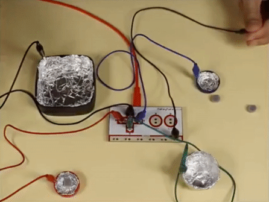
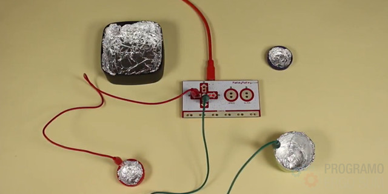
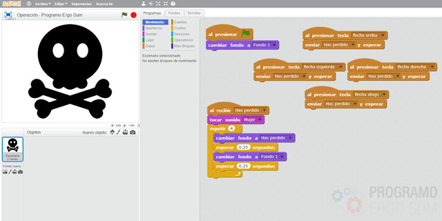
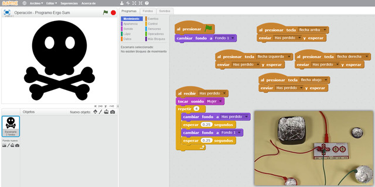

## Introducción

En este tutorial aprenderás a utilizar la placa de electrónica Makey-Makey junto al lenguaje de programación por bloques de Scratch para crear el juego de operación. Este juego consiste en coger diferentes órganos sin tocar el contacto de aluminio que hará saltar la alarma.

> Con esta sencilla aplicación estaremos conectando el mundo físico con el mundo digital.

 

## Construcción del juego

Para simular el juego de operación con Scratch y Makey-Makey primero debemos crear la plantilla. En vez de crear una plantilla con los huecos (como el juego original) optamos por una elaboración más casera.

En nuestro ejemplo hemos reutilizado diferentes tipos de tapones con diferentes tamaños. Los recubrimos con papel de aluminio para que hagan un buen contacto y lo pegamos a la base con pegamento.

  <iframe src="//www.youtube.com/embed/abt0QHZJSkE" allowfullscreen></iframe>

Recuerda que cada contacto de la placa Makey-Makey está conectado a un tapón sobre el papel de aluminio. El último cable, conectado a la toma de tierra será el que tendrá que tocar el alumno para cerrar el circuito.

 

## Programación con Scratch

En el siguiente vídeo te mostramos la programación que como puedes observar es muy sencilla. Lo único que hemos programado son eventos en programación.

  <iframe src="//www.youtube.com/embed/FQ-zEb9L6dg" allowfullscreen></iframe>

Como se puede observar, al detectar que se ha tocado el aluminio de uno de los tapones se mostrará un mensaje por pantalla y emitiremos un sonido.

 

## Resultado

  <iframe src="//www.youtube.com/embed/ez6wWNTDFS4" allowfullscreen></iframe>

En este último video te enseñamos un sencillo ejemplo sobre el funcionamiento del juego de operación con Makey Makey y Scratch. Fíjate como en todo momento se está tocando el cable negro conectado a la toma de tierra para cerrar el circuito.

 

## Instrumentos africanos

En el blog [Los peques de mi cole](http://lospequesdemicole.blogspot.com/2018/04/juego-operacion-de-makey-makey-con.html) de nuestra amiga [Cati Navarro](https://twitter.com/catinagui) puedes ver un ejemplo del juego de operación utilizando instrumentos africanos para el aula de infantil.

  <iframe src="//www.youtube.com/embed/9gWxP3yyxI4" allowfullscreen></iframe>

 

## Peligro eléctrico

En el blog [EduTicTac](https://wikimanuals.edutictac.es/index.php?title=Es:Videojoc_Tecnol%C3%B2gic:_Perill_El%C3%A8ctric) de nuestro amigo [Daniel Turienzo](https://twitter.com/danielturienzo) han puesto en práctica una aplicación similar siguiendo este tutorial para diseñar y construir un videojuego tecnológico.

- Centro de estudios: IES Montserrat Roig de Elx.
- Profesor responsable: Daniel Turienzo.
- Estudiantes participantes: Adrián, Anouar, Chen, Francisco, Francisco Javier, Gloria, Jessica, Khadi, Manuela, Nerea y Sergio.

Las maquetas de este proyecto las presentaron en la convocatoria PROYECTA TÚ de la Feria de la Ciencia y la Tecnología en Elche (FeCiTElx2016), donde los asistentes pudieron jugar a varias versiones del videojuego al mismo tiempo que aprendieron como funciona la electricidad.

  <iframe src="https://player.vimeo.com/video/166987286" allowfullscreen></iframe>

 

## Otros proyectos

- [Minion operation game](https://www.instructables.com/id/Makey-Makey-and-Scratch-Operation-Game/)
- [Yoda operation game](https://iamclaudius.com/makey-makey-operation-game/)

 

## Materiales

- Juego de operación `Juego-de-operacion.sb2`
