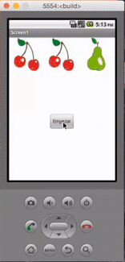

## Introducción

En este curso de programación de aplicaciones móviles con AppInventor aprenderás a utilizar las listas o colecciones de elementos al mismo tiempo que programas una pequeña aplicación. En esta aplicación se mostrarán diferentes imágenes y debemos contar el número de veces que pulsamos el botón hasta que aparezcan las 3 imágenes iguales.

 

## Diseño de la aplicación

En este primer videotutorial te enseñamos a maquetar la primera parte de la aplicación que corresponde a la parte visual denominada Designer.

  <iframe src="//www.youtube.com/embed/6Ia5XfTjQKk" allowfullscreen></iframe>

 

## Programación principal

En este video explicamos el concepto de listas y la funcionalidad que tienen en la programación.

  <iframe src="//www.youtube.com/embed/JpnRdoA0WiU" allowfullscreen></iframe>

 

## Optimización de la programación

Por último, te explicamos como optimizar el código mediante funciones para optimizar el código.

  <iframe src="//www.youtube.com/embed/uh8J-xkajtg" allowfullscreen></iframe>

