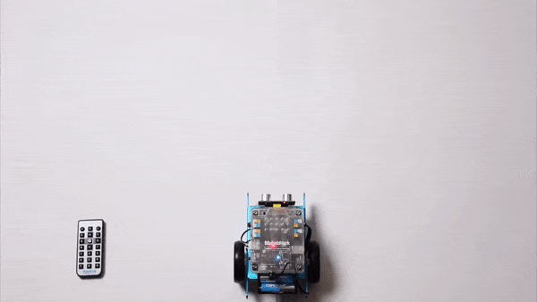
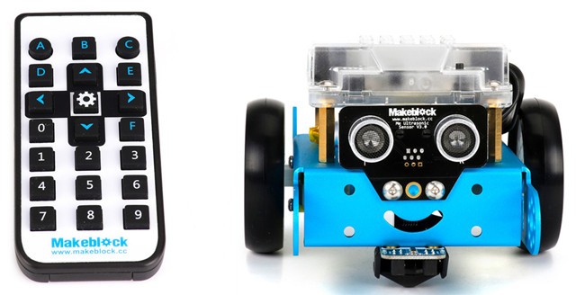
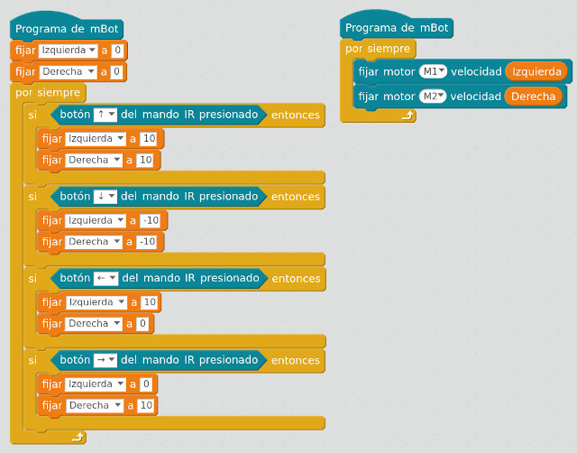
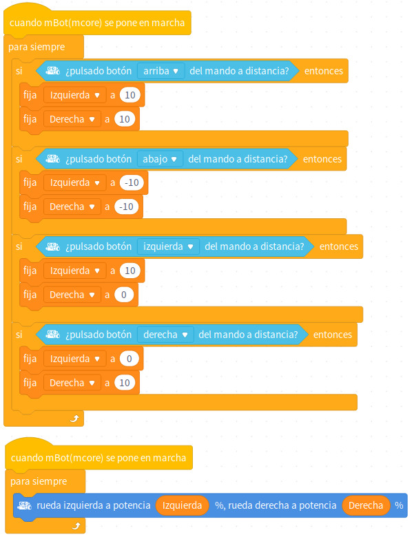
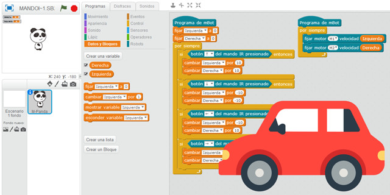

## Introducción

En este tutorial aprenderás a programar el mando por infrarojos del robot mBot. Para ello se programará sobre el lenguaje de programación por bloques de mBlock.

 

## Mando a distancia IR

El mando a distancia por infrarrojos es utilizado para controlar el robot mBot de forma remota. El mando está formado por números, letras desde la A hasta la D, flechas de dirección y el botón de configuración. Al funcionar por infrarrojos, a través de un mismo mando se puede controlar diferentes mBot.

> Si utilizas el robot mBot en el aula y utilizas mandos a distancia, puedes apuntar directamente sobre el robot en el mando utilizado, y dejar una separación de un par de metros entre robot y robot para que no existan interferencias.

 

## mBlock 3

Vamos a programar el mando a distancia sobre el editor el código de nuestro robot. Vamos a utilizar dos variables "izquierda" y "derecha" encargadas de almacenar la velocidad de giro de cada una de las ruedas, de tal forma, que al presionar cualquier flecha este valor irá aumentando o disminuyendo.

El algoritmo funcionará de la siguiente forma; si pulsamos las flechas hacia adelante o hacia atrás, el valor de las variables aumentará o disminuirá respectivamente. Por otro lado, si pulsamos las flechas izquierda o derecha, aumentaremos la variable de giro y disminuiremos la contraria para que haga el giro.

 

## mBlock 5 (versión actual)

El algoritmo funcionará de la siguiente forma; si pulsamos las flechas hacia adelante o hacia atrás, el valor de las variables aumentará o disminuirá respectivamente. Por otro lado, si pulsamos las flechas izquierda o derecha, aumentaremos la variable de giro y disminuiremos la contraria para que haga el giro.

 

## Retos propuestos

Si ya has completado todas las lecciones del tutorial te proponemos resolver los siguientes retos.

### Reto 1: Aumenta la velocidad

En este reto te propongo que modifiques la programación para que el robot aumente la velocidad. Es decir, en vez de cambiar la velocidad de 10 en 10 en sus respectivas condiciones, te propongo que crees una variable llamada "Velocidad" encargada de almacenar el valor de la velocidad, 25 por ejemplo.

 

## Materiales

- Mando IR en mBot `Mando.sb2`
- Reto 1: Aumentando la velocidad `Reto-1.sb2`
