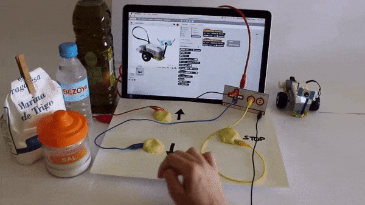
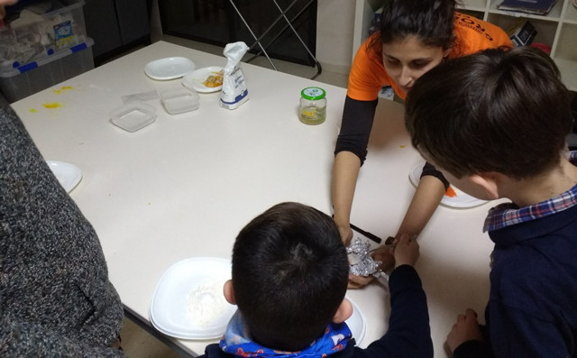

## Introducción

En este tutorial mostramos algunos ejemplos del uso de la Makey-Makey en el aula mediante trabajos manuales como la construcción de plastilina casera.

 

## Materiales conductores

Uno de los principales usos que se le puede dar a las placas Makey-Makey es mediante proyectos de manualidades. Por ejemplo, sabemos que la placa funciona cerrando los circuitos y en otros tutoriales se ha utilizado papel de aluminio u otros componentes conductores.

Ejemplos de materiales conductores:

- Fruta
- Agua
- Cobre
- Pintura de grafito
- Láminas de aluminio
- Plastilina conductora

 

## Plastilina conductora

Uno de los principales usos que se le puede dar a las placas Makey-Makey es mediante proyectos de manualidades. Por ejemplo, sabemos que la placa funciona cerrando los circuitos y en otros tutoriales se ha utilizado papel de aluminio u otros componentes conductores.

Sin embargo, una de las opciones consiste en elaborar plastilina conductora (o adquirirla en la tienda) para conectarla a nuestra placa Makey-Makey. Si optas por la primera opción, los niños se convertirán en creadores de sus propios productos de una forma muy divertida.

### Hacer plastilina conductora casera

- 1/2 Vaso de Harina
- 1/4 Vaso de Sal fina
- 1/4 Vaso de Agua
- 1 Cuchara sopera de Aceite de girasol
- 1/2 Limón exprimido
- Colorante de alimentación

El proceso es muy sencillo. Simplemente tenemos que mezclar en un recipiente la harina y la sal para que queden de forma homogenea. A continuación le vamos añadiendo agua poco a poco hasta que tengamos la masa. Al mismo tiempo podemos añadirle el aceite y el limon, así como de forma opcional el colorante para darle un color.

> Una pega acerca la fabricación de la plastilina conductora casera, es que apenas nos durará un día, ya que tiende a endurecerse y pudrirse.

 

## Explorando en infantil

En el blog [Los peques de mi cole](http://lospequesdemicole.blogspot.com/2018/02/experimentamos-con-makey-makey_10.html) de nuestra amiga [Cati Navarro](https://twitter.com/catinagui), experimentan el uso de la plastilina y la plastilina conductora en su aula de infantil.

  <iframe src="//www.youtube.com/embed/B3bBeaytCns" allowfullscreen></iframe>

 

## Piano con plastilina

En el siguiente vídeo, [Frank Sabaté](https://twitter.com/franksabate) nos muestra cómo crear un sencillo videojuego con Scratch 2.0 utilizando plastilina conductora.

  <iframe src="//www.youtube.com/embed/iar9oJJj4Lc" allowfullscreen></iframe>

 

## Otros proyectos

- [Batería con plastilina conductora](https://www.instructables.com/id/Haz-Una-Bater%C3%ADa-Con-Makey-Makey-Scratch-Y-Crea-Tu-/)
- [Car with Electric Circuit](http://saletadecreacio.com/en/conductive-plastiline-and-car-with-electric-circuit/)
- [Conductive Play Dough](https://www.instructables.com/id/How-to-make-conductive-play-dough/)
