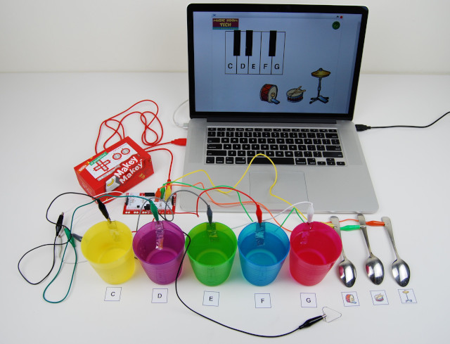
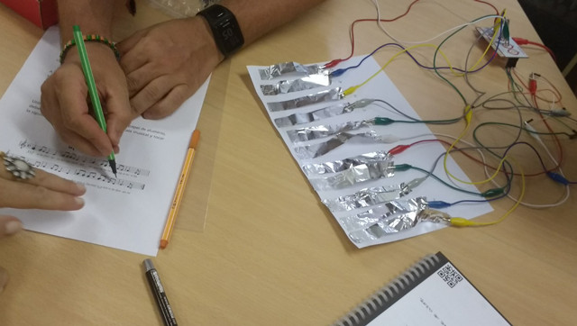
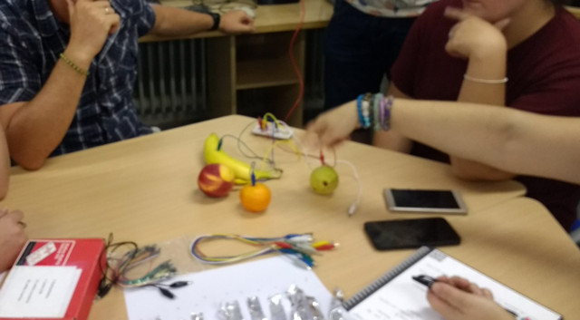

## Introducción

En este tutorial mostramos diferentes recursos educativos utilizando la placa Makey-Makey con diferentes actividades musicales.

 

## Aplicaciones de música

Podemos encontrar diferentes herramientas o aplicaciones para conectar nuestra placa Makey-Makey a un piano virtual de nuestro ordenador o portátil. Un ejemplo de ellas son las siguientes aplicaciones:

- Aplicación web de [piano sencillo](https://apps.makeymakey.com/piano/)
- Aplicación web de [piano avanzado](https://ericrosenbaum.github.io/MK-1/)
- Aplicación con Scratch de un [piano sencillo](https://scratch.mit.edu/projects/2543877/)

 

## Notas musicales

Un ejercicio muy común cuando se utiliza la Makey-Makey en el aula consiste en crear un piano para componer diferentes canciones con los alumnos. Para ello se pueden utilizar diferentes recortes con papel de aluminio para componer las notas musicales. Cada recorte de aluminio se conectará a las diferentes teclas de la placa Makey-Makey (mediante pinzas de cocodrilo y latiguillos en la parte trasera de la placa).

 

## Frutas musicales

Otra opción en la que nos encontramos es la de realizar el piano con diferentes objetos conductores de electricidad, como el caso de la fruta o verdura. De esta forma podemos darnos cuenta que existen diferentes objetos conductores y se puede explicar la conductividad en el aula. Por ejemplo, ¿sabías que la piel del Kiwi es menos conductor que la piel del plátano?

 

## Piano humano

En el [tutorial](https://catedu.gitbooks.io/scratch-avanzado-y-makey-makey/content/piano.html) del Centro Aragonés de Tecnologías para la Educación (Catedu), han puesto en práctica la placa Makey-Makey para simular un piano humano.

  <iframe src="//www.youtube.com/embed/M-8-JaDIgY0" allowfullscreen></iframe>

 

## Más ejemplos

En el siguiente vídeo se muestra el gran ingenio de algunas personas al utilizar la plaza Makey-Makey.

  <iframe src="//www.youtube.com/embed/fR9pcI-Te5s" allowfullscreen></iframe>

 

## Otros proyectos

En el blog [La Meva Escola](https://lamevaescola.com/las-flores-con-makey-makey/) han puesto en práctica una aplicación similar para los peques. Se trata de una actividad muy divertida, no os podéis imaginar la cara de sorpresa de los peques al ver que al tocar las flores salía música de ellas.

  <iframe src="//www.youtube.com/embed/exrKKlNPuuw" allowfullscreen></iframe>

