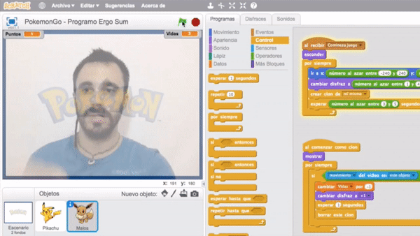
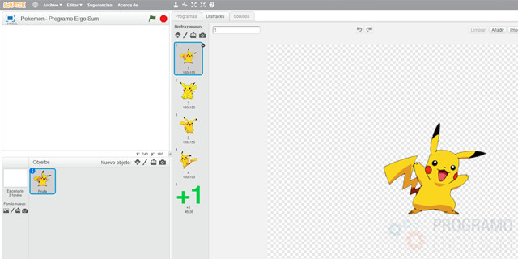
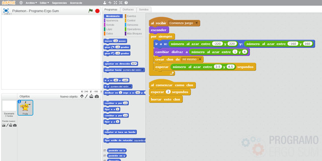
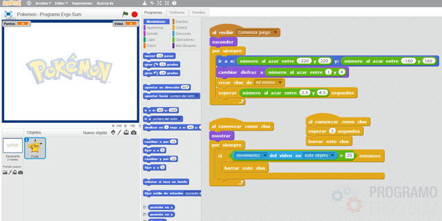
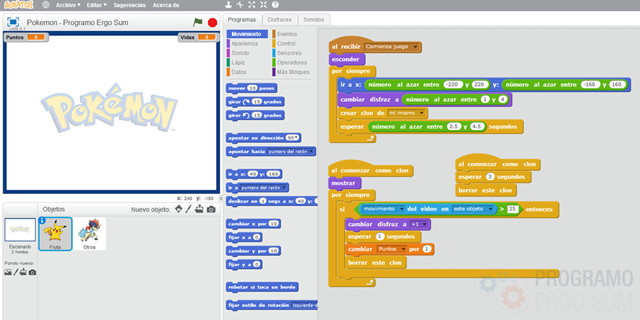
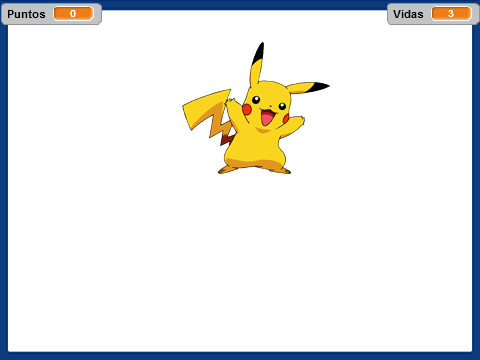

## Introducción

En este tutorial de realidad aumentada con Scratch 2.0 aprenderás a programar un sencillo videojuego. El juego consiste en capturar solamente a los Pikachu y en caso de capturar a otros personajes se pierde una vida, así hasta que se pierdan todas las vidas y termine la partida.

### Reinventa, programa y comparte

Antes de continuar con las lecciones de este curso de programación con Scratch te recomendamos seguir los siguientes pasos para reinventar y obtener todas las imágenes utilizadas en el videojuego gratis.

- Reinventa el proyecto [Pokemon Go (base)](https://scratch.mit.edu/projects/147157486/editor) para obtener todas las imágenes.
- Programa el videojuego siguiendo los videotutoriales de las siguientes lecciones.
- Comparte el proyecto y si está entre los mejores aparecerá en la sección Mejores proyectos.

 

## Clones con scratch

  <iframe src="//www.youtube.com/embed/RIGKRIjiWPs" allowfullscreen></iframe>

### Disfraces del videojuego

En primer lugar creamos el personaje principal del videojuego con sus respectivos disfraces. Hay que resaltar que es importante el nombre que les vamos a añadir a los disfraces ya que desde la programación elegiremos de forma aleatoria un determinado disfraz.

### Programación del personaje

El siguiente paso consiste en programar los clones para que aparezcan de forma aleatoria en diferentes coordenadas del escenario. Recuerda que como buenas prácticas de programación utilizamos clones en vez de crear diferentes objetos y duplicar código.

 

## Detectar zonas

  <iframe src="//www.youtube.com/embed/YuBNIvwG1Ok" allowfullscreen></iframe>

### Activar la cámara

En esta parte del tutorial se programa la funcionalidad principal del videojuego. Para ello se crea en el escenario los eventos principales de "Comienza juego" y "Game Over".

Por último, se programa sobre el objeto principal del juego la condición de borrar el clon en caso de que lo toquemos.

 

## Variables

  <iframe src="//www.youtube.com/embed/Hsez5TZwPOg" allowfullscreen></iframe>

### Puntos y vidas del videojuego

En esta última parte del tutorial añadimos unas cuantas mejoras al videojuego. Estas mejoras corresponden a los puntos y vidas que se incrementarán respectivamente en cada personaje.

 

## Mejores proyectos

