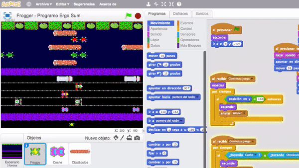
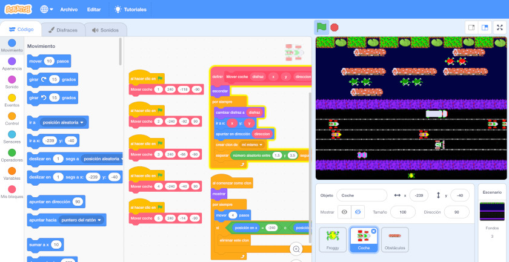
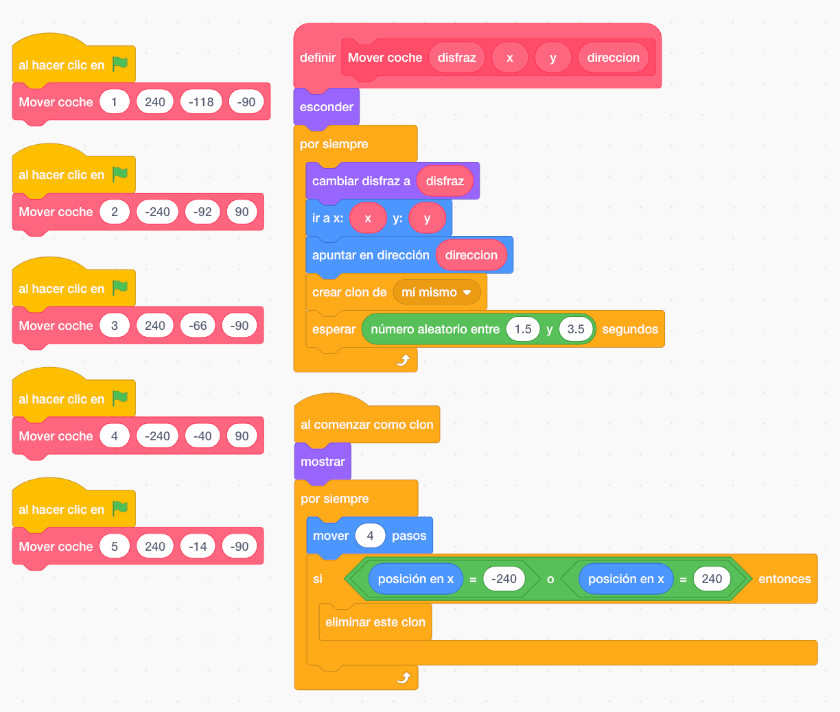
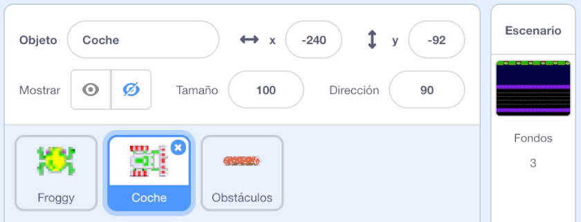
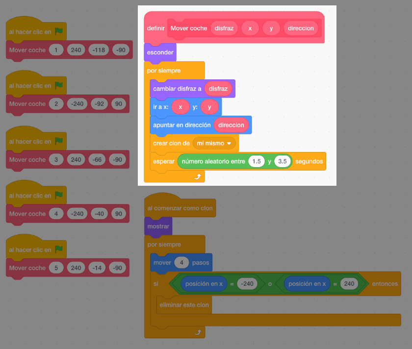
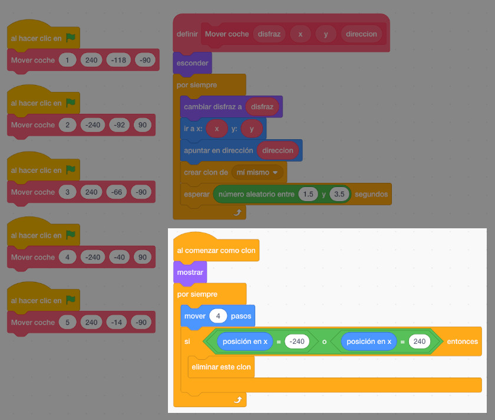

## Programación Orientada a Objetos

La Programación Orientada a Objetos o POO, es un **paradigma de programación informática** que basa su resolución de problemas, en la creación de los llamados objetos, que no son más que unidades que contienen una serie de características y atributos a los cuales se les asignará una serie de datos para resolver el problema.

Los objetos manipulan los datos de entrada para la obtención de datos de salida específicos, donde cada objeto ofrece una funcionalidad especial.

### Conceptos básicos

Entre los principales conceptos básicos del paradigma de la programación orientada a objetos tenemos:

- **Clase**: Definiciones de propiedades y comportamiento de un tipo de objeto.
- **Atributo**: Elementos que contienen tipos de datos asociados a objetos.
- **Método**: Conjunto de instrucciones que se realizan a los datos que son asignados a un objeto.
- **Objeto**: Elementos provistas de un conjunto de propiedades y atributos considerados instancias.

### ¿Qué es Scratch?

Scratch es un entorno gráfico de programación desarrollado por un grupo de investigadores del Lifelong Kindergarten Group del Laboratorio de Medios del MIT, bajo la dirección del Dr. Mitchel Resnick. Este entorno gráfico hace que la programación sea más atractiva y accesible para todo aquel que se enfrenta por primera vez a aprender un lenguaje de programación. Según sus creadores, fue diseñado como medio de expresión para ayudar a niños y jóvenes a expresar sus ideas de forma creativa, al tiempo que desarrollan habilidades de pensamiento lógico.

La aplicación de los lenguajes de programación por bloques permiten una presentación visual del paradigma y metodología de la programación informática permitiendo centrarse en la lógica de la programación dejando a un lado la sintaxis propia de los lenguajes de programación (puntos y comas, paréntesis, etc).

 

## POO en Scratch

En esta sección vamos a explicar el paradigma de la programación orientada a objetos con el videojuego de frogger programado con Scratch. El objetivo del videojuego consiste en guiar a la rana Froggy hasta su hogar. Para hacerlo, la rana debe evitar coches mientras cruza una carretera congestionada y luego cruzar un río lleno de riesgos.

Como puedes observar, aparecen 5 coches moviéndose desde un lateral hacia el opuesto, al igual que los troncos. Cada instancia del objeto a su vez se mueve desde una posición, dirección y velocidad diferente que establecemos en un método del objeto.

La programación del personaje principal es muy sencilla mientras que la programación de los objetos "coche" o "tronco" es idéntica como se muestra en la siguiente imagen.

## Objetos

Con este paradigma de programación, los objetos manipulan los datos y cada objeto ofrece una funcionalidad especial. En este caso el mismo objeto toma diferentes posiciones, diseños, velocidades, etc. Además de establecer uns propiedades inciales éstas pueden modificarse en tiempo de ejecución, es decir, durante el transcurso del videojuego.

## Concurrencia

Mediante la programación paralela o concurrente simulamos varios procesos que se ejecutan de forma paralela. En este ejemplo, tanto los vehículos como los troncos se lanzan al mismo tiempo. Se puede observar en el videojuego que aun teniendo solamente un objeto "coche", al empezar el videojuego aparecen 5 coches. Con los troncos ocurre exactamente lo mismo.

## Abstracción

Una parte importante de la metodología de la programación es la reutilización de código. En este caso la misma función se encarga de realizar la misma funcionalidad según los datos que se le pasan por parámetro. Esta función recibe los parámetros de disfraz, posición x e y, y la dirección hacia donde debe moverse el objeto.

## Clones

Con esta técnica nuestros procesos se realizan más rápido aprovechando al máximo los recursos utilizados por el juego. En este caso eliminamos los vehículos una vez llegan al final.

 

## Conclusión

Con las anteriores imágenes pretendemos hacer ver que la programación con Scratch puede ser un juego de niños, si, pero también es una herramienta muy poderosa para iniciarse en la programación, ya que se adquieren conceptos importantes de una forma muy sencilla.

Recuerda que la programación es una ciencia que se encarga de diseñar, codificar, depurar y mantener el código de los programas. No basta con programar, hay que hacerlo bien.
