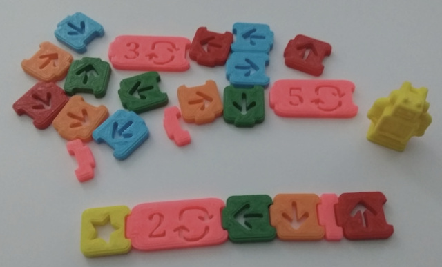
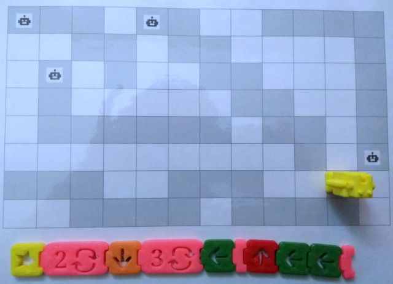
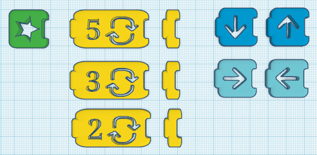

## Introducción

Con este juego se pueden aprender las bases y la lógica de la programación utilizando sencillas fichas que puedes crearte utilizando cartulina o una impresora 3D.

> Esta actividad surge como adaptación del juego Yo Aprendo a programar de Ediset.

 

## Instrucciones del juego

En este juego deberás guiar al robot hasta la meta escogiendo el mejor camino de los posibles. Para ello contarás con una serie de fichas (avanzar, retroceder, girar a la izquierda y derecha, bucles y ficha de inicio).

El juego se puede jugar en parejas, donde uno crea el recorrido sobre una hoja cuadriculada y el oponente resulve el camino utilizando los bloques de programación.

Otra opción es utilizar plantillas de ejemplos con algoritmos complejos como se observa en la siguiente imagen. 

 

## Reinventa el juego

Todas las piezas de este juego se han realizado en Tinkercad para que puedas contribuir en el desarrollo de nuevas piezas. Además, puedes descargar los ficheros en formato `.stl` desde nuestra página en Thingiverse e imprimir las piezas con una impresora 3D.

 

## Materiales

- [Thingiverse](https://www.thingiverse.com/thing:3911302)
