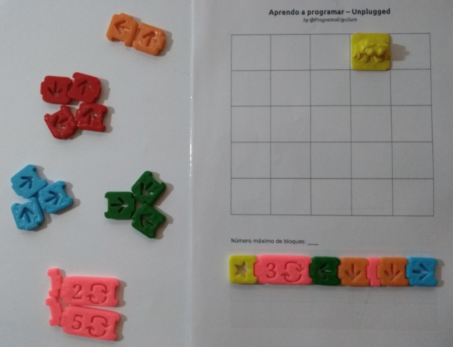

## Introducción

Con este juego se pueden aprender las bases y la lógica de la programación utilizando sencillas fichas que puedes crearte utilizando cartulina o una impresora 3D.

 

## Desarrollo de la partida

En este juego deberás guiar al robot hasta la meta escogiendo el mejor camino de los posibles. Para ello contarás con una serie de fichas (avanzar, retroceder, girar a la izquierda y derecha, bucles y ficha de inicio).

El juego se puede jugar en parejas, donde uno crea el recorrido sobre una hoja cuadriculada y el oponente resulve el camino utilizando los bloques de programación. 

 

## Agradecimientos

Esta actividad surge como adaptación del juego *Yo Aprendo a programar de Ediset*.

 

## Materiales

- [Thingiverse](https://www.thingiverse.com/thing:3911302)