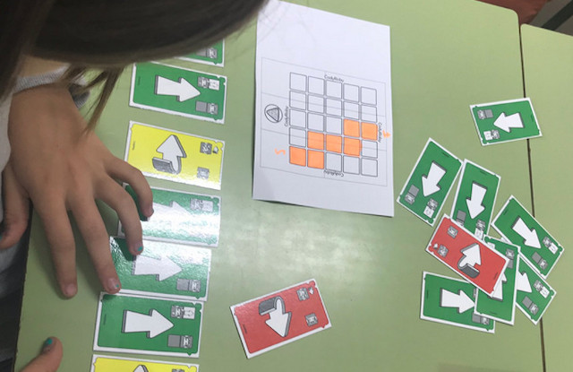

## Introducción

El juego [Cody & Roby](http://codeweek.it/cody-roby-en/) proporciona una manera fácil de empezar a jugar con robots y programación sin necesidad de usar un ordenador. Roby es un robot que ejecuta instrucciones y Cody es un programador que proporciona instrucciones. Las instrucciones se representan mediante cartas. Solo hay 3 instrucciones, avanzar, girar a la derecha y girar a la izquierda. 

El kit que puedes descargar desde la [web del creador](http://codeweek.it/codyroby/), incluye 40 tarjetas cody, una caja de tarjetas cody, un tablero de ajedrez, 5 piezas de Roby y 24 fichas. No obstante, puedes modificar las tarjetas existentes y personalizar o crear las tuyas propias.

  <iframe src="//www.youtube.com/embed/D5hQ9UTDQ6s" allowfullscreen></iframe>

 

## Instrucciones del juego

Las instrucciones son sencillas. Se utilizan las tres instrucciones antes mencionadas, representadas por cartas de colores, de forma que Roby se moverá por el tablero siguiéndolas. Los jugadores estarán ejecutando en realidad secuencias de instrucciones y por tanto trabajando su pensamiento computacional.

Desde la propia web del proyecto nos enseñan 4 modalidades de juego:

- Race
- Duel
- Snake
- Full-Fill

 

## Race (Carrera)

> El primero en atravesar un circuito gana la partida.

En esta modalidad de juego primero se construye un circuito que deberá atravesar nuestro robot. A continuación agrupamos las tarjetas según las instrucciones y empieza la partida. Los jugadores deben tomar una tarjeta y colocarla sobre la mesa en orden según secuencia. El primer jugador que tenga la secuencia correcta y completa será el que gane la partida.

  <iframe src="//www.youtube.com/embed/izpB0Cvl0tk" allowfullscreen></iframe>

 

## Duel (El duelo)

> Sitúate sobre el robot contrincante y elimínalo.

En esta modalidad se barajan todas las cartas y se reparten 5 cartas a cada jugador. Los jugadores irán desechando cartas y realizando movimientos de las cartas desechadas. El objetivo del juego consiste en eliminar a los demás jugadores cuando el robot se ha puesto sobre el robot contrincante. Los jugadores siempre deberán tener 5 cartas en la mano.

  <iframe src="//www.youtube.com/embed/JiGjrOwOz6Y" allowfullscreen></iframe>

 

## Snake (Serpiente)

> Consigue pasar por el mayor número de casillas.

En esta modalidad se barajan todas las cartas y los jugadores deben conseguir pasar por el mayor número de casillas. Por cada casilla que pase el robot se deja una ficha. El juego consiste en conseguir el mayor número de casillas.

  <iframe src="//www.youtube.com/embed/th0nbgo0PBs" allowfullscreen></iframe>

 

## Full-Fill (Relleno completo)

> Consigue pasar por el mayor número de casillas sin repetir.

En esta modalidad de juego se barajan todas las cartas y solamente juega un jugador. El objetivo del juego consiste en pasar por todas las casillas sin repetir para obtener el mayor número de casillas.

  <iframe src="//www.youtube.com/embed/XqWRDab5GDw" allowfullscreen></iframe>

 

## Enlaces de interés

- [Cody & Roby](http://codeweek.it/cody-roby-en/)
- [DIY Starter Kit](http://codeweek.it/cody-roby-en/diy-starter-kit/)
