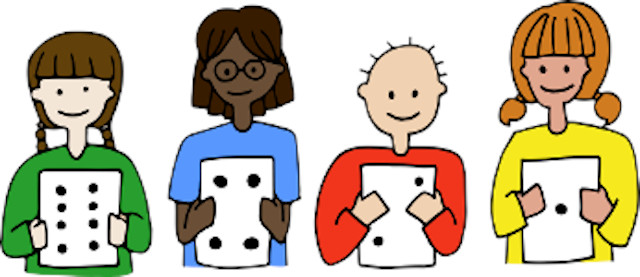

## Introducción

Actualmente podemos encontrar numerosas actividades para desarrollar el pensamiento computacional sin utilizar un ordenador, lo que se conoce como programación desenchufada o desconectada. Actividades que no dependen del uso de ordenadores y así poder evitar la confusión entre la informática y la programación o el aprendizaje de programas de aplicaciones informáticas.

Estas actividades de programación desconectada tienden a permitir que los alumnos descubran las respuestas por sí mismos, en lugar de darles soluciones o algoritmos que seguir, es decir, *se fomenta un enfoque constructivista* ya que queremos que los alumnos se den cuenta de que son capaces de encontrar soluciones a los problemas por su cuenta, en vez de darles una solución al problema.

  <iframe src="//www.youtube.com/embed/l7FwWt16IY4" allowfullscreen></iframe>

Las actividades desconectadas, además de ser ideales para ir adquiriendo ciertas destrezas en el mundo de la programación informática, suelen ser de bajo coste al utilizar materiales comúnmente encontrados en las aulas.

 

## CS Unplugged

El proyecto [CS Unplugged](https://csunplugged.org/es/) es una colección de material didáctico y de libre acceso que enseña las bases de la informática a través de interesantes juegos y puzles con la ayuda de cartas, cuerdas, lápices y mucha actividad física.

Cuenta con planes de estudios, planes de clases, vídeos didácticos, actividades de integración curricular y ejercicios de programación para practicar con el ordenador los conceptos de informática que acaban de aprender sin él. 

El objetivo principal del proyecto es promocionar la informática (y la computación en general) entre los jóvenes, como una disciplina interesante, fascinante e intelectualmente estimulante. 

  <iframe src="//www.youtube.com/embed/KOYy4kyLEHs" allowfullscreen></iframe>

Desde la web del proyecto podrás [descargar](https://classic.csunplugged.org/books/) un PDF disponible en varios idiomas con una gran cantidad de prácticas para realizar sin necesidad de utilizar un ordenador o dispositivo informático.

 

## Enlaces de interés

- [CS Unplugged en PDF](https://classic.csunplugged.org/books/)
- [Web anterior de CS Unplugged](https://classic.csunplugged.org/)
