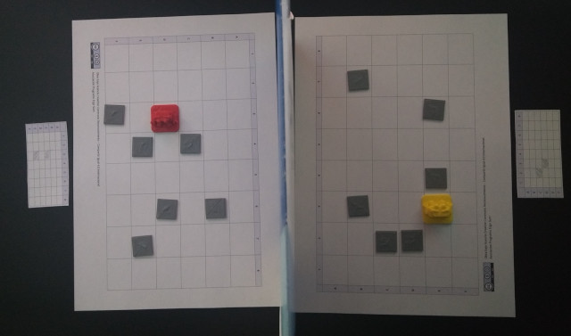

## Introducción

En este juego, cada jugador tendrá que atravesar el tablero evitando los obstáculos ocultos. Para ello deberás guiar a tu robot utilizando solamente 3 movimientos adelante, gira a la derecha y gira a la izquierda. Cada vez que te encuentres con un obstáculo será el turno de tu contrincante. El primero que logre atravesar el tablero gana la partida.

Cada jugador dispone de un tablero el cual no podrá ver su contrincante. Deberá colocar 10 obstáculos de forma aleatoria. La única condición es que tiene que haber un camino posible para que se pueda atravesar conociendo los movimientos del robot.

 

## Desarrollo de la partida

Empieza el jugador 1 indicando a su contrincante en qué fila quiere colocar a su robot, por ejemplo, en la posición 1B y éste le contestará si puede colocarlo o no. En caso de poder colocarlo, continuará indicando el siguiente movimiento, por ejemplo, avanza. Y nuevamente el contrincante le indicará si puede continuar o no. Este proceso se repetirá hasta que no pueda avanzar por encontrar un obstáculo, en cuyo caso será el turno para el jugador 2.

Para facilitar la partida, se cuenta con unas fichas individuales donde podrás apuntar tus obstáculos y evitarlos en tu siguiente turno de la partida.

El primero que logre atravesar el tablero ganará la partida.

 

## Agradecimientos

Esta actividad surge como adaptación del juego utilizado por [@GorkaProfe](https://twitter.com/Gorkaprofe/status/1079352225430978562) en el aula con sus alumnos.

 

## Materiales

- [GitHub](https://github.com/ProgramoErgoSum/programar-sin-ordenador)