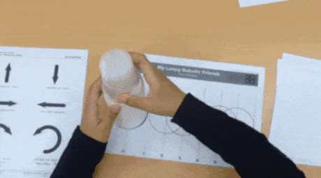
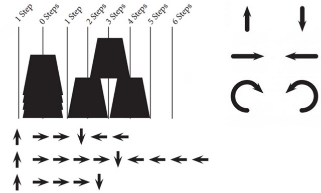
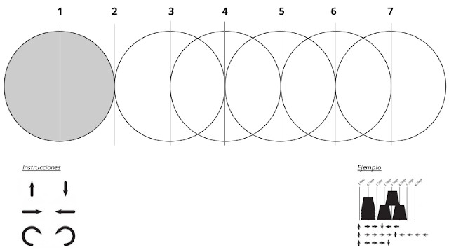

## Introducción

Esta actividad permite introducirnos al mundo de la programación y robótica sin utilizar ni ordenadores ni robots. La actividad consiste en utilizar movimientos como si de un brazo robótico se tratase para formar una estructura utilizando vasos de plástico.

> My Robotic Friends fue publicada en la Computer Science Education Week de 2013 por por Thinkersmith.

 

## Consideraciones previas

En esta actividad pueden participar los estudiantes en parejas o formando grupos de 3 o 4 alumnos para competir y colaborar entre ellos mismos. Para ello deberemos definir los roles `programador` y `robot` dentro de las parejas o grupos de alumnos.

- Los programadores se encargarán de realizar la secuencia de instrucciones.
- Los robots deberán reconstruir la estructura siguiendo las instrucciones de los programadores para obtener el mismo resultado.

 

## Instrucciones del juego

Una vez definidos los roles dentro del grupo, el equipo de los robots deberán abandonar la sala mientras los programadores crean y programan el algoritmo mediante las instrucciones necesarias para construir una estructura de vasos. Las instrucciones de programación son las siguientes:

- Coger o soltar vaso
- Avanzar o retroceder brazo (1/2 posición)
- Girar 90º sentido horario o antihorario

Una vez terminado el algoritmo por parte de los programadores, los robots volverán a la sala y deberán seguir las instrucciones de los programadores para crear la estructura de vasos.

Si los programadores han realizado bien su trabajo y los robots han seguido las instrucciones de forma correcta, el resultado de la estructura debe ser idéntica a la que programaron los programadores.

 

## En educación primaria

En caso de utilizar esta actividad con estudiantes más pequeños de primeros cursos de educación primaria, puedes ayudarte de una plantilla similar a la siguiente para explicar los movimientos de avanzar y retroceder.

De esta forma, la pila de vasos estarán sobre el círculo de color gris y se moverán 1/2 de la posición del vaso.

 

## En educación secundaria

Para usuarios más avanzados se suelen proponer estructuras más complejas utilizando además otro tipo de instrucciones de repeticiones o funciones.

Este tipo de instrucciones engloban una serie de repeticiones en instrucciones, por ejemplo, en vez de utilizar las instrucciones `-> -> ->` se podría sustituir por `(3)->` indicando que la instrucción `->` se repite 3 veces seguidas.

 

## Enlaces de interés

- [Computer Science Education Week - Robotics Spanish](https://csedweek.org/files/CSEDrobotics_spanish.pdf)
- [My Robotics Friends - Code.org](https://www.youtube.com/watch?v=xaW3PAzHxCU)

 

## Materiales

- Plantilla `Plantilla.pdf`
