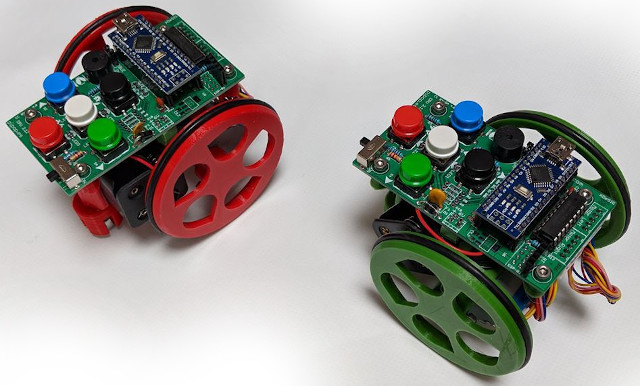
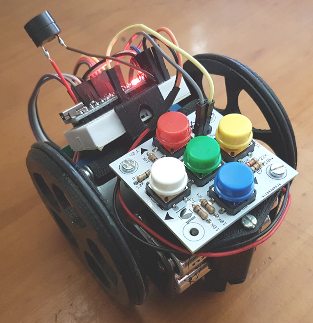
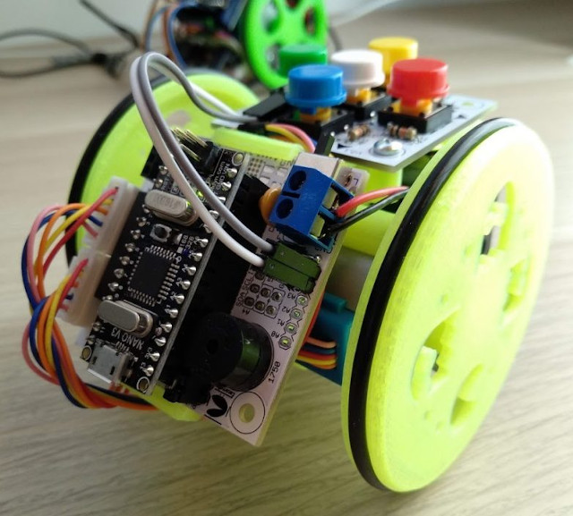
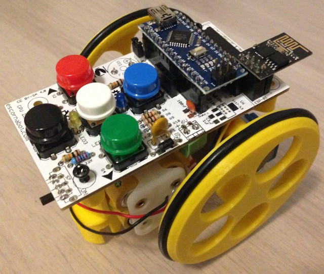
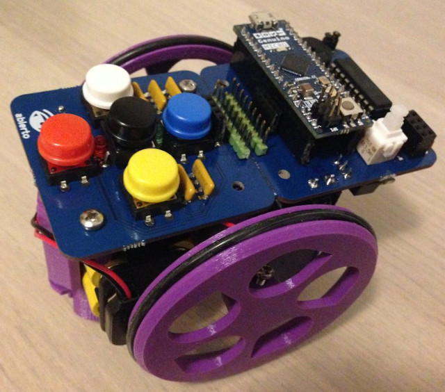
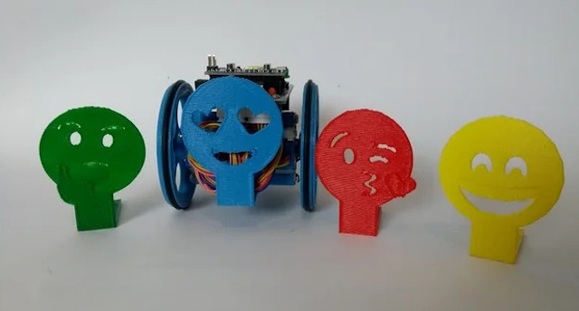

## Introducción

En este tutorial vamos a explicar diferentes actividades de robótica educativa para introducir el robot de suelo Escornabot en el aula desde educación infantil.

 

## ¿Qué es Escornabot?

[Escornabot](http://escornabot.com/web/) es un proyecto de robot educativo para iniciarse en el campo de la robótica y la programación que puede ejecutar secuencias de movimientos que son programadas por el usuario mediante la pulsación de botones del robot o introduciendo comandos en un dispositivo móvil con conexión Bluetooth. Similar a otros robots de suelo como Beebot, Next, etc. lo que hace especial a Escornabot es la filosofía que sigue de proyecto de código y hardware abierto.

Aunque nace en la asociación de makers Bricolabs (Galicia), son muchos los que aportan y difunden el proyecto para que más niños y niñas sientan interés por la programación y la robótica desde cero, uno de ellos es [Pablo Rubio](https://pablorubma.cc/escornabot).

 

## Brivoi Audacius DIY

Con esta versión podrás construirte tu propio Escornabot Do It Yourself (DIY) de la forma más económica posible.

 

## Brivoi Compactus

Similar a la versión Audacius DIY con la diferencia de utilizar 2 placas de electrónica en vez de cableado directo sobre la protoboard.

 

## Singularis 2.12 XDeSIG

En esta versión solamente dispones de una placa con los componentes de electrónica ensamblados directamente y sin cables a la vista. Puedes descargar las piezas y diseños desde [Thingiverse](https://www.thingiverse.com/thing:3269696).

 

## Ogaki abiertocc

Similar a la versión 2.12 de XDeSIG creada por abierto.cc.

 

## Diseños

Si dispones de una impresora 3D puedes descargar diseños creados por la comunidad desde la cuenta de Escornabot en [Thingiverse](https://www.thingiverse.com/escornabot/designs). 

Uno de los diseños que puedes encontrar es el proyecto [Escornamoji](https://www.thingiverse.com/thing:2939496) que realizamos con los alumnos para jugar al parchis con Escornabot.

