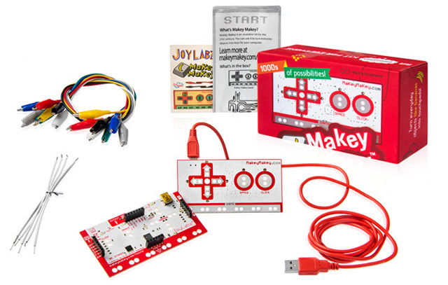
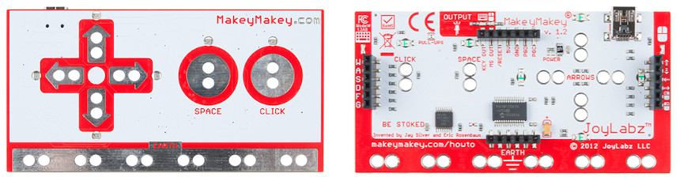
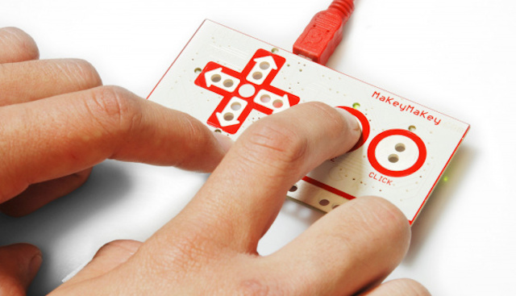
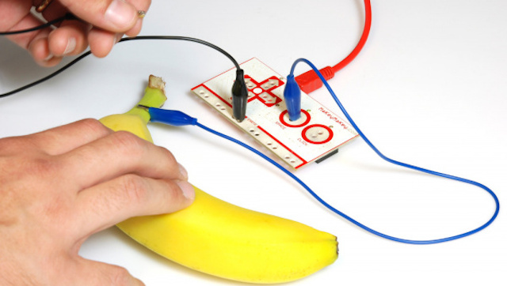

## Introducción

Makey-Makey es una placa similar al mando de una videoconsola que simula ser un teclado o ratón, lo que permite enviar órdenes al ordenador al que se encuentre conectado. En vez de pulsar los botones lo que hacemos es cerrar el circuito mediante contactos o pinzas de cocodrilo y de esta forma se simula haber pulsado un botón. De esta forma, nos permite convertir cualquier objeto de la vida diaria en un teclado, un mando o un ratón.

La idea de Makey-Makey es sencilla y simple. Consiste en una placa de electrónica con un cable USB que se conecta al ordenador como un periférico más, de manera que da la oportunidad a sus usuarios de buscar y encontrar nuevas maneras de interactuar con sus ordenadores, potenciando la creatividad, la imaginación y el diseño.

 

## An Invention Kit for Everyone

Haz un piano con plátanos, juega al Mario, deja que tu gato se haga una foto. Este es un kit de invención simple para principiantes y expertos. En el video podemos ver a Jay y a Eric, miembros del Media Lab del MIT, haciendo algunas divertidas demostraciones del uso de este kit.

  <iframe src="//www.youtube.com/embed/rfQqh7iCcOU" allowfullscreen></iframe>

 

## Primeros pasos

Si nos fijamos en la placa Makey-MAkey, podemos observar como en la parte delantera podemos conectar los cables cocodrilo con los cursores, el espacio o el botón izquierdo del ratón, mientras que en la parte trasera, utilizaremos los cables jumper para conectarlos con algunas teclas comunes del teclado (A, W, S, D, etc.) y algunos movimientos del ratón. De esta forma, podemos conectar esta placa a casi cualquier material consiguiendo que este se convierta en una especie de teclado o mando para un videojuego.

Lo único que tenemos que hacer es conectar la placa al USB de nuestro ordenador o portátil y de forma automática debe reconocerse como un periférico más... es decir, no hay que instalar ningún tipo de software.

Para comprobar que nuestra placa funciona, simplemente debemos tocar la placa sobre la parte inferior serigrafiada con la palabra `EARTH` y el tecla `space`. Observaremos como se enciende una luz roja junto a la placa.

El funcionamiento para cualquier aplicación sería el siguiente:

1. Conectar la placa al pc mediante el cable USB
2. Conectar un cable cocodrilo a la tierra
3. Conectar un cable cocodrilo o jumper a cualquiera de las conexiones delanteras o traseras
4. Cerrar el circuito con cualquier material conductor

 

## Ejemplos

A continuación puedes encontrar unos cuantos ejemplos para utilizar con la placa Makey-Makey.

- El cuerpo humano con Makey-Makey y Scratch. [Tutorial](https://www.programoergosum.es/tutoriales/el-cuerpo-humano-con-makey-makey-y-scratch/)
- Juego de operación con Makey-Makey y Scratch. [Tutorial](https://www.programoergosum.es/tutoriales/juego-de-operacion-con-makey-makey-y-scratch/)
- Lunch: O Say Can You See. [YouTube](https://www.youtube.com/watch?v=Uiq0DTCJvy0)
- J.Views playing Teardrop with vegetables. [YouTube](https://www.youtube.com/watch?v=xvmTav3SYsc)
- Interactive Dance Floor. [YouTube](https://www.youtube.com/watch?v=JoWNiOQLtpU)

  <iframe src="//www.youtube.com/embed/wkPt9MYqDW0" allowfullscreen></iframe>

 

## Materiales

A continuación puedes encontrar una gran cantidad de recursos educativos para utilizar utilizando Makey-Makey.

- Aplicaciones en la web de [Makey-Makey](https://makeymakey.com/blogs/how-to-instructions/apps-for-plug-and-play)
- Proyectos en [Instructables](https://www.instructables.com/makeymakey)
- Recursos maker en [Thingiverse](https://www.thingiverse.com/tag:makey)
