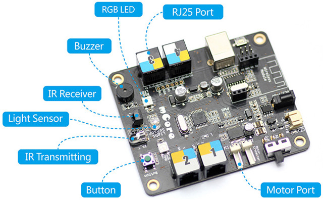
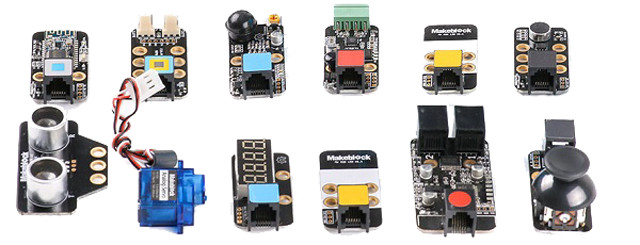
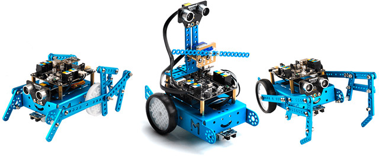
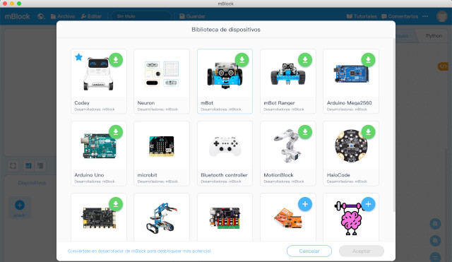
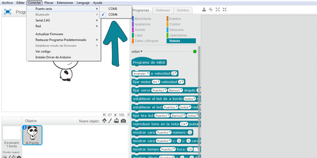
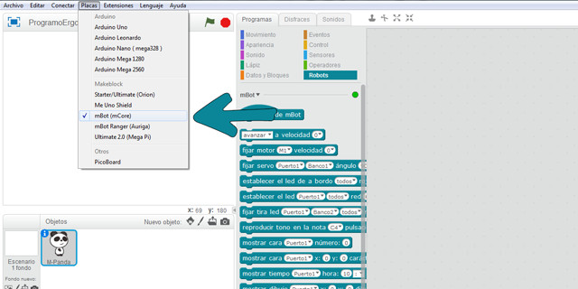
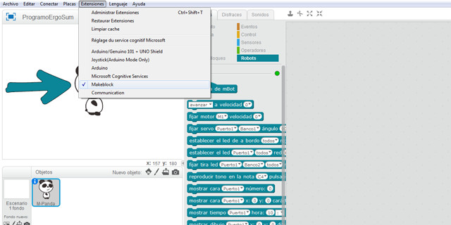
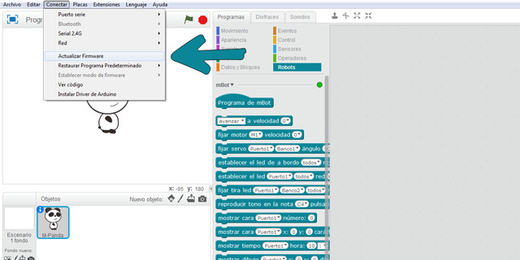
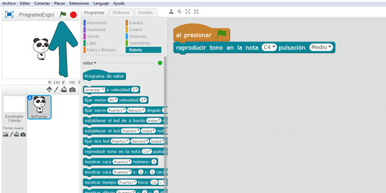
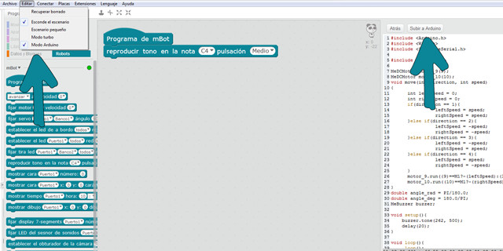

## Introducción

El [robot mBot](https://www.makeblock.com/steam-kits/mbot) es un robot educativo creado por MakeBlock ideal para iniciarse en la programación y robótica desde educación primaria. Está basado en Arduino UNO considerándose sencillo de utilizar ya que no necesita cableado ni soldaduras gracias a sus conectores RJ25 (típicas conexiones de teléfono).

En cuanto a la programación, se puede programar utilizando lenguajes de programación por bloques o en modo textual:

- Utilizando mBlock, el software de programación propio de Makeblock, basado en Scratch, que nos permite programar el robot sin necesidad de aprender un lenguaje complejo de programación.
- Utilizando Arduino para usuarios de nivel intermedio. En este caso se utiliza un lenguaje de programación de Arduino y necesitamos instalar las librerías de Makeblock en el software de Arduino IDE.
- Utilizando la app de mBot disponible para iOS y Android. La podemos utilizar sin necesidad de instalarle un código previo al robot.

### Especificaciones técnicas

- Placa: mCore (basada en Arduino)
- Micro controlador: Atmega328
- Peso: 400gr
- Alimentación: 4 pilas AA o batería de litio de 3,7V
- Accesorios: Sensor de luz, botón, infrarrojos, ultrasónico, seguidor de línea, zumbador, Led RGB, transmisor.
- Conexiones: 2 motores y 4 sensores
- Comunicación: Bluetooth, Serie inalámbrica 2.4G
- Dimensiones: 17 x 13 x 9 cm (montado)

 

## Hardware de mBot

El robot educativo mBot utiliza la placa mCore la cual tiene un micro controlador ATmega238 con 4 puertos con conexiones RJ25 para conectar sensores. También integra un interruptor de encendido, un botón, dos LEDs RGB, un buzzer, un sensor de luminosidad y un sensor de infrarrojos.

Los módulos o sensores que pretendemos conectar a la placa vienen clasificados por color. Ese color debe corresponder con el color del puerto al cual pretendemos conectarlo. Es decir, en la imagen anterior vemos que el puerto 2 dispone de tres colores (amarillo, azul y blanco), lo que indica que en él podremos conectar cualquier módulo cuyo RJ25 disponga de alguno de esos colores.

Los colores que podemos encontrarnos en los puertos de las diferentes placas de Makeblock son: Rojo (motores), Amarillo (interface digital), Azul (interface digital dual), Gris (Puerto serie, bluetooth), Negro (interface analógica y dual) y Blanco (Puerto I2C). Este sistema de identificación por colores hace que conectar los accesorios de electrónica con la placa sea algo muy intuitivo y fácil.

 

## Construcción del Robot

En el video de esta lección se muestra como montar el robot de mBot paso a paso siguiendo el manual del fabricante. El manual es muy sencillo y didáctico y viene expresado con un lenguaje para que los alumnos de último ciclo de educación primaria o secundaria sean capaces de montarlo sin ningún problema.

  <iframe src="//www.youtube.com/embed/dsOqO8fmqpk" allowfullscreen></iframe>

> Cuando adquieres el robot de mBot por primera vez suele venir preparado para que sea montado en el aula por los alumnos.

Por otro lado, recordar que dependiendo de las extensiones o robots de mBot adquiridos, el montaje será diferente ya que puede incluir nuevas funcionalidades, sensores, etc. Desde la página web del fabricante podrás encontrar todos los modelos de robots educativos disponibles, así como las fichas técnicas, ayudas en el montaje y ejemplos de programación.

 

## mBlock 5 (versión actual)

mBlock 5 es un entorno gráfico de programación basado en el editor Scratch 3.0 para que escuelas y centros de formación pueda introducir la robótica educativa de una forma sencilla y enseñar a programar robots basados en Arduino.

### Instalar mBlock 5

En primer lugar deberás descargar el software de mBlock desde la [web del fabricante](https://www.mblock.cc/en-us/download/) para instalarlo en tu equipo.

Una vez instalado, conectamos nuestro robot mBot utilizando el cable USB y encendemos el interruptor que viene en la carcasa y seguiremos los siguientes pasos para configurarlo y conectarlo a nuestro software de mBlock.

- Añadir dispositivo
- Conectar
- Elegir extensión
- Modo en vivo
- Modo cargar

### Añadir dispositivo

En primer lugar deberemos añadir el robot mBot o el que estemos utilizando de forma similar a cuando en Scratch se añade un nuevo personaje. Una vez seleccionado el robot nos aparecerá como aparece en la siguiente imagen.

### Conectar

Para poder trabajar con el robot mBot deberemos conectarlo al puerto USB y seleccionar el puerto al cual se encuentre conectado. Una vez conectado nos deberá aparecer un mensaje indicando que se ha conectado correctamente.

### Hola Mundo

Puedes probar a programar el siguiente código y pulsar la bandera verde. Si todo ha salido correcto deberás escuchar un sonido en el robot mBot. De esta forma ya habremos configurado y conectado correctamente nuestro robot mBot con el software mBlock.

### Modo en vivo vs cargar

A diferencia de la versión anterior de mBlock, en esta versión tenemos dos modos de trabajar con el robot:

- Modo de carga: Permite carcar el código en un dispositivo, para que siga las instrucciones programadas después de desconectarlo del ordenador.
- Modo en vivo: Este modo es ideal para probar el código en tiempo real. Usando mensajes y variables, puedes hacer que tu dispositivo interactúe con el escenario.

 

## mBlock 3 (versión anterior)

mBlock 3 es un entorno gráfico de programación basado en el editor Scratch 2.0 para que escuelas y centros de formación pueda introducir la robótica educativa de una forma sencilla y enseñar a programar robots basados en Arduino.

### Instalar mBlock 3

En primer lugar deberás descargar el software de mBlock desde la [web del fabricante](https://www.mblock.cc/en-us/download/) para instalarlo en tu equipo.

Una vez instalado, conectamos nuestro robot mBot utilizando el cable USB y encendemos el interruptor que viene en la carcasa y seguiremos los siguientes pasos para configurarlo y conectarlo a nuestro software de mBlock.

- Conectar el puerto USB
- Elegir placa
- Elegir extensión
- Actualizar firmware
- Programar y depurar el código
- Subir el programa a Arduino

### Conectar el puerto USB

En primer lugar debemos elegir el puerto correcto al cual hemos conectado nuestro robot mBot. En caso de dudas puedes acceder a las herramientas administrativas de tu equipo (Windows, Linux o MAC) y comprobar el puerto utilizado.

### Elegir la placa y extensiones del robot utilizado

mBlock puede ser utilizado con diferentes robots educativos o placas como Arduino. En este caso deberemos seleccionar la placa del robot mBot y la extensión de MakeBlock

A continuación observaremos como aparecen los bloques de programación para este robot en el apartado de robots en la pestaña de programas.

### Actualizar firmware

Según se va programando el código a ejecutar en el robot, podemos ir probándolo sin necesidad de desconectarlo del puerto USB. En este caso, deberemos cargar el firmware en el robot para que el código y variables utilizadas en el programa puedan ser mostradas desde el robot hacia la pantalla de mBlock.

### Hola Mundo

Puedes probar a programar el siguiente código y pulsar la bandera verde. Si todo ha salido correcto deberás escuchar un sonido en el robot mBot. De esta forma ya habremos configurado y conectado correctamente nuestro robot mBot con el software mBlock.

### Subir el código programado al robot

Una vez hemos programado nuestro robot y queremos que funcione de forma autónoma sin necesidad de estar conectado a nuestro PC mediante el cable USB, deberemos cargar el código en nuestro robot. Para ello deberemos acceder al apartado de Arduino y subir el código al robot. El proceso suele tardar unos segundos.

