## Introducción

En este tutorial aprenderás a programar diferentes prácticas utilizando las salidas analógicas de la placa de arduino. Para cada una se explica la parte de electrónica que deberás conocer antes de programarlas. Observarás además que puedes programarlas utilizando los lenguajes de programación por bloques o textual de Arduino.

- Práctica 1: Luces aleatorias
- Práctica 2: LED RGB de ánodo común
- Práctica 3: Servomotor 0-180
- Práctica 4: La Guerra de las Galaxias

### ¿Qué materiales voy a necesitar?

Antes de continuar con las lecciones del curso asegúrate que dispones de todos los componentes que se van a necesitar. Los componentes utilizados en este tutorial son:

- Arduino UNO
- Protoboard
- Latiguillos
- LEDs
- RGB
- Resistencias
- Servomotor
- Zumbador


<br />


## Salidas analógicas PWM

Una señal analógica es aquella que puede tomar diferentes valores. Su forma característica es conocida como señal de onda senoidal y las representaciones se realizan en el dominio del tiempo. La función principal de las salidas analógicas es entregar una señal de control que le dará funcionalidad a un circuito electrónico que será el encargado de cumplir con las funciones que el usuario requiera.

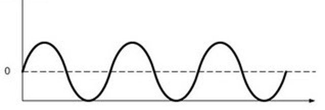

### Salidas digitales en Arduino

En electrónica se suele utilizar un convertidor de digital a analógico (DAC) para transformar la señal digital en analógica, sin embargo arduino no incluye un DAC dentro de los circuitos que forman la placa, con lo cual no son capaces de producir salidas analógicas. Sin embargo son capaces de producir una señal analógica modulada por pulso PWM.

> En Arduino UNO no tenemos una señal analógica pura, es decir, se utiliza la técnica PWM.

PWM (modulación por ancho o de pulso) es un tipo de señal de voltaje utilizada para enviar información o para modificar la cantidad de energía que se envía a una carga. Este tipo de señales es muy utilizada en circuitos digitales que necesitan emular una señal analógica, en las cuales se les cambia el ancho relativo respecto al período de la misma, el resultado de este cambio es llamado ciclo de trabajo y sus unidades están representadas en términos de porcentaje.

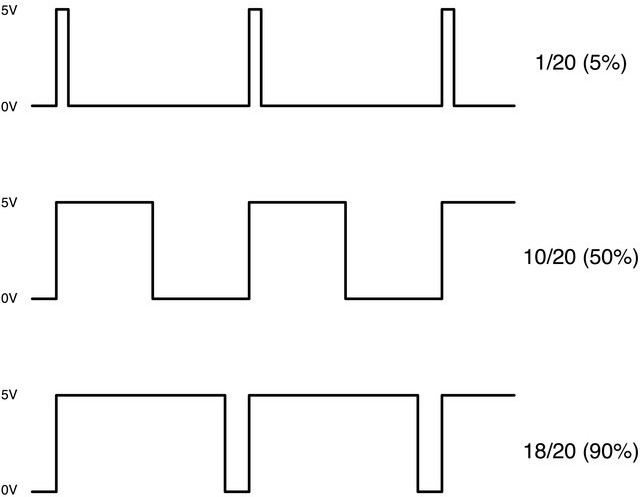

En arduino disponemos de 6 pines analógicos PWM serigrafiados con el símbolo de alterna (~) con los números 11, 10, 9, 6, 5, 3.

> La salida analógica PWM toma los valores comprendidos entre 0 y 255.

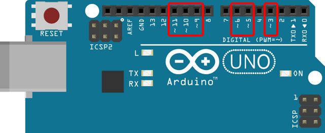

Los pines de salida han sido diseñados para entregar señales de voltaje, no para suplir corriente a un circuito. El máximo de corriente que puede entregar un pin de salida es de aproximadamente 40mA (suficiente para encender un LED). Las cargas que vamos a manejar no deben superar los 5V ni consumir más de 40mA.

### Bloques de programación

Para programar las siguientes prácticas utilizando el lenguaje de programación por bloques de mBlock, deberás conocer los siguientes bloques de programación, encargados de regular los pines analógicos PWM de la placa de arduino.

El primer bloque activa el pin analógico PWM número 5 de la placa de arduino a un valor de 0, con lo cual si conectamos un LED correctamente se apagará. Por otro lado, si cambiamos el valor por 150 observaremos que el LED se ilumina con una intensidad media.

También disponemos de un bloque encargado de hacer girar un servomotor entre 0º y 180º y otro bloque para reproducir frecuencias en el zumbador.

> Los pines para las salidas analógicas PWM corresponden a los pines 11, 10, 9, 6, 5 y 3 y pueden tomar valores comprendidos entre 0 y 255, o entre 0 y 180 para el caso de los servomotores.

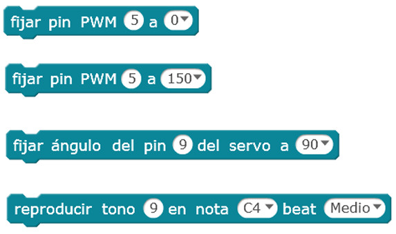

### Instrucciones de programación

Para programar las siguientes prácticas utilizando el lenguaje de programación textual de Arduino IDE, deberás conocer las siguientes instrucciones de programación.

**Función pinMode()**

La función pinMode(), utilizada en la función setup(), sirve para configurar el modo de trabajo de un pin pudiendo ser INPUT (entrada) u OUTPUT (salida).

```arduino
// Configura "pin" como salida
pinMode(pin, OUTPUT);

// Ejemplo: Activar el pin digital 13 como salida
pinMode(13, OUTPUT);
```
 
**Función analogWrite()**

La función analogWrite(), utilizada normalmente en la función loop(), sirve para escribir un valor a un pin PWM. Los valores posibles están comprendidos entre 0 y 255. Recuerda que en arduino disponemos de los pines 11, 10, 9, 6, 5, 3 para utilizar como salidas PWM.

```arduino
// Establece en "pin" el valor 150
analogWrite(pin, 150);

// Ejemplo: Activar el pin digital 11 con valor 255
analogWrite(11, 255);
```

**Función random()**

La función random() sirve para elegir un valor aleatorio entre dos valores dados.

```arduino
// Elige un valor entre un mínimo y un máximo
random(mínimo, máximo);

// Ejemplo: Elige un valor entre 0 y 255
random(0, 255);
```

### Estructura de un programa en Arduino IDE

Todo programa para Arduino consta de 2 funciones; la función setup() y la función loop(). La función setup() es la primera función que se ejecuta en nuestro programa, ejecutándose sólo una vez, y se utiliza para configurar la comunicación con nuestro equipo, inicializar los pines de nuestra tarjeta de Arduino e inicialización de las variables.

```arduino
// La función setup() es la primera función en ejecutarse, una sola vez
void setup(){
  Instrucción 1
  Instrucción 2
  ...
  Instrucción N
}
```

La función loop() se ejecuta repetidamente después de la función setup(). Dentro de la misma vamos a introducir el programa que queremos ejecutar dentro de la placa de Arduino.

```arduino
// La función loop() se ejecuta repetidamente en modo bucle infinito
void loop(){
  Instrucción 1
  Instrucción 2
  ...
  Instrucción N
}
```

### Sintaxis de programación en Arduino IDE

Es importante tener claras las siguientes reglas del lenguaje de programación:

- Toda línea termina en punto y coma ";" excepto las estructuras de control que se acompañan con llaves "{}".
- Las instrucciones y variables son sensibles a mayúsculas y minúsculas, es decir, debemos respetar el nombre exacto.
- Las instrucciones que comienzan por el símbolo de doble barra "//" se tomará como comentario para el programa. También se dispone de comentarios de múltiples líneas /* */.


<br />


## Práctica 1: Luces aleatorias

El objetivo de esta práctica es encender en diferentes intensidades 3 LEDs blancos, es decir, se va a programar un código encargado de encender cada LED blanco a una intensidad de luz diferente (haciendo uso de la salida analógica).

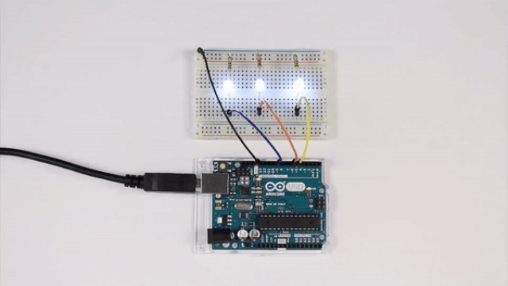

### Materiales

- 1 Arduino UNO
- 1 Protoboard
- 4 Latiguillos
- 3 LEDs blancos
- 3 Resistencias de 100Ω (marrón-negro-marrón)

### Esquema eléctrico

Se conectan los LEDs a los pines analógicos PWM (~) 9, 6 y 5. La patilla larga del LED debe ser conectada al voltaje positivo (ánodo) y la corta al voltaje negativo (cátodo) pasando por la resistencia.

```
V = 5V - 3.3V = 1.7V
I = 20mA

V = I x R ; R = V / I

R = 1.7V / 0.02A = 85Ω -> 100Ω (por aproximación)
```

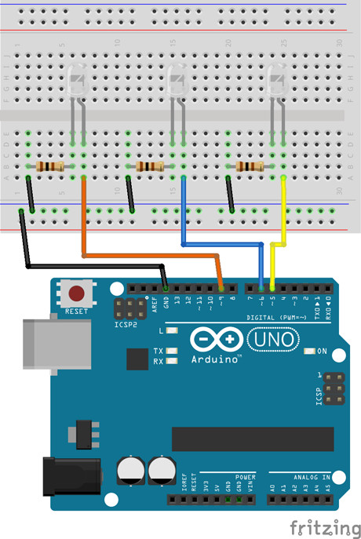

### Programación en mBlock

Al ejecutar el código se establecerá un valor aleatorio entre 0 y 255 en cada uno de los pines analógicos PWM. Además esperaremos medio segundo para poder visualizar el efecto.

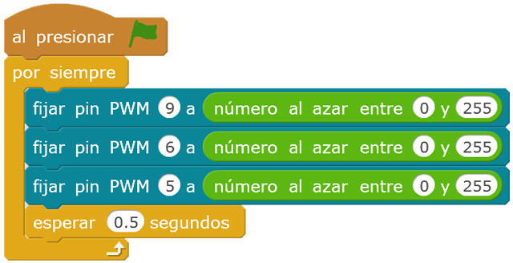

### Programación en Arduino IDE

En primer lugar, se configura los pines analógicos PWM 9, 6 y 5 en modo salida (OUTPUT). Esta configuración se establece en la función setup(), ya que solamente se ejecuta una vez.

Por otro lado, al ejecutar el código se establecerá un valor aleatorio entre 0 y 255 en cada uno de los pines analógicos PWM y esperaremos medio segundo (500 milisegundos) para visualizar el efecto aleatorio.

```arduino
void setup() {
  pinMode(9, OUTPUT);
  pinMode(6, OUTPUT);
  pinMode(5, OUTPUT);
}

void loop() {
  analogWrite(9, random(0, 255));
  analogWrite(6, random(0, 255));
  analogWrite(5, random(0, 255));
  delay(500);
}
```


<br />


## Práctica 2: LED RGB (ánodo común)

El objetivo de esta práctica consiste en encender un LED RGB de ánodo común en sus 3 colores básicos rojo, verde y azul. Aunque esta práctica se podría realizar utilizando salidas digitales, se va a realizar utilizando salidas analógicas con valores de 255.

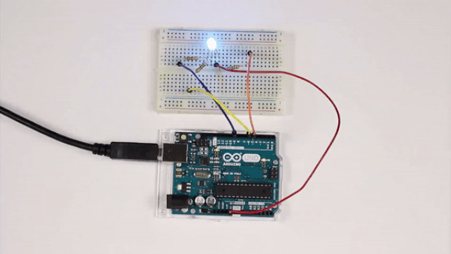

### Materiales

- 1 Arduino UNO
- 1 Protoboard
- 4 Latiguillos
- 1 LED RGB de ánodo común
- 1 Resistencias de 100Ω (marrón-negro-marrón)
- 2 Resistencias de 220Ω (rojo-rojo-marrón)

### Esquema eléctrico

La patilla más larga del LED RGB de ánodo común se conecta al pin de 5V de la placa de arduino para que esté polarizado positivamente. La patilla que queda a la izquierda corresponde al color rojo, el cual se conectará con su debida resistencia. Las otras dos patillas corresponden a los colores verde y azul por orden. También habrá que conectarlas a sus resistencias que además son de menor valor.

**Cálculo de la resistencia para el LED RGB (rojo)**

```
V = 5V - 2.1V = 2.9V
I = 20mA

V = I x R ; R = V / I

R = 2.9V / 0.02A = 145Ω -> 220Ω (por aproximación)
```

**Cálculo de la resistencia para el LED RGB (verde - azul)**

```
V = 5V - 3.3V = 1.7V
I = 20mA

V = I x R ; R = V / I

R = 1.7V / 0.02A = 85Ω -> 100Ω (por aproximación)
```


### Programación en mBlock

Al ejecutar el código se activará cada uno de los pines encargados de encender el LED RGB. En este caso, al estar utilizando un LED RGB de ánodo común para encender el color rojo tendremos que polarizar inversamente el color que queremos visualizar, dicho de otro modo, tendremos que establecer a un valor bajo el pin conectado a la patilla del color rojo y un valor alto a las patillas del color verde y azul.


### Programación en Arduino IDE

En primer lugar, se configura los pines analógicos PWM 9, 6 y 5 en modo salida (OUTPUT). Esta configuración se establece en la función setup(), ya que solamente se ejecuta una vez.

Por otro lado, al ejecutar el código se activará cada uno de los pines encargados de encender el LED RGB. En este caso, al estar utilizando un LED RGB de ánodo común para encender el color rojo tendremos que polarizar inversamente el color que queremos visualizar, dicho de otro modo, tendremos que establecer a un valor bajo el pin conectado a la patilla del color rojo y un valor alto a las patillas del color verde y azul. Además se crea un retardo de 1 segundo (1000 milisegundos) para apreciar el efecto de cambio de color.

```arduino
void setup() {
  pinMode(9, OUTPUT);
  pinMode(6, OUTPUT);
  pinMode(5, OUTPUT);
}

void loop() {
  analogWrite(9, 0);
  analogWrite(6, 255);
  analogWrite(5, 255);
  delay(1000);
  analogWrite(9, 255);
  analogWrite(6, 0);
  analogWrite(5, 255);
  delay(1000);
  analogWrite(9, 255);
  analogWrite(6, 255);
  analogWrite(5, 0);
  delay(1000);
}
```


<br />


## Práctica 3: Servomotor 0º-180º

El objetivo de esta práctica consiste en mover un servomotor desde su posición o ángulo de 0º hasta 180º y vuelta a empezar, de forma repetida. Además, se desplazará de 10º en 10º.

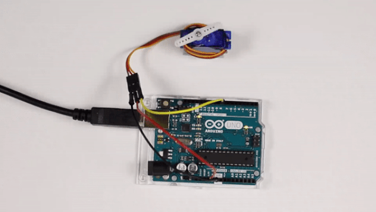

### Materiales

- 1 Arduino UNO
- 3 Latiguillos
- 1 Servomotor

### Esquema eléctrico

Conectamos el cable rojo (positivo del servomotor) al pin 5V de la placa de arduino, el cable negro (negativo del servomotor) al pin GND de la placa de arduino y el color amarillo al pin analógico PWM 9 de la placa de arduino.

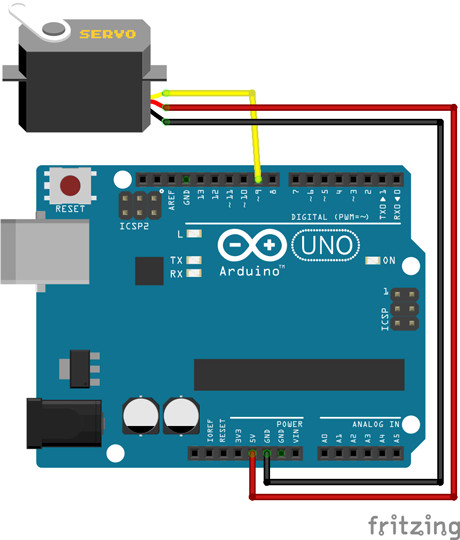

### Programación en mBlock

Al ejecutar el código se crea una variable encargada de almacenar el ángulo del servomotor, que por defecto empezará en su posición de 0º. A continuación se repite 18 veces el cambio de ángulo por 10º esperando una décima de segundo. De esta forma el servomotor se desplazará hasta la posición 180º. Y como tiene que regresar se vuelve a crear un bucle pero en este caso la variable irá decrementando de 10º en 10º.

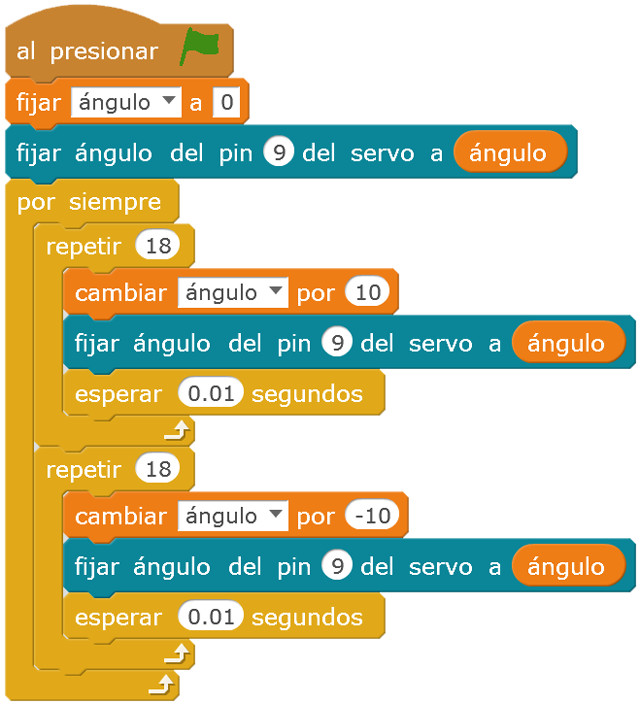

### Programación en Arduino IDE

En primer lugar, se importa la librería a utilizar <Servo.h> y se inicializa el objeto llamado servomotor. Además se configura el pin analógico PWM 9 a utilizar por el servomotor. Esta configuración se establece en la función setup(), ya que solamente se ejecuta una vez.

Por otro lado, al ejecutar el código se recorre 18 veces el cambio de ángulo por 10º esperando una décima de segundo. De esta forma el servomotor se desplazará hasta la posición 180º. Y como tiene que regresar se vuelve a crear un bucle pero en este caso la variable irá decrementando de 10º en 10º.

```arduino
#include <Servo.h> 

Servo servomotor;

void setup() {
  servomotor.attach(9);
}

void loop() {
  for(int i=0; i<=180; i+=10){
    servomotor.write(i);
    delay(100);
  }
  for(int i=180; i>=0; i-=10){
    servomotor.write(i);
    delay(100);
  }
}
```


<br />


## Práctica 4: La Guerra de las Galaxias

El objetivo de esta práctica consiste en reproducir con ayuda de un zumbador la banda sonora de La Guerra de las Galaxias mediante frecuencias.

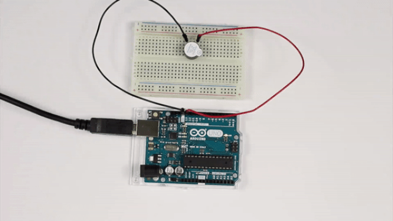

### Materiales

- 1 Arduino UNO
- 1 Protoboard
- 2 Latiguillos
- 1 Zumbador

### Esquema eléctrico

Se conecta el cable negro (negativo) del zumbador al pin GND de la placa de arduino y el cable rojo (positivo) al pin analógico PWM 9 de la placa de arduino.

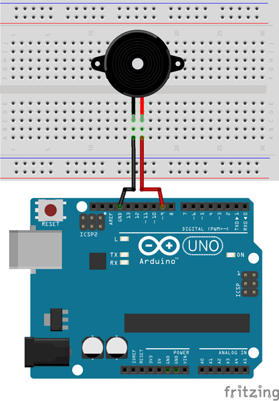

### Programación en mBlock

Al ejecutar el código utilizamos los bloques de sonido siguiendo la partitura de la banda sonora de La Guerra de las Galaxias.


### Programación en Arduino IDE

En primer lugar se crea una lista con las notas y tonos de cada una de las notas. También se va a utilizar una función encargada deemitir una frecuencia pasada por parámetro durante una determinada duración, también pasada por parámetro.

Por otro lado, al ejecutar el código se llama a la función que reproduce la nota dada siguiendo la partitura de la banda sonora de La Guerra de las Galaxias.

```arduino
int c[5]={131,262,523,1046,2093}; // Do
int d[5]={147,294,587,1175,2349}; // Re
int e[5]={165,330,659,1319,2637}; // Mi
int f[5]={175,349,698,1397,2794}; // Fa
int g[5]={196,392,784,1568,3136}; // Sol
int a[5]={220,440,880,1760,3520}; // La
int b[5]={247,494,988,1976,3951}; // Si

void nota(int frecuencia, int duracion)
{
  tone(9, frecuencia);
  delay(duracion);
  noTone(9);
  delay(50);
}

void setup() {

}

void loop() {
  nota(f[2],500);
  nota(f[2],500);
  nota(f[2],500);
  nota(d[2],250);
  nota(a[2],250);
  nota(f[2],500);
  nota(d[2],250);
  nota(a[2],250);
  nota(f[2],500);
  delay(500);
  nota(c[3],500);
  nota(c[3],500);
  nota(c[3],500);
  nota(d[3],250);
  nota(a[2],250);
  nota(f[2],500);
  nota(d[2],250);
  nota(a[2],250);
  nota(f[2],500);
  delay(1000);
}
```


<br />


## Materiales 

- Luces aleatorrias - Esquema eléctrico `fritzing.fzz`
- Luces aleatorrias en mBlock `mblock.sb2`
- Luces aleatorrias en Arduino IDE `arduino.ide`
- Led RGB (ánodo común) - Esquema eléctrico `fritzing.fzz`
- Led RGB (ánodo común) en mBlock `mblock.sb2`
- Led RGB (ánodo común) en Arduino IDE `arduino.ide`
- Led RGB (cátodo común) - Esquema eléctrico `fritzing.fzz`
- Led RGB (cátodo común) en mBlock `mblock.sb2`
- Led RGB (cátodo común) en Arduino IDE `arduino.ide`
- Servomotor - Esquema eléctrico `fritzing.fzz`
- Servomotor en mBlock `mblock.sb2`
- Servomotor en Arduino IDE `arduino.ide`
- La Guerra de las Galaxias - Esquema eléctrico `fritzing.fzz`
- La Guerra de las Galaxias en mBlock `mblock.sb2`
- La Guerra de las Galaxias en Arduino IDE `arduino.ide`
