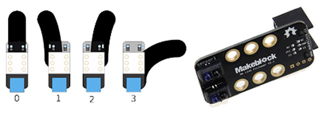
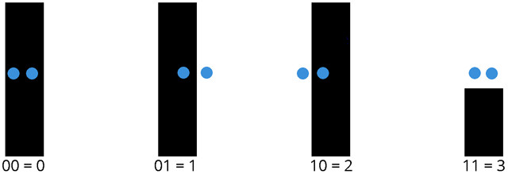
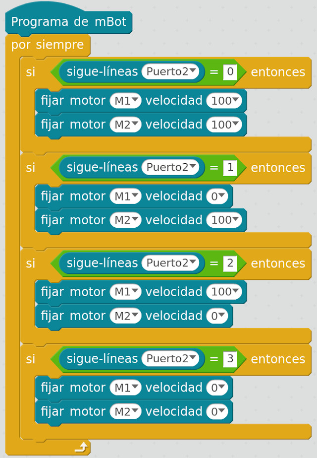
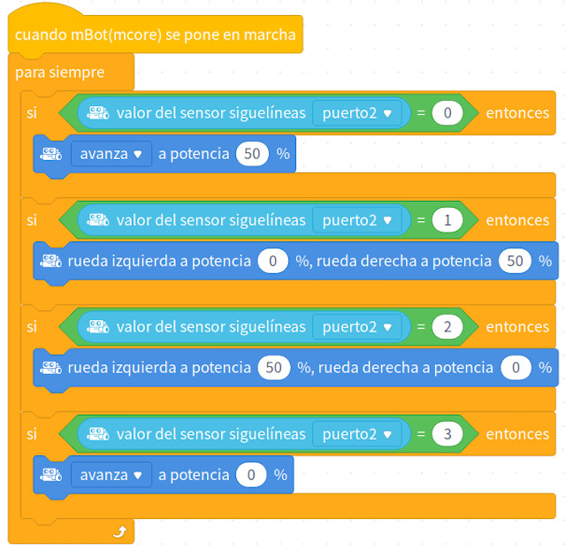
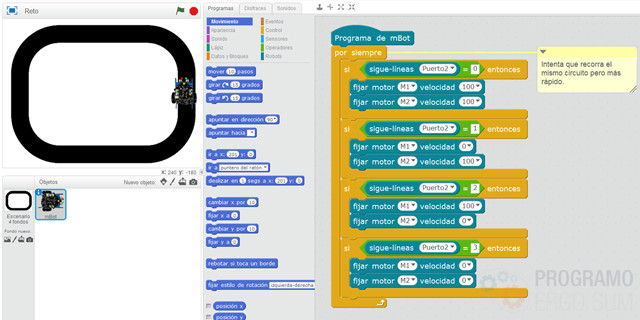

## Introducción

En este tutorial aprenderás a programar el sensor sigue líneas o de infrarojos del robot mBot. Para ello se programará sobre el lenguaje de programación por bloques de mBlock.

 

## Sensor sigue-líneas

El sigue-líneas o sensor de infrarrojos (IR) es un sensor de medición de distancia que se basa en un sistema de emisión y recepción de radiación lumínica en el espectro de los infrarrojos. Dicho de otro modo, es un sensor con una fuente de luz (diodo emisor) y detector (fototransistor) integrados en un mismo encapsulado. La detección del objeto se consigue por la reflexión (o no) del haz infrarrojo sobre la superficie del objeto. Este sensor se utiliza habitualmente para detectar el color de un objeto, en nuestro caso, distinguir blanco y negro en aplicaciones para el seguimiento de línea.

El funcionamiento del sensor es el siguiente; si el sensor del robot mBot está sobre la línea negra, los reflejos del sensor son absorbidos por la misma con lo cual el receptor del sensor no recibe ningún valor, o lo que es lo mismo, dando el valor 0. Del mismo modo, si uno de los dos sensores del robot queda fuera de la línea, se producirá el reflejo indicando los valores 1 o 2 respectivamente. Por último, si ambos sensores quedan fuera de la línea se mostrará el valor 3.

- Valor 0: mBot tiene los dos detectores IR sobre la línea.
- Valor 1: mBot tiene el detector IR de la derecha fuera de la línea.
- Valor 2: mBot tiene el detector IR de la izquierda fuera de la línea.
- Valor 3: mBot tiene ambos detectores IR fuera de la línea.

 

## Ejemplo en Scratch

En el siguiente vídeo se simula sobre Scratch el funcionamiento de un sigue-líneas (antes de programarlo sobre el propio robot). De esta forma entenderemos el concepto y funcionamiento del sensor sigue-líneas.

  <iframe src="//www.youtube.com/embed/6RPOuI9MhvE" allowfullscreen></iframe>

 

## mBlock 3

En el siguiente vídeo se programa sobre mBlock el funcionamiento de nuestro sigue-líneas. Como puedes observar el funcionamiento del sensor es muy parecido al programado con Scratch en la lección anterior. La diferencia es que en este caso tenemos que tener en cuenta los valores que devuelve el sensor IR.

  <iframe src="//www.youtube.com/embed/NBkQY4pj7mA" allowfullscreen></iframe>

Es muy importante conocer las conexiones donde hemos conectado nuestro robot para que no realice movimientos inesperados. En nuestro caso hemos seguido las conexiones que vienen por defecto en el manual de construcción del robot.

 

## mBlock 5 (versión actual)

La programación del sigue líneas es muy sencilla siempre y cuando tengamos en cuenta los valores que devuelve el bloque de sensores. Nuestro robot variará la velocidad hacia la derecha o izquierda dependiendo de dicho valor, y parará en caso de salirse del circuito.

 

## Retos propuestos

Si ya has completado todas las lecciones del tutorial te proponemos resolver los siguientes retos.

### Reto 1: Aumentando la velocidad

En este reto te proponemos que realices los cambios que creas necesarios para que el Robot siga la línea a una mayor velocidad que la propuesta en el tutorial. Para ello recuerda que tras cada cambio que realices en el robot deberás cargar el código.

 

## Materiales

- Sigue-líneas sobre Scratch `Scratch.sb2`
- Sigue-líneas sobre mBlock `mBlock.sb2`
- Reto 1: Aumentando la velocidad `Reto-1.sb2`
