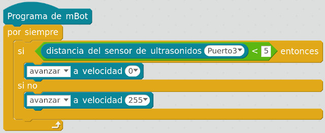
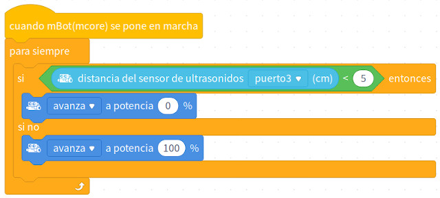

## Introducción

En este tutorial aprenderás a programar el sensor de ultrasonidos o distancia del robot mBot. Para ello se programará sobre el lenguaje de programación por bloques de mBlock.

 

## Sensor de ultrasonidos

El sensor de ultrasonidos o distancia son detectores de proximidad que detectan objetos a distancias que van desde pocos centímetros hasta varios metros. El sensor emite un sonido y mide el tiempo que la señal tarda en regresar. Estos reflejan en un objeto, el sensor recibe el eco producido y lo convierte en señales eléctricas, las cuales son elaboradas en el aparato de valoración.

El funcionamiento del sensor es muy sencillo; se utiliza un emisor para emitir una onda de sonido de alta frecuencia (ultrasonido) y un receptor para escuchar la onda reflejada. En mBlock solamente tenemos que utilizar el bloque que nos devuelve la longitud a la cual se encuentra de un obstáculo. A partir de esa distancia podemos actuar según nuestro objetivo.

 

## mBlock 3

En este apartado se va a programar un sencillo código encargado de detectar un obstáculo y detenerse ante él. Para ello, utilizaremos una condición encargada de comparar el valor obtenido del sensor de ultrasonidos, y en caso de ser mayor que 5 centímetros, parará los motores (izquierdo - M1 y derecho - M2). En caso contrario, los motores funcionarán al máximo permitido en mBlock, que es el valor de 255.

 

## mBlock 5 (versión actual)

Para programar el código encargado de detener el robot si estamos a menos de 5 centímetros de un objeto utilizaremos los bloques del apartado de acción de mBlock. Para ello, utilizaremos una condición encargada de comparar el valor obtenido del sensor de ultrasonidos, y en caso de ser mayor que 5 centímetros, parará los motores (izquierdo - M1 y derecho - M2). En caso contrario, los motores funcionarán al 100% de la velocidad máxima de los motores.

 

## Retos propuestos

Si ya has completado todas las lecciones del tutorial te proponemos resolver los siguientes retos.

### Reto 1: Pelotas de tenis

En este reto de programación con mBot deberás calcular el número de pelotas de tenis que caben en tu habitación utilizando el sensor de ultrasonidos de mBot. Para ello deberás realizar operaciones matemáticas sobre el papel.

### Reto 2: Disminuyendo la velocidad

En este reto de programación con mBot deberás programar el código que haga que el robot mBot se vaya deteniendo a medida que se va acercando a un obstáculo.

