## Introducción

En este tutorial con Scratch 2.0 te explicamos cómo programar el videojuego de Arkanoid. El videojuego consiste en romper unos ladrillos con una pelota. La pelota rebota en las paredes y no debe tocar el borde inferior de la pantalla en cuyo caso terminará la partida. Para que no toque el borde inferior debemos desplazar una nave en movimiento horizontal donde la pelota rebotará.

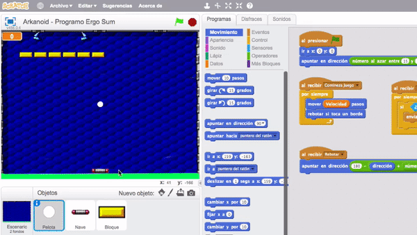

### Reinventa, programa y comparte

Antes de continuar con las lecciones de este curso de programación con Scratch te recomendamos seguir los siguientes pasos para reinventar y obtener todas las imágenes utilizadas en el videojuego gratis.

- Reinventa el proyecto [Arkanoid (base)](https://scratch.mit.edu/projects/147152819/editor) para obtener todas las imágenes.
- Programa el videojuego siguiendo los videotutoriales de las siguientes lecciones.
- Comparte el proyecto y si está entre los mejores aparecerá en la sección Mejores proyectos.

 

## Inicio del juego

  <iframe src="//www.youtube.com/embed/dddeFS44f-E" allowfullscreen></iframe>

### Escenario del videojuego

En esta primera lección del curso se explica como crear el escenario y asignar los movimientos iniciales de la pelota. En el vídeo te explicamos cómo crear y modificar el escenario para detectar el fondo de la pantalla añadiendo un color sólido al mismo. Para ello, además de crear el fondo principal del videojuego, crearemos otro fondo que se mostrará cuando finalice la partida.

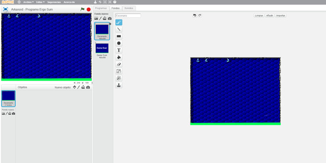

### Programación de la pelota

Una vez programadas las funciones necesarias en el escenario, añadimos el objeto de la pelota que se moverá a lo largo y ancho del escenario siguiendo un movimiento aleatorio y rebotando en caso de tocar alguno de los bordes de la pantalla. En caso de tocar el color sólido puesto en el borde inferior del escenario, enviaremos un mensaje para que finalice la partida.

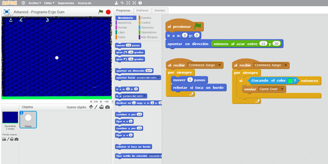

### Movimientos de la nave

Para finalizar, se programa el movimiento de la nave, que en nuestro caso se mueve utilizando nuestro ratón. PAra ello será necesario intercambiar la posición sobre el eje horizontal de la nave por el que tenga nuestro ratón. Otra alternativa es utilizando las flechas derecha e izquierda de nuestro teclado.

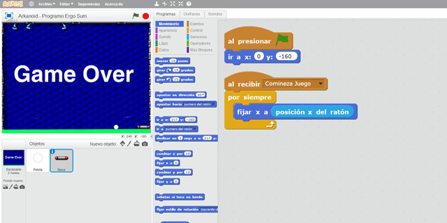

 

## Juego de Arkanoid

  <iframe src="//www.youtube.com/embed/R1J6csAkbfs" allowfullscreen></iframe>

### Partida

En este video se desarrolla la segunda parte del juego en sí. Los bloques son creados mediante clones y utilizando un bucle anidado.

> El concepto de bucle anidado es un término utilizado en algoritmos informáticos. Hay que utilizarlos con cuidado para no entrar en bucles infinitos.

Podrás observar en el video que estamos utilizando clones con Scratch (lo que llamamos buenas prácticas de programación) para crear todos los bloques del videojuego en tiempo de ejecución. Imagina que sin esta técnica, en vez de crear 1 bloque tendríamos que crear 55 bloques con sus respectivas programaciones. Es decir, nos hemos ahorrado horas y horas de programación.

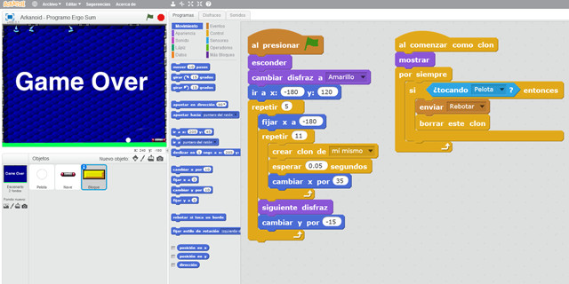

 

## Variables en Scratch

  <iframe src="//www.youtube.com/embed/rN-eu3N29FU" allowfullscreen></iframe>

### Variable para la velocidad

En esta lección vamos a crear una variable encargada de aumentar la velocidad de la pelota para complicar así ganar la partida. Dicha variable aumentará su valor cada vez que obtengamos un bloque nuevo, y dicho valor deberá añadirse al bloque de mover la pelota.

Recuerda que siempre que se crean variables debemos inicializarlas a un valor por defecto. En este caso las inicializamos en el escenario siguiendo las buenas prácticas de programación que comentamos en el video anterior.

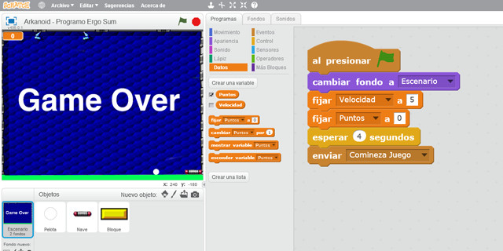

### Variable para los puntos

Por otro lado, vamos a añadir otra variable encargada de acumular los bloques que destruimos mostrando su valor por la pantalla. Esta variable se puede ver como un contador de puntos de la partida, y que más adelante utilizaremos para saber si hemos obtenido todos los bloques para finalizar la partida.

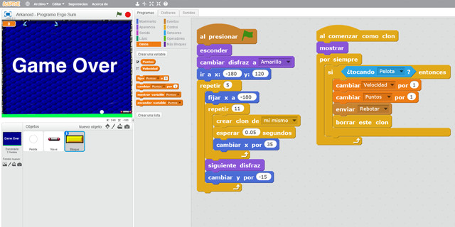

 

## Dudas en YouTube

En esta lección vamos a responder una duda muy común que suele aparecer en este videojuego cuando se cambia un objeto de dirección durante el transcurso del videojuego. Esta duda la plantea Eduardo a través de un comentario en nuestro canal de YouTube.

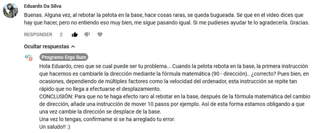

**Problema**

Cuando el objeto Pelota toca al objeto Nave o Bloque, realizamos el cambio de dirección mediante la ecuación matemática (180 - dirección) y además le añadimos una pequeña desviación de 15º. El problema es que según varios factores (tamaño de la bola, velocidad de nuestro ordenador, etc.) se realizan varios cambios de dirección, sin que la pelota llegue a desplazarse del objeto que toca, lo que crea el efecto de que la pelota se buguea quedando enganchada como comenta Eduardo en el comentario.

**Solución**

Para solucionarlo basta con añadir un bloque para que la pelota se desplace obligatoriamente justo después de cambiar de dirección, y de esa forma, evitar que vuelva a tocar al objeto en el mismo instante.

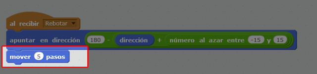

 

## Retos propuestos

Si ya has completado todas las lecciones del tutorial te proponemos resolver los siguientes retos de programación con Scratch.

### Reto 1: Movimiento de la nave mediante teclado

En el tutorial se explica cómo programar el movimiento horizontal de la nave utilizando el puntero del ratón, sin embargo, en este reto, te propongo que modifiques la programación del videojuego para controlar la nave utilizando las flechas derecha e izquierda de tu teclado.

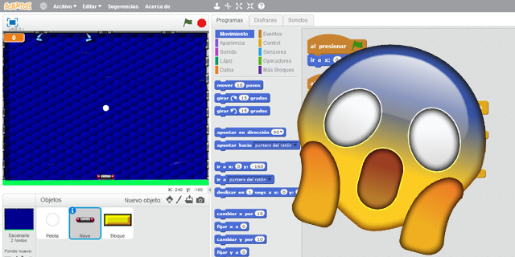

### Reto 2: Cambio de disfraces

Para personalizar el videojuego a tu gusto y ser el más original de tus amigos puedes modificar la apariencia del videojuego de Arkanoid. Recuerda que no será necesario modificar ningún bloque de programación, solamente deberás cambiar los disfraces de los objetos.

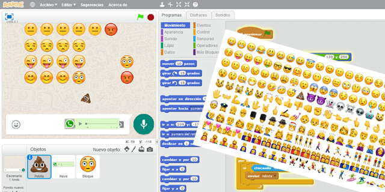

### Reto 3: Efecto de bloque al desaparecer

Siempre que la pelota toca un bloque de programación este se borra, sin embargo quedaría más chulo si al desaparecer gira desvaneciéndose al mismo tiempo como se muestra en la siguiente imagen. La programación es muy sencilla.

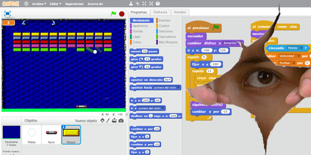

 

## Mejores proyectos

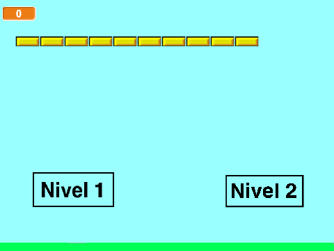

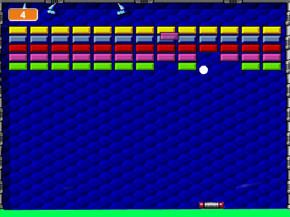

 

## Materiales

- VideoJuego de Arkanoid `Arkanoid.sb2`
- Reto 1: Movimiento de la nave mediante teclado `Reto-1.sb2`
- Reto 2: Cambio de disfraces `Reto-2.sb2`
- Reto 3: Efecto de bloque al desaparecer `Reto-3.sb2`
