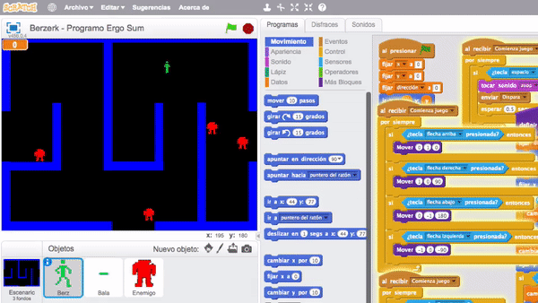
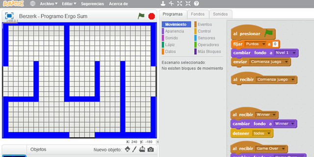
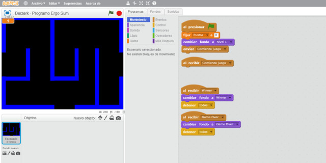
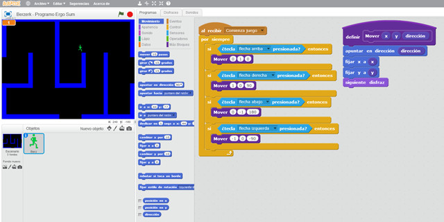
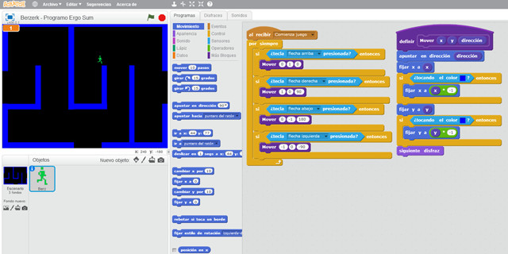
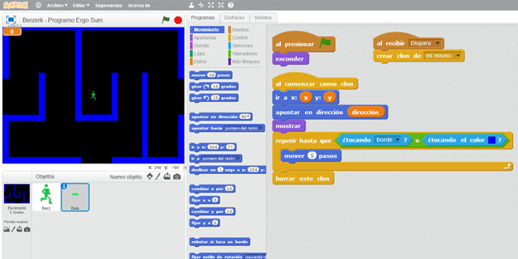
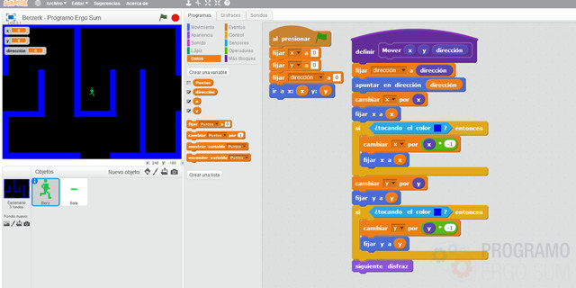
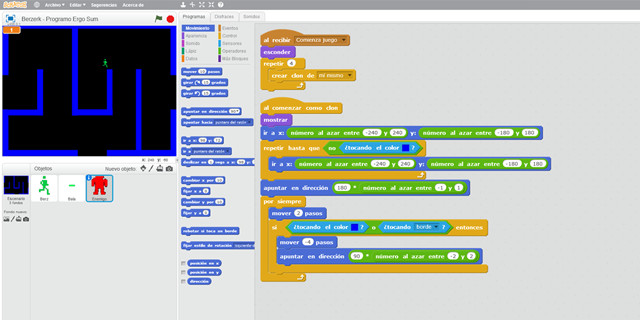
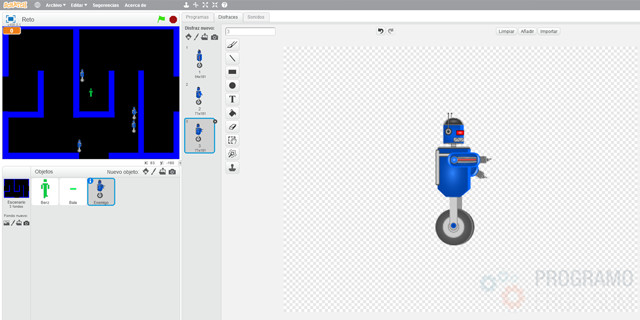

## Introducción

En este tutorial con Scratch 2.0 te explicamos cómo programar el videojuego de Berzerk. El videojuego consiste en desplazar por el escenario al personaje principal y disparar a todos los robots que aparecen en la partida. Ganarás cuando consigas eliminar a todos los robots.

### Reinventa, programa y comparte

Antes de continuar con las lecciones de este curso de programación con Scratch te recomendamos seguir los siguientes pasos para reinventar y obtener todas las imágenes utilizadas en el videojuego gratis.

- Reinventa el proyecto [Berzerk (base)](https://scratch.mit.edu/projects/186867561/editor) para obtener todas las imágenes.
- Programa el videojuego siguiendo los videotutoriales de las siguientes lecciones.
- Comparte el proyecto y si está entre los mejores aparecerá en la sección Mejores proyectos.

 

## Escenario del juego

  <iframe src="//www.youtube.com/embed/BxirkPwoqbI" allowfullscreen></iframe>

### Escenario

A la hora de programar videojuegos es muy importante utilizar una buena base de diseño. Normalmente se suelen utilizar plantillas o cuadrículas ya que los personajes se mueven una determinada cantidad de píxeles o pasos.

Para este videojuego se ha creado una cuadrícula como se explica en el video para que el personaje principal y los robots puedan desplazarse libremente siguiendo el recorrido y sin atravesar las paredes del videojuego. En nuestro caso hemos utilizado una plantilla de 16 píxeles.

### Programación del escenario

En cuanto a la programación en el escenario, se crean los eventos de "Comienza juego", "Game Over" y "Winner", los cuales cambiarán al fondo correspondiente en cada caso.

Como se comenta en el video, el flujo de entrada principal del videojuego es el escenario, ya que en el mismo activaremos cuando aparecen los fantasmas, la comida, etc.

### Programación del personaje

En primer lugar importamos nuestro personaje con sus respectivos disfraces para el efecto de movimiento

La programación es muy sencilla ya que en tutoriales anteriores hemos realizado movimientos parecidos. En este caso utilizamos condiciones en vez de eventos debido a las ventajas que explicamos en el vídeo, y además hemos creado una función "Mover" la cual recibe por parámetro las coordenadas y la dirección hacia donde se mueve nuestro personaje.

 

## Personaje principal

  <iframe src="//www.youtube.com/embed/D3HG6imqDqE" allowfullscreen></iframe>

### Programación del personaje

En la lección anterior vimos como programar los movimientos básicos del personaje. Sin embargo, en ocasiones no queremos que nuestro personaje pase por determinadas posiciones o que no atraviese las paredes. La solución para por retroceder la misma cantidad de pasos en la misma dirección como te enseñamos en el video.

### Programación de la bala

En la segunda parte del video se crea el objeto bala de forma similar a como se creó en otros tutoriales que hemos realizado en esta misma plataforma. Es decir, el evento de presionar una tecla se lanzará desde el personaje principal, pero la programación del efecto de la bala se programa en el objeto bala. Esto mismo se explica en el vídeo como puedes ver.

 

## Disparo de balas

  <iframe src="//www.youtube.com/embed/uF53cfTaSGM" allowfullscreen></iframe>

### Programación de la bala

Como hemos comentado en la lección anterior, al programar el efecto de disparo el evento se lanza desde el personaje principal y la funcionalidad de la bala se programa desde el propio objeto bala. Sin embargo nos encontramos con un problema y es que tras disparar debemos saber desde donde dispara nuestro personaje y hacia dónde apunta. Para ello debemos crear variables para almacenar dichos datos.

 

## Creando enemigos

  <iframe src="//www.youtube.com/embed/0ngFdOT4MWM" allowfullscreen></iframe>

### Personajes enemigos

En primer lugar se crea el personaje enemigo que será clonado en tiempo de ejecución. Para ello importamos los disfraces necesarios.

En cuanto a la programación es muy sencilla y similar a la programación que se realizó en el videojuego de Pac-Man. Es decir, vamos a crear el clon en posiciones aleatorias siempre y cuando no se sitúe sobre una pared.

En el vídeo tamibén programamos el evento de "Game Over" que ocurrirá cuando el enemigo toque al personaje principal del videojuego.

 

## Movimientos aleatorios

  <iframe src="//www.youtube.com/embed/FsG48pXqY_4" allowfullscreen></iframe>

### Algoritmo aleatorio

El algoritmo para mover a los clones es un concepto matemático. Nos ayudamos de los números aleatorios para multiplicarlos por la constante 90. De esta forma obtenemos las 4 direcciones posibles (0, 90, 180 ó 270).

Una vez conseguimos que se muevan de forma aleatoria debemos programar que no puedan atravesar las paredes como hemos hecho en videojuegos anteriores.

Por último, solamente nos queda programar el evento de "Winner" una vez disparemos a todos los robots.

 

## Retos propuestos

Si ya has completado todas las lecciones del tutorial te proponemos resolver los siguientes retos de programación con Scratch.

### Reto 1: Crea diferentes tipos de enemigos

En este reto te proponemos crear los movimientos del robot para que parezca que se está moviendo. Para ello deberás descargar los sprites que te adjuntamos en los materiales y programar el movimiento

<!--
 

## Mejores proyectos

-->
