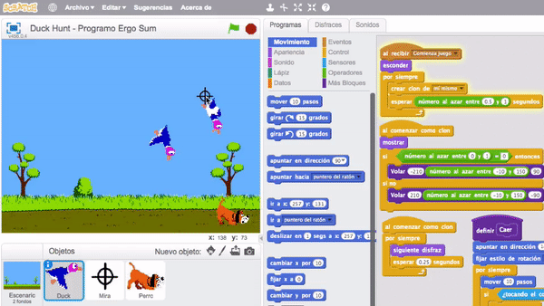
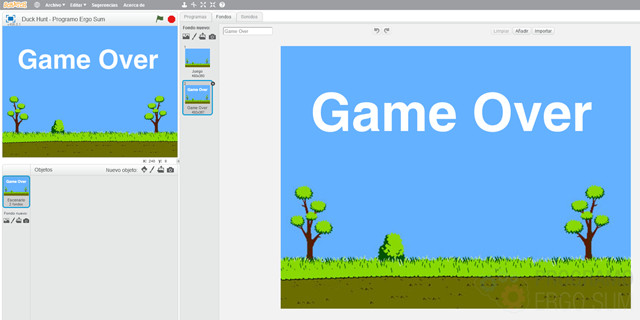
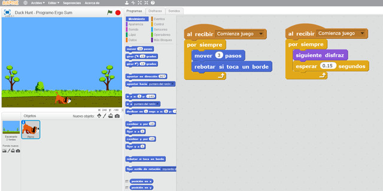
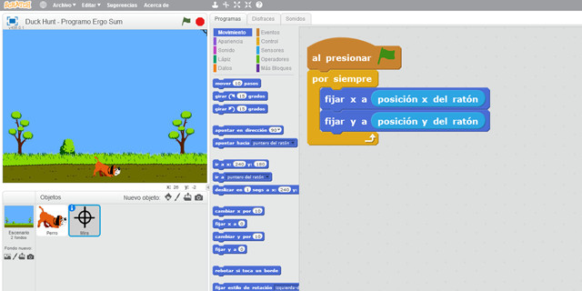
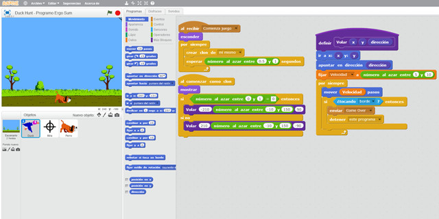
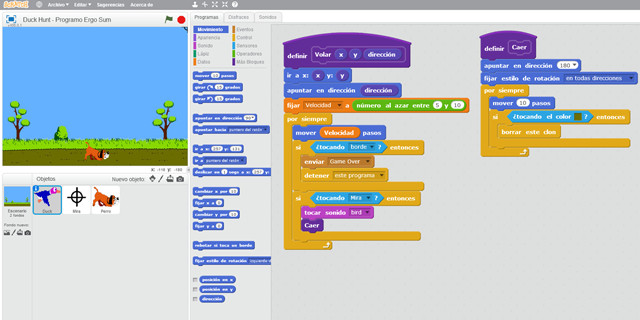
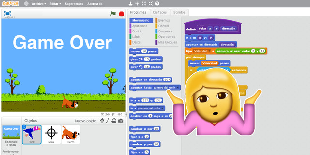
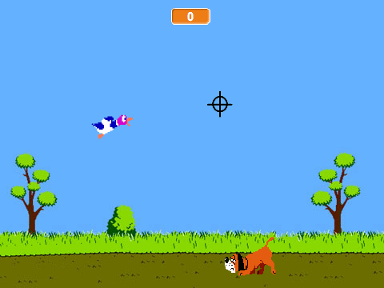

## Introducción

En este tutorial con Scratch 2.0 te explicamos cómo programar el videojuego de Duck Hunt. Duck Hunt es un videojuego creado y desarrollado por Nintendo para la Nintendo Entertainment System (NES). El videojuego consiste en disparar a los patos que van apareciendo en la pantalla sin dejar escapar ninguno. Algunos pájaros van más deprisa que otros. En caso de que un pájaro llegue al final de la pantalla se acabará la partida.

### Reinventa, programa y comparte

Antes de continuar con las lecciones de este curso de programación con Scratch te recomendamos seguir los siguientes pasos para reinventar y obtener todas las imágenes utilizadas en el videojuego gratis.

- Reinventa el proyecto [Duck Hunt (base)](https://scratch.mit.edu/projects/147152758/editor) para obtener todas las imágenes.
- Programa el videojuego siguiendo los videotutoriales de las siguientes lecciones.
- Comparte el proyecto y si está entre los mejores aparecerá en la sección Mejores proyectos.

 

## Escenario del juego

  <iframe src="//www.youtube.com/embed/wUIJIWI6WsU" allowfullscreen></iframe>

### Escenario

Al igual que hemos realizado en el resto de tutoriales de programación con Scratch, lo primero que tenemos que hacer es crear los fondos y programación del escenario como programación principal del videojuego.

### Movimiento del perro

También se añade un nuevo personaje, en este caso el perro, que lo único que va a hacer es moverse desde la derecha de la pantalla hasta la izquierda.

 

## Punto de mira

  <iframe src="//www.youtube.com/embed/XUFgF33qhX0" allowfullscreen></iframe>

### Mira

En esta lección te enseñamos los distintos métodos de programar el punto de mira. En nuestro caso, como comentamos en el video, movemos el punto de mira utilizando las coordenadas del ratón.

### Movimiento de los patos

Una vez creado el punto de mira, creamos un nuevo objeto y añadimos los diferentes sprites de los patos. Fíjate que se crean 2 disfraces para hacer el efecto de movimiento.

En cuanto a la programación, nos ayudamos de una función para definir las coordenadas y dirección que tomarán los patos, ya que no queremos que todos aparezcan desde la misma posición.

 

## Disparos

  <iframe src="//www.youtube.com/embed/zz0DTHV0XBE" allowfullscreen></iframe>

### Disparando a los patos

En este video te explicamos el concepto de función para la abstracción de código en programación orientada a objetos. Además programamos una mejora al videojuego que consiste en que cuando disparamos al pato, cae hacia el suelo hasta que toca la tierra y desaparece.

 

## Retos propuestos

Si ya has completado todas las lecciones del tutorial te proponemos resolver los siguientes retos de programación con Scratch.

### Reto 1: Dispara pulsando la tecla espacio

En este reto te proponemos cambiar la programación para que el punto de mira tenga que disparar además de pasar por encima del objeto. Es decir, habrá que pulsar la tecla espacio para efectuar el disparo. Para ello debemos modificar la programación solamente en la condición.

 

## Mejores proyectos

