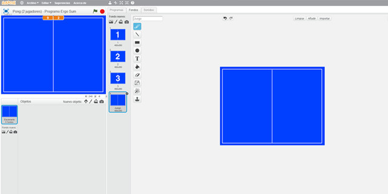
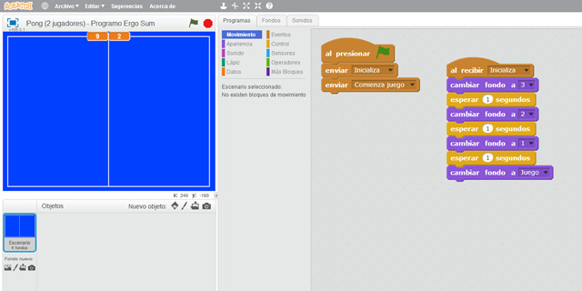
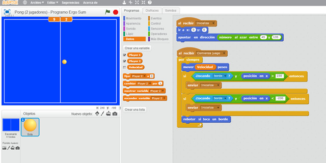
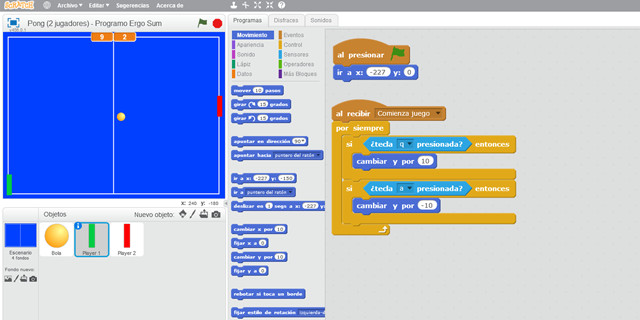
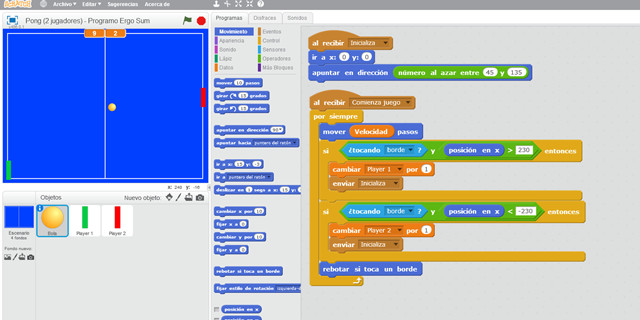
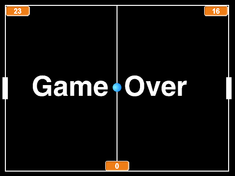
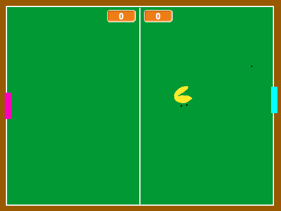
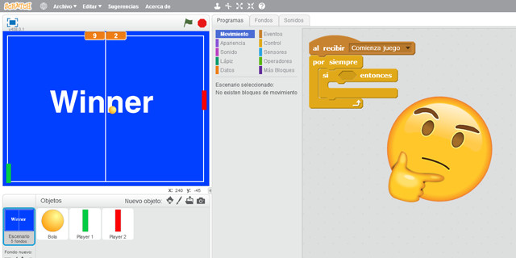

## Introducción

En este tutorial con Scratch 2.0 te explicamos cómo programar el videojuego de pong en su versión para dos jugadores. El videojuego consiste en hacer rebotar la pelota sin tocar los laterales de la pantalla en cuyo caso acumulará puntos para tu rival.

### Reinventa, programa y comparte

Antes de continuar con las lecciones de este curso de programación con Scratch te recomendamos seguir los siguientes pasos para reinventar y obtener todas las imágenes utilizadas en el videojuego gratis.

- Reinventa el proyecto [Pong 2 Jugadores (base)](https://scratch.mit.edu/projects/118054472/editor) para obtener todas las imágenes.
- Programa el videojuego siguiendo los videotutoriales de las siguientes lecciones.
- Comparte el proyecto y si está entre los mejores aparecerá en la sección Mejores proyectos.

 

## Escenario

  <iframe src="//www.youtube.com/embed/-S5TDAg2LIw" allowfullscreen></iframe>

### Escenario del videojuego

En primer lugar creamos 4 escenarios. Los 3 primeros corresponden a la cuenta atrás antes del inicio del juego (3, 2 y 1). El último escenario será la pantalla principal.

### Programación del escenario

Creamos el evento "inicializa" destinada al cambio de fondos. De esta forma siempre que la invoquemos al evento "inicializa", empezará la cuenta atrás mostrando los diferentes fondos.

Por último invocamos al evento "Comienza juego" al presionar la bandera verde.

> Observar que si durante el transcurso del videojuego volvemos a invocar a la función inicializar, los fondos volverán a cambiarse.

 

## Pelota

  <iframe src="//www.youtube.com/embed/mfNMeEo0cHI" allowfullscreen></iframe>

### Programación de la pelota

Añadimos al escenario el objeto que utilizaremos como bola y ajustamos el tamaño deseado.

A continuación inicializamos los valores por defecto que tomará dicho objeto. En este caso, la posición va a ser la posición 0 en el eje X y la posición 0 en el eje Y, es decir, la posición (0,0).

Además le tenemos que añadir un ángulo aleatorio de giro. En este caso optamos por un ángulo comprendido entre 45º y 135º para intentar que el ángulo sea lo más horizontal posible.

Como se puede observar la velocidad de la bola será siempre la misma. Si queremos que cambie tenemos que guardar el valor en una variable. Con lo cual, creamos una variable llamada velocidad.

Siempre que se utilizan variables debemos de inicializarlas a un valor por defecto. En este caso le asignamos el valor en la función principal `Presionar bandera verde`.

 

## Jugadores

  <iframe src="//www.youtube.com/embed/ze-cvFf5DfE" allowfullscreen></iframe>

### Jugadores del videojuego

Mediante el editor de fondos o con ayuda de otro software extreno, creamos las palas de lo ambos jugadores, cada una de un color.

En primer lugar se inicializan las posiciones origen de cada paleta, en su eje x e y respectivamente. A continuación al recibir la llamada del evento `Comienza juego` cambiamos las posiciones de la coordenada vertical para que la paleta suba o baje según la tecla presionada.

Por último, modificamos la programación de la bola para que rebote no sólo cuando toca un borde, sino que además deberá rebotar si toca cualquiera de las paletas.

 

## Mejoras

  <iframe src="//www.youtube.com/embed/qYQzBsWAmhU" allowfullscreen></iframe>

### Mejoras aplicadas al videojuego

Se crean 2 variables donde almacenaremos los puntos de cada jugador. De este modo cada vez que la bola toque un borde opuesto al jugador, este sumará 1 punto. Para detectar dichos bordes, nos ayudamos de las coordenadas sobre el eje horizontal X, detectando si el valor de X es menor o igual casi el total del borde de la pantalla.

 

## Dudas en YouTube

En esta lección vamos a responder a una duda muy común que suele aparecer en este tipo de videojuegos cuando se cambia un objeto de dirección durante el transcurso del videojuego. Esta duda la plantea Jordi a través de un comentario en nuestro canal de YouTube.

**Problema**

Cuando el objeto Bola toca al objeto Player 1 o Player 2, realizamos el cambio de dirección mediante la ecuación matemática (dirección * -1) y además le añadimos una pequeña desviación de 5º. El problema es que según varios factores (tamaño de la bola, velocidad de nuestro ordenador, etc.) se realizan varios cambios de dirección, sin que la bola llegue a desplazarse, lo que crea el efecto de que la bola queda enganchada a la paleta como comenta Jordi en el comentario.

**Solución**

Para solucionarlo basta con añadir un bloque para que la bola se desplace obligatoriamente justo después de cambiar de dirección, y de esa forma, evitar que vuelva a tocar la paleta en el mismo instante.

 

## Mejores proyectos

 

## Retos de Scratch

Si ya has completado todas las lecciones del tutorial te proponemos resolver los siguientes retos de programación con Scratch.

### Reto 1: El primero en llegar a 10 puntos gana

Si juegas durante mucho tiempo te derás cuenta que el videojuego no termina nunca. En este reto te propongo añadir a la programación una condición que muestre un mensaje por pantalla cuando un jugador llegue a 10 puntos. Esta programación deberás realizarla en el escenario.

