## Introducción

En este tutorial con Scratch 2.0 te explicamos cómo programar el videojuego de Space Invaders utilizando conceptos avanzados del paradigma de la programación informática, así como conceptos de programación orientada a objetos con Scratch. Su objetivo es eliminar a los alienígenas con un cañón láser y obtener la mayor cantidad de puntos posible.

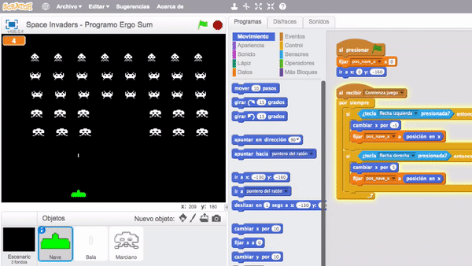

### Reinventa, programa y comparte

Antes de continuar con las lecciones de este curso de programación con Scratch te recomendamos seguir los siguientes pasos para reinventar y obtener todas las imágenes utilizadas en el videojuego gratis.

- Reinventa el proyecto [Space Invaders (base)](https://scratch.mit.edu/projects/185372903/editor) para obtener todas las imágenes.
- Programa el videojuego siguiendo los videotutoriales de las siguientes lecciones.
- Comparte el proyecto y si está entre los mejores aparecerá en la sección Mejores proyectos.

 

## Space Invaders

  <iframe src="//www.youtube.com/embed/7heq5xo6prE" allowfullscreen></iframe>

### Programación del escenario

En primer lugar creamos 4 escenarios. Los 3 primeros corresponden a la cuenta atrás antes del inicio del juego (3, 2 y 1). El último escenario será la pantalla principal.

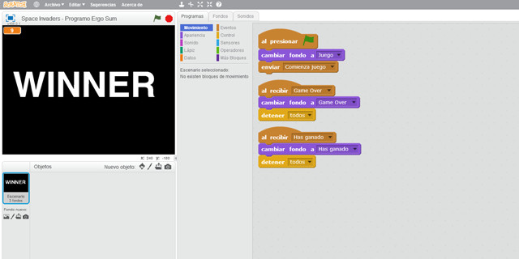

### Nave del videojuego

En la segunda parte de este video se crea el objeto de la nave en el evento "Comienza juego" y mediante las teclas derecha e izquierda la desplazamos sobre el eje horizontal.

En el video explicamos las diferencias existentes entre mover los objetos mediante eventos o mediante condiciones. En este caso hemos optado por este mecanismo para explicar todas las opciones posibles.

Por último, preparamos un nuevo evento que se ejecutará cuando pulsemos la tecla espacio. Como puedes imaginar, este evento producirá el disparo de la bala que crearemos en otro objeto en la siguiente lección.

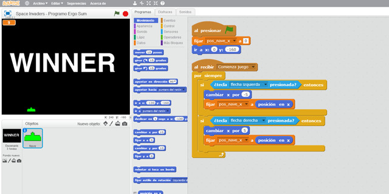

 

## Disparo de la bala

  <iframe src="//www.youtube.com/embed/Ekyfw-5Au7w" allowfullscreen></iframe>

### Disfraces de la bala

En este video creamos el objeto bala con sus diferentes disfraces. Además del disfraz principal añadimos otro para simular el efecto explosión. De esta forma, cuando la bala toque un marciano realizaremos el cambio de disfraz durante unas milésimas de segundo. También reproduciremos un sonido.

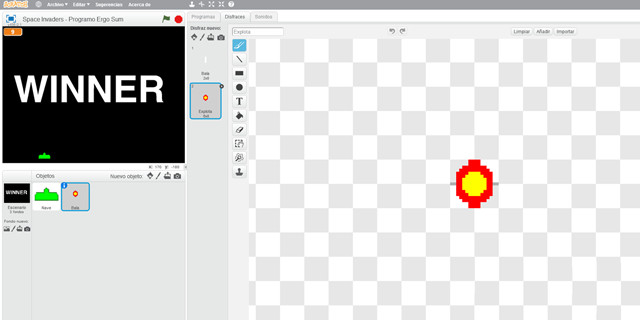

### Programación de la bala

En cuanto a la programación de la bala tenemos que destacar varios puntos:

- El primero de ellos es que el evento se ejecuta desde la nave. Es decir, cuando pulsamos la tecla de disparo, ejecutamos el evento "Dispara" y dicho evento se implementa dentro de la programación de la bala. Además necesitamos el punto sobre el eje horizontal en el momento del disparo.
- En segundo lugar, cuando se crea el clon de la bala este se moverá en dirección vertical hasta que toque el borde superior de la pantalla en cuyo caso desaparecerá.

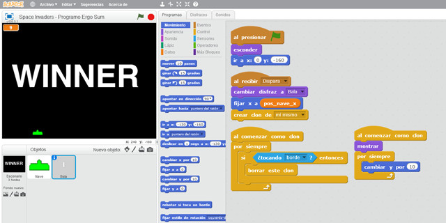

 

## Crear marcianos

  <iframe src="//www.youtube.com/embed/PpAC3Vj4nqU" allowfullscreen></iframe>

### Disfraces del marciano

En este video creamos el objeto marciano con sus respectivos disfraces. Podrás observar que solamente se crea un marciano y que será clonado utilizando los clones de Scratch en tiempo de ejecución.

Es importante que todos los marcianos tengan el mismo tamaño y estén centrados en el centro del escenario para que formen una cuadrícula.

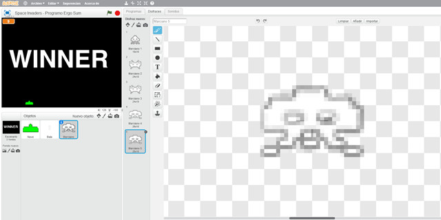

### Programación de los marcianos

En la segunda parte del video aparece la técnica de programación paralela utilizando funciones. Es decir, creamos una función llamada "Crear marciano" cuyo objetivo será clonar 8 marcianos sobre el eje vertical con una separación y dicha función será invocada 5 veces, 1 por columna.

Destacar los parámetros de la función los cuales corresponden al disfraz del marciano y las coordenadas de origen donde se clonarán los marcianos.

> También se podría haber utilizado un bucle para invocar la función "Crear marciano", pero hemos realizado esta implementación para explicar el concepto de paralelismo.

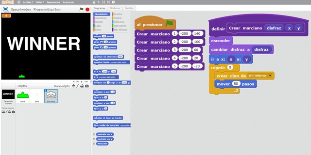

 

## Movimiento de clones

  <iframe src="//www.youtube.com/embed/s-T7SaqMfPo" allowfullscreen></iframe>

### Movimientos de los clones

En este video se programa el movimiento de los marcianos. Esta tarea parece la funcionalidad más compleja del videojuego pero sin embargo la programación es muy sencilla.

El movimiento de los marcianos es simple, es decir, se moverá hacia la derecha 10 veces, bajará una posición, se moverá 10 veces hacia la izquierda, volverá a bajar y vuelta a empezar... con lo cual podemos ver que tenemos un bucle anidado con los movimientos. También hemos añadido un retardo en el tiempo para que se mueva paso a paso.

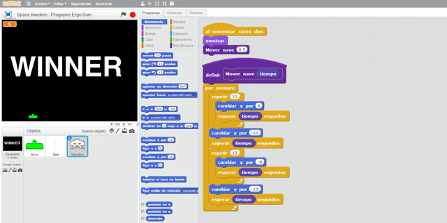

 

## Mejoras y puntos

  <iframe src="//www.youtube.com/embed/Dsim_9Ia9DU" allowfullscreen></iframe>

### Puntos del videojuego

En este video añadimos la variable de puntos para detectar cuando hemos ganado la partida. Esta variable se inicializa en el escenario (siguiendo buenas prácticas de programación) y se incrementa cada vez que la bala toca un marciano.

Por último, también tenemos que programar la función para terminar la partida, y esto lo hacemos en el objeto marciano cuando toca el borde inferior de la pantalla.

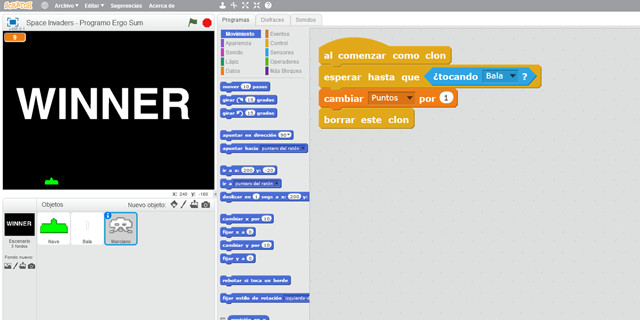

 

## Retos propuestos

Si ya has completado todas las lecciones del tutorial te proponemos resolver los siguientes retos de programación con Scratch.

### Reto 1: Disparo metralleta

En este reto te proponemos que añadas una nueva funcionalidad al videojuego para que se puedan disparar ráfagas de balas a modo metralleta. Para ello deberás añadir una nueva funcionalidad en la función seleccionada.

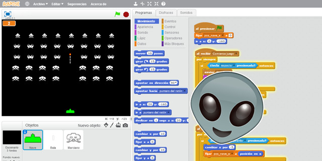

 

## Mejores proyectos

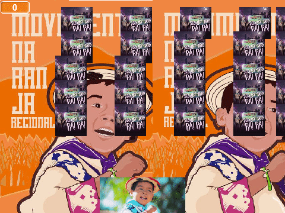

 

## Materiales

- VideoJuego de Space Invaders `Space-invaders.sb2`
- Reto 1: Disparo metralleta `Reto-1.sb2`
