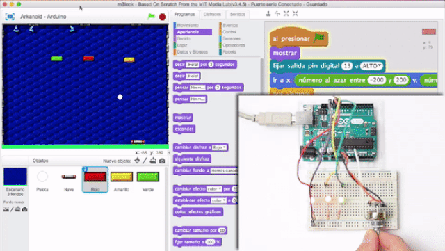

# Videojuego de tocado con mBlock y Arduino

En este curso aprenderás a programar un sencillo videojuego utilizando el lenguaje de programación por bloques de mBlock (basado en Scratch 2.0) e interactuar con las salidas digitales de una placa de Arduino. El juego consiste en tocar los diferentes objetos de colores y encender los LEDs correspondientes.



### Materiales

En esta práctica vamos a programar un videojuego donde aparecerán diferentes objetos de colores a lo largo y ancho del escenario. En caso de tocar uno de los objetos, deberá encenderse un LED de la placa de Arduino acorde con el color que se está tocando, es decir, si tocamos un objeto de color verde, se deberá encender un LED de color verde, y así con todos los objetos del videojuego.

- 1 Arduino UNO
- 1 Protoboard
- 4 Latiguillos
- 1 LED
- 1 Sensor LDR
- 1 Resistencia de 220Ω (rojo-rojo-marrón)
- 1 Resistencia de 10KΩ (marrón-negro-naranja)

### Esquema eléctrico

Los Diodos LED que estamos utilizando para la práctica admiten una tensión máxima de 2,1V y para evitar que se puedan dañar tendremos que colocarle una resistencia al circuito. Para ello, vamos a calcular el valor de la resistencia siguiendo la Ley de Ohm, es decir, la tensión en el Led tiene que ser 2,1V.

Si el pin de Arduino ofrece 5V, el tensión que debe circular por la resistencia es 5V – 2,1V = 2,9V. Por otro lado, sabemos que la intensidad que circula por el Led es de 20mA. Con lo cual siguiendo la Ley de Ohm, tenemos que:

```
R = 2,9V / 0,02A = 145Ω
```

Redondeamos el resultado obtenido a un valor de resistencia por encima de su resistencia ideal, obteniendo una resistencia de 220Ω.

> Mirando en la tabla de resistencias, la resistencia de 220Ω corresponde al color rojo-rojo-marrón.


### Programación en mBlock

<div class="iframe">
  <iframe src="//www.youtube.com/embed/gYZJhxXhYis" allowfullscreen></iframe>
</div>

Lo primero que tenemos que hacer es crear un proyecto nuevo en mBlock y configurarlo con las extensiones y placa de Arduino correspondiente como se explica en el curso de introducción a Arduino y configuración de mBlock.

Una vez configurado crearemos un objeto que se moverá a lo largo y ancho del escenario de scratch en movimientos aleatorios y rebotando en caso de tocar cualquiera de los bordes. También crearemos un objeto con forma de "Punto de mira" que será el que se moverá con ayuda de nuestro ratón.

Además, como lo que queremos es encender un LED de la placa de Arduino, la programación es muy sencilla, ya que solamente deberemos comprobar si el objeto está tocando el punto de mira para activar la salida digital de arduino, o desactivarla en caso contrario.


Una vez programado el objeto principal, recuerda que puedes duplicar el mismo objeto para crear cuantos objetos como LEDs quieras encender. Lo único que tendrás que cambiar será el número del pin de Arduino que quieres encender.


<br />


## Retos propuestos

Si ya has completado todas las lecciones del tutorial te proponemos resolver los siguientes retos de programación con Scratch.

### Reto 1: Añade una variable de tiempo

En este reto te propongo que añadas una variable al videojuego para mostrar el tiempo máximo de permanencia tocando los colores. En caso de no estar tocando ningún color el cronómetro deberá empezar de cero nuevamente.


