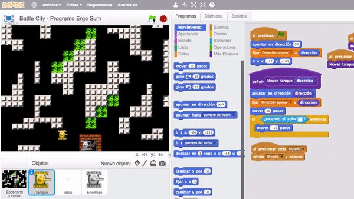
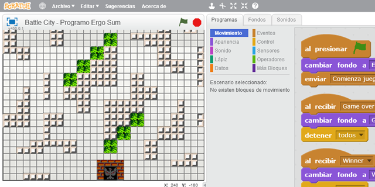
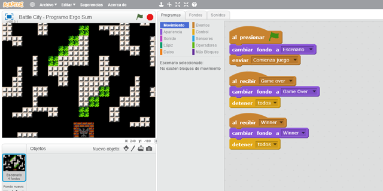
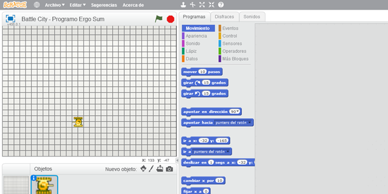
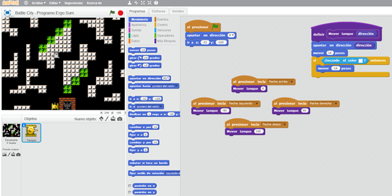
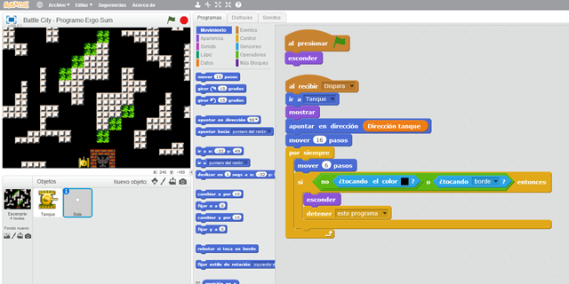
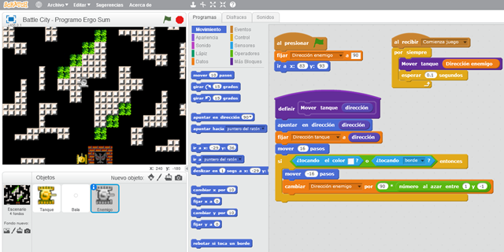
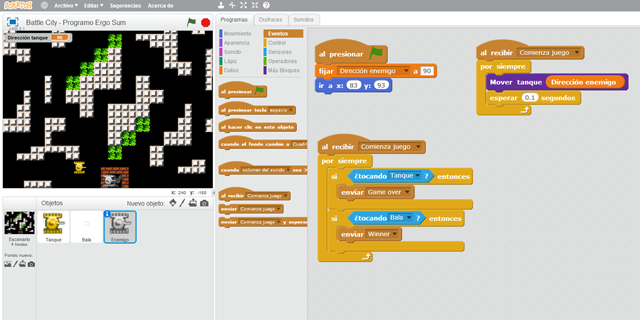
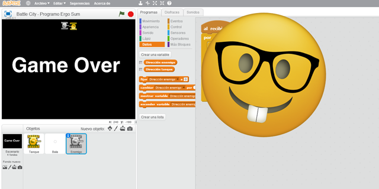

# Videojuego de Battle City programado con Scratch 2.0

En este curso de Scratch te explicamos cómo programar el videojuego de Battle City. El videojuego consiste en atacar a los tanques enemigos los cuales se mueven con movimientos aleatorios a lo largo del escenario. Si consigues eliminar todos los tanques enemigos ganarás la partida.

### Reinventa, programa y comparte

Antes de continuar con las lecciones de este curso de programación con Scratch te recomendamos seguir los siguientes pasos para reinventar y obtener todas las imágenes utilizadas en el videojuego gratis.

- Regístrate o accede a la web de <a target="_blank" href="https://scratch.mit.edu">Scratch</a>.
- Reinventa el proyecto <a target="_blank" href="https://scratch.mit.edu/projects/186865487/editor">Battle City (base)</a> para obtener todas las imágenes.
- Programa el videojuego siguiendo los videotutoriales de las lecciones de este curso.
- Comparte el proyecto y si está entre los mejores aparecerá en la sección Mejores proyectos.

 

## Escenario del juego

  <iframe src="//www.youtube.com/embed/cBdAutHTR-4" allowfullscreen></iframe>

### Cuadrícula del escenario

A la hora de programar videojuegos es muy importante utilizar una buena base de diseño. Normalmente se suelen utilizar plantillas o cuadrículas ya que los personajes se mueven una determinada cantidad de píxeles o pasos.

Para este videojuego se ha creado una cuadrícula como se explica en el video para que los tanques puedan desplazarse libremente siguiendo el recorrido y sin atravesar las paredes del videojuego.

### Programación del escenario

En cuanto a la programación en el escenario, se crean los eventos de "Comienza juego", "Game Over" y "Winner", los cuales cambiarán al fondo correspondiente en cada caso.

 

## Movimientos del tanque

  <iframe src="//www.youtube.com/embed/u3HSTLy5eeU" allowfullscreen></iframe>

### Posiciones del tanque

Una vez importado el tanque programamos sus movimientos como se explica en el video, es decir, tenemos que tener en cuenta la cuadrícula utilizada para que avanze la misma cantidad de pasos como tamaño tiene la cuadrícula.

En este videojuego hemos utilizado una cuadrícula de 16 píxeles de lado para crear los ladrillos de las paredes y árboles. Nuestro tanque se situará encima del grupo de 4 cuadrados con lo que se mueve una cantidad de 16 píxeles o pasos.

### Programación del tanque

En cuanto a la programación de nuestro personaje principal, se ha creado la función "Mover tanque" la cual recibe por parámetro la dirección hacia la que tiene que moverse el tanque. De esta forma estamos utilizando buenas prácticas de programación ya que evitamos duplicar código en los eventos de las direcciones.

 

## Disparos

  <iframe src="//www.youtube.com/embed/wTmTFex6qcg" allowfullscreen></iframe>

### Programación de la bala

Para crear el objeto bala podemos utilizar la propia herramienta de Scratch de dibujo aunque podríamos importar otro tipo de sprite.

En cuanto a la programación de la bala procedemos a utilizar una función que hace aparecer la bala en una determinada posición (la misma que tengamos cuando pulsemos la tecla de disparo) y se moverá en la dirección hacia la que apunta el tanque.

Para ello debemos crear el evento en el tanque y la funcionalidad en el propio objeto bala, como se explica en el video.

> Podríamos utilizar clones para disparar pero optamos por realizarlo de esta forma para no complicar tanto el videojuego.

 

## Tanques enemigos

  <iframe src="//www.youtube.com/embed/cbL4fdwydz4" allowfullscreen></iframe>

### Algoritmo aleatorio de los tanques

En primer lugar se importa el tanque enemigo e inicializamos sus propiedades de coordenadas, dimensiones, etc.

La parte de la programación es un poco más compleja ya que vamos a crear un algoritmo para que el personaje se mueva de forma aleatoria.

La forma de programar el algoritmo consiste en establecer un número aleatorio que actuará como dirección aleatoria del tanque una vez encontremos un obstáculo, como se explica en el vídeo.

> Para el cambio de dirección observa que hacemos uso de las matemáticas.

 

## Mejoras

  <iframe src="//www.youtube.com/embed/gyawVkJJVeg" allowfullscreen></iframe>

### Mejoras del videojuego

Una de las mejoras que vamos a programar en el videojuego consiste en añadir las funcionalidades de "Winner" o "Game Over". También podríamos crear mejoras de sonidos, puntos, etc.

 

## Retos propuestos

Si ya has completado todas las lecciones del tutorial te proponemos resolver los siguientes retos de programación con Scratch.

### Reto 1: Haz desaparecer los tanques al finalizar la partida

En este reto tendrás que averiguar porque no desaparecen los tanques al finalizar la partida. Para ello deberás modificar las partes del código que creas necesarias.

