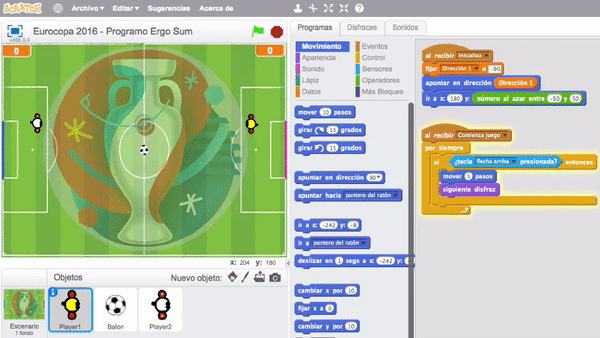
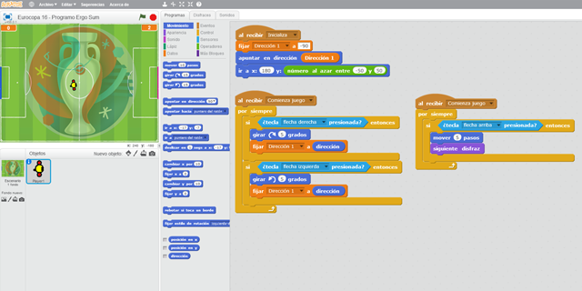
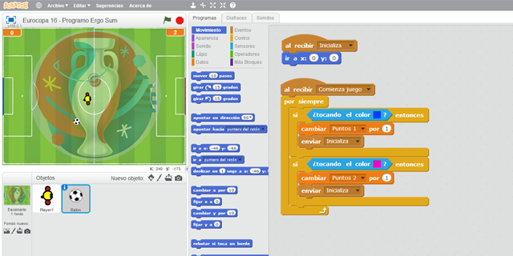
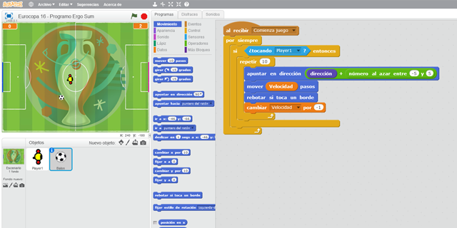
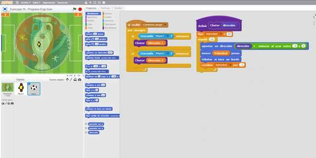
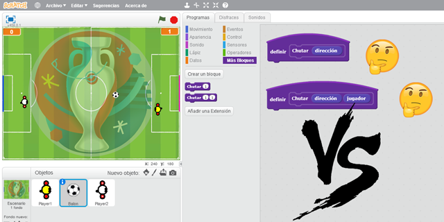

# Videojuego de Fútbol programado con Scratch 2.0

En este curso de Scratch te explicamos cómo programar un videojuego de fútbol. El videojuego está programado para una versión de 2 jugadores y cada uno controlará un personaje. El objetivo es muy sencillo, consiste en conducir el balón hasta la portería del rival para marcar un gol.

### Reinventa, programa y comparte

Antes de continuar con las lecciones de este curso de programación con Scratch te recomendamos seguir los siguientes pasos para reinventar y obtener todas las imágenes utilizadas en el videojuego gratis.

- Regístrate o accede a la web de <a target="_blank" href="https://scratch.mit.edu">Scratch</a>.
- Reinventa el proyecto <a target="_blank" href="https://scratch.mit.edu/projects/147151871/editor">Eurocopa 2016 (base)</a> para obtener todas las imágenes.
- Programa el videojuego siguiendo los videotutoriales de las lecciones de este curso.
- Comparte el proyecto y si está entre los mejores aparecerá en la sección Mejores proyectos.

 

## Jugador 1

  <iframe src="//www.youtube.com/embed/sUC0JvL1rOY" allowfullscreen></iframe>

### Movimientos del jugador 1

En este video se crea en el escenario las funciones Inicializa y Comienza juego encargadas de las inicializaciones y comienzo del juego en todos los objetos. Para el caso del jugador, hemos optado por crearlo con el editor de dibujo, aunque podéis utilizar sprites descargados de internet.

La programación de nuestro personaje es muy sencilla, simplemente tenemos que añadirle las direcciones de nuestro jugador mediante giros y el efecto avanzar como explicamos en el video.

> En siguientes videotutoriales crearemos videojuegos de fútbol más avanzados.

 

## Movimientos del balón

  <iframe src="//www.youtube.com/embed/aoksH0RSgO0" allowfullscreen></iframe>

### Marcar goles

En esta lección programamos el movimiento del balón para que haga efecto de control sobre el jugador y también programamos la detección de las porterías para marcar un gol.

La forma más sencilla para detectar las porterías es dibujar una línea de un color sólido diferente al resto de los colores que tenemos en el escenario. De esta forma, siempre que toquemos dicho color significará que hemos marcado un gol.

### Movimientos del balón

Para mover el balón como si lo estuviésemos controlando, hemos optado por realizar un pequeño desplazamiento en la misma dirección que apunta nuestro jugador. Así de esta forma, el balón se moverá produciendo un efecto de desaceleración.

### Controles del balón

Por último, y aunque todavía no se ha creado el segundo jugador del juego, podemos observar que en vez de programar la misma funcionalidad por duplicado, podemos utilizar una función encargada de mover el balón cuando sea tocado por un jugador u otro. En este caso le indicamos mediante parámetro la dirección a la que se tiene que mover.

> Esta técnica utilizada para reutilizar códigos es una de las buenas prácticas de programación que recomendamos.

 

## Jugador 2

  <iframe src="//www.youtube.com/embed/nKdrurkjr2I" allowfullscreen></iframe>

### Movimientos del jugador 2

En este último videotutorial, solamente hemos duplicado el jugador anteriormente creado reutilizando la programación ya programada. Recuerda que es muy importante estar seguro que la programación funciona correctamente para no duplicar errores.

También se han añadido nuevas colisiones en el balón para detectar ambos jugadores y los colores de los sprites.

 

## Retos propuestos

Si ya has completado todas las lecciones del tutorial te proponemos resolver los siguientes retos de programación con Scratch.

### Reto 1: El Jugador 1 mueve más rápido el balón

En muchos videojuegos existe el llamado "handicap". En este reto tienes que modificar el funcionamiento del juego para dotarlo de cierta ventaja sobre uno de los jugadores. En concreto, deberás modificar la programación para que el Jugador 1 mueva el balón más deprisa que el Jugador 2.

